<h2 align=center>Week II</h2>

<h1 align=center>Adders</h1>

<p align=center><strong><em>Song of the day</strong>: <a href="https://youtu.be/_SftevyQ4kw"><strong><u>Reste Avec Moi</u></strong></a> by Pépite (2017).</em></p>

<br>

## Sections

1. [**Two's Complement**](#0)
    1. [**Fixed Bit-Width**](#0-1)
    2. [**But Why Tho?**](#0-2)
    3. [**Decimal to Two's Complement**](#0-3)
    4. [**Two's Complement to Decimal**](#0-4)
    5. [**The Range of an n-Bit Two's Complement Number**](#0-5)
2. [**From `XOR` to Addition**](#1)
3. [**A Quick Note on Reading Verilog**](#2)
4. [**The Half Adder**](#3)
5. [**The Full Adder**](#4)
6. [**Ripple-Carry Adders**](#5)
7. [**Multiplexers**](#6)
8. [**Subtracters**](#7)
9. [**Comparators**](#8)
10. [**Shifters**](#9)
11. [**Zero- and Sign-Extension**](#10)
12. [**The ALU**](#11)
13. [**Bitwise Operations**](#12)
    1. [**Bitwise AND**](#12-1)
    2. [**Bitwise OR**](#12-2)
    3. [**Bitwise XOR**](#12-3)
    4. [**Bitwise NOT**](#12-4)
14. [**Adders on Real Hardware**](#13)
15. [**Appendix: Deriving the Two's Complement Trick**](#14)

<br>

<a id="0"></a>

## Two's Complement

Before we build a circuit that adds two numbers together, we need to settle a design question first: how do negative numbers get represented in binary, such that the adder we're about to build handles them with zero extra logic? If you don't take anything else from this lecture, take this section—everything downstream depends on it.

Every number we've dealt with so far has been non-negative. But real programs constantly subtract, negate, and compare _signed_ values—and the hardware needs to handle all of that using the same addition circuits we're about to build. So, how do you encode negative numbers in binary so that ordinary addition still works?

_Ah_, you say, _easy_. Reserve one bit as a sign bit (0 = positive, 1 = negative) and use the remaining bits for the actual number.

_Ah_, I say, _this breaks in two ways_: it produces two representations of zero (`+0` and `−0`), and it requires the addition circuit to inspect the sign bit and change its behaviour (a simple `if`-statement in Python/C, but very complicated for your computer)—complexity that propagates into every piece of arithmetic hardware.

**Two's complement** is the most chef's-kiss solution to avoid both problems. It's what every modern processor uses.

<a id="0-1"></a>

### Fixed Bit-Width

Two's complement only makes sense within a *fixed* number of bits.

The first thing you need to know is the **most significant bit (MSB)**: in two's complement, a 1 in the MSB means the number is negative. For a 4-bit system, the 16 available bit patterns are assigned values like this:

| Bit pattern | Two's complement value |
|-------------|----------------------|
| 0000        | 0                    |
| 0001        | 1                    |
| ...         | ...                  |
| 0111        | 7                    |
| 1000        | −8                   |
| 1001        | −7                   |
| ...         | ...                  |
| 1111        | −1                   |

Notice the range is asymmetric: there are 8 non-negative values (0 through 7) but 8 negative values (−8 through −1). There is always one more negative number than positive ones, because zero takes one of the non-negative slots.

**Bit-width warning:** If a number requires more bits than your field provides, the extra high-order bits are basically discarded—what we call **truncation**.

For example, 20 in binary is `0b10100` (5 bits). Stored in a 4-bit field, the leading 1 is dropped, leaving `0100` = 4. The value is now wrong, with no error or warning. Keep bit-width in mind whenever you're working with fixed-size integers—you'll see this same shape of bug twice more in this lecture, in the shifter and sign-extend sections.

<a id="0-2"></a>

### But why tho?

The reason two's complement is universal is that **ordinary binary addition works correctly for both positive and negative numbers, with no special cases**. The addition circuit doesn't need to know whether its operands are signed or unsigned—it just adds bits and discards the carry out of the top position.

For example, 3 + (−3) in 4-bit two's complement:

```
  0011   (3)
+ 1101   (−3)
──────
  0000   (0, carry discarded)
```

The carry out is thrown away and the result is 0. The same adder circuit that adds 3 + 5 also correctly computes 3 + (−3), with zero additional logic. That simplicity is the entire point—and it's the reason this section comes *before* we build the adder, not after: we need to know what the adder has to handle before we design it.

If you want to see exactly *why* that carry-discard trick is guaranteed to work, rather than just take it on faith, the full derivation is in the [Appendix](#14) at the end of this lecture.

<a id="0-3"></a>

### Decimal to Two's Complement

To convert a negative decimal number to its two's complement binary representation in *n* bits:

1. Convert the absolute value to binary, padded to *n* bits.
2. Invert every bit.
3. Add 1.

```
Step 1. |−3| = 3 → 0011

Step 2. Invert:  0011  →  1100

Step 3. Add 1:   1100 + 0001 = 1101
```

Result: −3 = **1101** in 4-bit two's complement.

This isn't simply theory, either, it's a two-instruction idiom I use constantly when writing Game Boy assembly. In [PONG.gb](https://github.com/sebastianromerocruz/PONG.gb), the ball's direction is stored as a signed byte (`wXBallDir`, `wYBallDir`: `1` or `−1`), and bouncing off a wall or a paddle just means negating it. Here's [`FlipY`](https://github.com/sebastianromerocruz/PONG.gb/blob/main/src/pong.asm), called whenever the ball hits the top or bottom of the screen:

```asm
FlipY:
    push af
    ld a, [wYBallDir]
    cpl        ; step 2: invert every bit
    inc a      ; step 3: add 1
    ld [wYBallDir], a
    pop af
    ret
```

`cpl` (complement) is step 2 above, `inc a` is step 3—two SM83 instructions, and that's the entire negation. `FlipX` is the identical routine on `wXBallDir`, fired from paddle collisions instead of wall collisions. No branching, no "if positive do this, if negative do that"—just the two's complement trick, running sixty times a second on real hardware. Keep this in your back pocket; we'll meet its counterpart—the adder that *consumes* this encoding—by the end of this lecture.

<a id="0-4"></a>

### Two's Complement to Decimal

The decode procedure is symmetric—the same three steps in reverse:

1. If the MSB is 0, the number is non-negative—convert normally and done.
2. If the MSB is 1, invert all bits.
3. Add 1.
4. Convert to decimal and apply a minus sign.

**Example:** Convert `1101` (4-bit two's complement) to decimal.

```
Step 1. MSB = 1 → negative.

Step 2. Invert:  1101  →  0010

Step 3. Add 1:   0010 + 0001 = 0011

Step 4. 0011 = 3 → −3
```

Result: **1101₂ = −3**

<a id="0-5"></a>

### The Range of an n-Bit Two's Complement Number

```
−2^(n−1)  to  2^(n−1) − 1
```

For 4 bits: −8 to 7. For 8 bits: −128 to 127. For 32 bits: −2,147,483,648 to 2,147,483,647. This is why integer overflow is a real bug and not a theoretical curiosity: adding two large positive 32-bit integers can produce a result exceeding 2,147,483,647, which wraps around to a large negative number, silently and without error. Understanding two's complement is what lets you reason about *why* that happens and when to guard against it.

<br>

<a id="1"></a>

## From `XOR` to Addition

Back in Week I, buried in the `XOR` section, we made a promise: "`XOR` turns out to be the addition primitive... we'll see this again when we build `adders`." This is that.

Add two single bits by hand, the way you'd add any two digits, and there are exactly four cases:

```
0 + 0 = 0   (sum 0, no carry)
0 + 1 = 1   (sum 1, no carry)
1 + 0 = 1   (sum 1, no carry)
1 + 1 = 0   (sum 0, carry 1, i.e. "10" in binary)
```

Look at the sum column and the carry column separately, and you'll notice you already know both gates:

| A | B | Sum | Carry |
|---|---|:---:|:---:|
| 0 | 0 | 0 | 0 |
| 0 | 1 | 1 | 0 |
| 1 | 0 | 1 | 0 |
| 1 | 1 | 0 | 1 |

The **Sum** column is exactly `A XOR B`. The **Carry** column is exactly `A AND B`. That's not a coincidence you're supposed to memorise—it falls straight out of the truth tables you already built in Week I. Two gates you already know, wired to the same two inputs, *are* a 1-bit adder.

<br>

<a id="2"></a>

## A Quick Note on Reading Verilog

We're about to write a lot of Verilog this lecture, before Verilog is formally taught (that's [next lecture](/lectures/03-verilog)). Rather than make you wait two weeks to read code that's genuinely useful *now*, here's just enough syntax to read everything below. Consider this a preview, not the full treatment—Lecture 3 covers structural vs. continuous assignment, synthesis, and the design philosophy properly. This is a decoder ring, not a substitute.

**The module.** Every circuit is wrapped in a `module`, which lists its inputs and outputs by name:

```verilog
module my_circuit(A, B, Y);
    input  A, B;
    output Y;
    // ... the circuit goes here ...
endmodule
```

`A` and `B` flow in, `Y` flows out. Nothing here "runs" top to bottom like a Python script—every line describes a permanent physical connection, and all of them exist simultaneously, the same way real wires and gates would.

**Continuous assignment**—the style we'll use almost everywhere below—connects a wire directly to an expression:

```verilog
assign Y = A & B;
```

Read this as "`Y` is permanently wired to the output of an AND gate fed by `A` and `B`," not as "compute `A & B` and store it in `Y`." The operators are the ones you'd guess from Week I: `&` is `AND`, `|` is `OR`, `^` is `XOR`, `~` is `NOT`.

**Structural instantiation** is the other style, where you name an actual gate:

```verilog
and A1 (Y, A, B);
```

Syntax: `gate_type instance_name (output, input1, input2, ...)`—for Verilog's **built-in primitive gates** specifically (`and`, `or`, `xor`, `nand`, `nor`, `not`), the **first** argument is always the output, the rest are inputs, in order. That's a rule the language enforces for these six primitives only. `A1` is just a label you chose; it doesn't mean anything to the circuit. Both styles above describe the *exact same wire*. You'll see us use continuous assignment more, since it reads closer to the Boolean equation you'd already write by hand.

**This output-first rule does not carry over to modules you write yourself.** Once you instantiate a module of your own design—like `full_adder`, coming up shortly—positional arguments just match whatever order *that module's own port list* declares, in whichever order its `input`/`output` ports happen to be written. If a module's header lists inputs before outputs (as `full_adder`'s does), every instantiation of it lists inputs before outputs too. Worth remembering before the ripple-carry example below, where the outputs land in positions 4 and 5, not position 1.

**Buses.** A single wire holds one bit. To carry several bits together—like a 3-bit number—declare a vector:

```verilog
input [2:0] A;   // a 3-bit bus: A[2], A[1], A[0]
```

`[2:0]` means "bits numbered 2 down to 0," i.e. 3 bits, with `A[2]` as the most significant. You can use the whole bus as one signal (`A + B`) or reach into a single bit (`A[0]`).

**Internal wires**, declared with `wire`, are signals that exist only inside the module—values that pass between two gates but never touch the outside world:

```verilog
wire W1;
assign W1 = A & B;
assign Y  = W1 | C;
```

That's the whole toolkit. New constructs (the `?:` ternary, `{}` concatenation and replication) get explained inline the first time each shows up below.

<br>

<a id="3"></a>

## The Half Adder

Formally: a **half adder** is a circuit that adds two 1-bit numbers and produces a sum bit and a carry bit. It's called "half" because, as we're about to see, it's missing something a real adder needs—but for a single bit with nothing to carry *in* from, it's complete.

<a id="fg-1"></a>

<p align=center>
    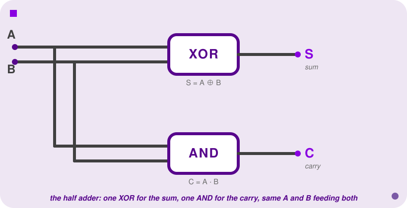
    </img>
</p>

<p align=center>
    <sub>
        <strong>Figure I</strong>: The half adder—one <code>XOR</code> for the sum, one <code>AND</code> for the carry, both fed the same <code>A</code> and <code>B</code>.
    </sub>
</p>

In Verilog, this is about as close to a one-liner as combinational logic gets. Structurally, naming the gates directly:

```verilog
module half_adder(A, B, Sum, Carry);
    input  A, B;
    output Sum, Carry;

    xor X1 (Sum,   A, B);
    and A1 (Carry, A, B);
endmodule
```

Two instantiations, one per gate. `X1` computes `Sum` from `A` and `B`; `A1` computes `Carry` from the same two inputs—there's no "flow" between them, they're just two independent gates that happen to share their inputs, exactly like Figure I shows.

Or, with continuous assignment, which by now should feel like the more natural way to say it, since it's a direct transcription of the truth table we just derived:

```verilog
module half_adder(A, B, Sum, Carry);
    input  A, B;
    output Sum, Carry;

    assign Sum   = A ^ B;
    assign Carry = A & B;
endmodule
```

Both modules describe the identical circuit—same gates, same wires, just two ways of writing it down. Prefer continuous assignment when you have the Boolean expression in hand (which, from here on, is most of the time).

Here's the "half" problem: this circuit has no way to accept a carry *coming in* from a less-significant bit. That's fine for the rightmost bit of an addition—there's nothing to its right to carry in from—but every other bit position needs one. If all you have is half adders, you can only ever add 1-bit numbers.

<br>

<a id="4"></a>

## The Full Adder

A **full adder** adds three bits—`A`, `B`, and a carry-in `Cin`—and produces a `Sum` and a carry-out `Cout`. Three inputs means eight rows:

| A | B | Cin | Sum | Cout |
|---|---|:---:|:---:|:---:|
| 0 | 0 | 0 | 0 | 0 |
| 0 | 0 | 1 | 1 | 0 |
| 0 | 1 | 0 | 1 | 0 |
| 0 | 1 | 1 | 0 | 1 |
| 1 | 0 | 0 | 1 | 0 |
| 1 | 0 | 1 | 0 | 1 |
| 1 | 1 | 0 | 0 | 1 |
| 1 | 1 | 1 | 1 | 1 |

Let's actually derive the SOP form rather than just state it—same method as Week I, Section 3: one AND-term per row where the output is 1, OR'd together.

**`Sum`** is 1 on four rows: `(0,0,1)`, `(0,1,0)`, `(1,0,0)`, `(1,1,1)`:

```
Sum = ĀB̄Cin + ĀBC̄in + AB̄C̄in + ABCin
```

Count the 1s in each of those four rows: one, one, one, three—every single one of these rows has an **odd** number of 1s among its three inputs. That's not a coincidence worth shrugging past, because it points straight at a gate you already know.

Recall what `A ⊕ B` actually means: "these inputs differ," which is just a two-input way of saying "an odd number of my inputs (namely, 1) is 1"—0 and 2 are both even, and 1 is the only odd count two bits can produce. 

`XOR` was never really a "differs" gate; it's a **parity check**, and "differs" is just what parity-checking two bits happens to look like. Parity extends to any number of inputs for free, so recognising that `Sum = 1` happens on exactly the odd-parity rows tells you `Sum` should be **`A ⊕ B ⊕ Cin`**—chaining `XOR`s is definitionally how you compute parity across more than two bits.

`XOR` was only ever defined for two inputs, but it's associative, so nothing stops us from chaining two of them: first `XOR` `A` and `B` together, then `XOR` *that* result with `Cin`. Check the claim against the four rows above:

| A | B | Cin | A⊕B | (A⊕B)⊕Cin |
|---|---|:---:|:---:|:---:|
| 0 | 0 | 1 | 0 | **1** |
| 0 | 1 | 0 | 1 | **1** |
| 1 | 0 | 0 | 1 | **1** |
| 1 | 1 | 1 | 0 | **1** |

All four land on 1, matching `Sum` exactly—and it's easy to check the other four rows (where `Sum = 0`) the same way. So the four-term SOP collapses to a chain of the gate we already have:

```
Sum = A ⊕ B ⊕ Cin
```

<br>

**`Cout`** is 1 on four different rows: `(0,1,1)`, `(1,0,1)`, `(1,1,0)`, `(1,1,1)`. Count the 1s in each: two, two, two, three—every single one of these rows has *at least two* of the three inputs set. Again, that's not a coincidence of these particular four rows: out of all eight rows, exactly four have two-or-more 1s, and those are precisely the four listed here. So `Cout` is answering one specific question: "were at least two of the three inputs 1?" That's called a **majority function**:

```
Cout = ĀBCin + AB̄Cin + ABC̄in + ABCin
```

This one doesn't collapse as cleanly, but it does simplify. Split the four terms into two pairs—the first two share a `Cin`, the last two share an `AB`—and factor each pair:

```
Cout = ĀBCin + AB̄Cin + ABC̄in + ABCin
     = Cin(ĀB + AB̄) + AB(C̄in + Cin)     [factor Cin from the first pair, AB from the second]
     = Cin(A ⊕ B) + AB(1)               [ĀB + AB̄ is the XOR pattern again; C̄in + Cin = 1]
     = AB + Cin(A ⊕ B)
```

Put together, that's the full adder's Boolean description:

```
Sum  = A ⊕ B ⊕ Cin
Cout = AB + Cin(A ⊕ B)
```

Here's the elegant part: you don't need new gates to build that majority function. `A ⊕ B` is a half adder's sum output; `AB` is a half adder's carry output. A full adder is **two half adders and one `OR` gate**, wired so the first half adder's sum feeds the second half adder's `A` input, `Cin` feeds its `B` input, and the two carries get `OR`'d together:

<a id="fg-2"></a>

<p align=center>
    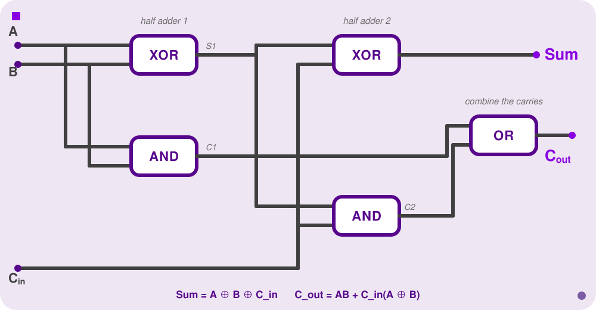
    </img>
</p>

<p align=center>
    <sub>
        <strong>Figure II</strong>: A full adder built from two half adders and one <code>OR</code> gate—no new logic, just careful wiring of gates you already have.
    </sub>
</p>

In Verilog, seeing the two half adders separately makes this a little clearer:

```verilog
module full_adder(A, B, Cin, Sum, Cout);
    input  A, B, Cin;
    output Sum, Cout;
    wire   S1, C1, C2;

    // half adder 1: A and B
    assign S1 = A ^ B;
    assign C1 = A & B;

    // half adder 2: S1 and Cin
    assign Sum = S1 ^ Cin;
    assign C2  = S1 & Cin;

    // combine the two carries
    assign Cout = C1 | C2;
endmodule
```

Walk through what each declared signal is doing: `S1` is the *first* half adder's sum—`A ⊕ B`—and it immediately becomes an input to the *second* half adder, alongside `Cin`. `C1` and `C2` are the two half adders' carry outputs; neither is the final answer on its own, which is why they get `OR`'d together into `Cout` on the last line. None of `S1`, `C1`, `C2` are ports—they're `wire`s, exactly as introduced in the [Verilog note](#2) above: signals that exist only to connect components *inside* this module.

You'll also see `Cout` written as the raw sum-of-products, without the half-adder factoring:

```
Cout = AB + A·Cin + B·Cin
```

Expand `AB + Cin(A ⊕ B)` yourself and check it matches—both are correct, they're just two different shapes of the same majority function. Don't be thrown if you see the "wrong" one on a slide; SOP form isn't unique, same as it wasn't back in Week I.

<br>

<a id="5"></a>

## Ripple-Carry Adders

A full adder adds one bit position. To add two N-bit numbers, chain N full adders together, wiring each one's `Cout` into the next one's `Cin`:

<a id="fg-3"></a>

<p align=center>
    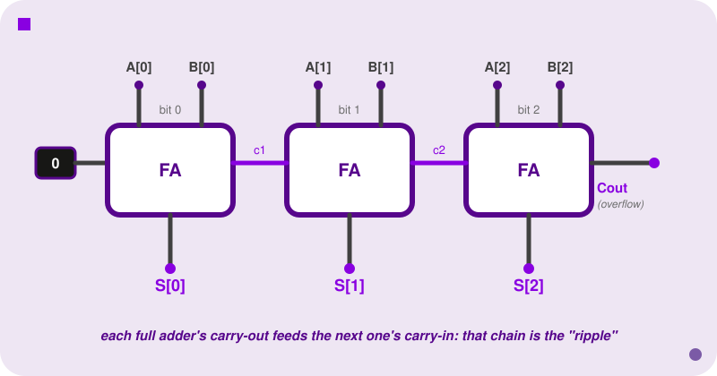
    </img>
</p>

<p align=center>
    <sub>
        <strong>Figure III</strong>: A 3-bit ripple-carry adder—three full adders chained, each one's <code>Cout</code> wired directly into the next one's <code>Cin</code>, matching the <code>adder_3bit</code> Verilog below.
    </sub>
</p>

- **Bit 0** gets its `Cin` hardwired to 0 (or you use a half adder there instead—there's nothing to its right to carry in from).
- **Every bit after that** takes its carry-in from the bit before it—that's the chain in the figure above.
- **Read the sum bits together**—`S[2] S[1] S[0]`—and you have 3-bit binary addition, built entirely out of the 1-bit adder we just derived. The same idea scales to any width: more full adders, same chaining.

It's called **ripple-carry** because that's exactly what happens: the carry has to physically propagate—ripple—through every full adder in the chain before the last one's sum is valid.

**Delay scales as N times the delay of a single full adder; size scales as N times the size of a single full adder.**

For a 3-bit adder, that's fine, but for the 32- or 64-bit adder inside a real CPU, that chain of propagation delay is a real problem—one of the reasons faster (carry-lookahead) adders exist, which is a rabbit hole for another course.

Here's the chain in Verilog, built by instantiating `full_adder` three times for a 3-bit adder—this is **structural** instantiation again (from the [Verilog note](#2)), just with a module that we wrote as the gate type instead of a built-in one like `xor`:

```verilog
module adder_3bit(A, B, Cin, S, Cout);
    input  [2:0] A, B;
    input  Cin;
    output [2:0] S;
    output Cout;
    wire   c1, c2;

    full_adder bit0(A[0], B[0], Cin, S[0], c1);
    full_adder bit1(A[1], B[1], c1,  S[1], c2);
    full_adder bit2(A[2], B[2], c2,  S[2], Cout);
endmodule
```

Let's break this one down—there's more bus notation packed in here than anywhere else so far:

- **`input [2:0] A, B;`** declares two 3-bit buses: `A` is really three wires bundled under one name, addressable as `A[2]` (most significant), `A[1]`, `A[0]` (least significant). Same for `B`, and for the 3-bit output `S`.
- **`input Cin; output Cout;`**, by contrast, get no `[2:0]`—they stay single bits, on purpose. There's only ever *one* carry coming into the whole chain and *one* carry leaving it; a carry isn't a multi-bit number, so it doesn't get a bus.
- **`wire c1, c2;`** declares two ordinary single-bit wires—notice there are only two of them for three full adders. That's not an oversight: these are purely the internal connections *between* stages. Bit 0's carry-out needs a wire to reach bit 1's carry-in (that's `c1`), and bit 1's needs one to reach bit 2's (`c2`)—but bit 2's carry-out already has somewhere to go, straight out to the `Cout` port, so it doesn't need one.
- **`full_adder bit0(A[0], B[0], Cin, S[0], c1);`** is where the bus actually gets torn apart, one bit at a time. `A[0]` reaches into the bus and pulls out just bit 0—a single wire, exactly what `full_adder`'s `A` port expects (recall `full_adder` itself only ever takes single-bit `A`, `B`, `Cin`). Same story for `B[0]` and `S[0]`.
- **The argument order here is not output-first.** `S[0]` and `c1` land in the *4th and 5th* positions, not the 1st. That's not a mistake—`full_adder` is a module we wrote ourselves, back in [The Full Adder](#4), with the header `module full_adder(A, B, Cin, Sum, Cout);`. Its own port list puts inputs first and outputs last, so every instantiation of it has to match that exact order. The "output goes first" rule from the [Verilog note](#2) only binds Verilog's six built-in primitive gates; it was never a rule for modules you define yourself.
- **The carry chain is the interesting part.** `bit0`'s last argument is `c1`—its carry *out*. `bit1`'s third argument (the `Cin` position) is that *same* `c1`—its carry *in*. That's not a coincidence: it's one physical wire, written twice because it plays two roles, output of stage 0 and input of stage 1. `c2` does the identical job between stages 1 and 2. That reused wire name, appearing in two different argument lists, *is* the ripple—the literal Verilog expression of "this stage's carry-out feeds that stage's carry-in."
- **`bit1` and `bit2`** repeat the exact same pattern one position over, each peeling off the next slice of every bus and picking up the previous stage's carry.

So reading the whole module top to bottom: declare two 3-bit buses in and one 3-bit bus out, declare two scratch single-bit wires for the internal handoffs, then three copies of the same 1-bit building block, each one peeling off a matching bit from every bus and stitching its carry to the next copy's carry-in.

Verilog also gives you the high-level operator directly:

```verilog
module adder_3bit_highlevel(A, B, S);
    input  [2:0] A, B;
    output [2:0] S;

    assign S = A + B;
endmodule
```

Both modules synthesise to the same ripple-carry hardware—and I know what you're thinking: `+` isn't magic, it's just shorthand that the synthesis tool expands into exactly the chain above, full adder by full adder. In practice, you'd always write `A + B`. **On homework in this course, you will sometimes be explicitly asked to build the adder out of gates instead**, specifically so you demonstrate you understand what `+` is hiding. Remember, reading is half of the battle.

<br>

<a id="6"></a>

## Multiplexers

Every circuit so far has had one fixed job: an adder always adds, a full adder always combines three bits the same way. But real hardware constantly needs to *choose*: which register's value should land on this wire right now? Which of two possible next instructions should the program counter become? Software has `if`/`else` for exactly this. Hardware needs the same idea, built entirely out of gates—no branching, no "skip this instruction," just a circuit whose output depends on a control signal instead of only on its data inputs. That circuit is a **multiplexer**.

A **multiplexer** ("mux") selects one of several input signals to route to a single output, based on a separate selector signal. Think of it as a switch: the selector decides which input "wins."

The simplest case, a **2:1 mux**, has two data inputs `D0`/`D1`, one selector `S`, and one output `Q`:

| S | D0 | D1 | Q |
|:-:|:-:|:-:|:-:|
| 0 | 0 | 0 | 0 |
| 0 | 0 | 1 | 0 |
| 0 | 1 | 0 | 1 |
| 0 | 1 | 1 | 1 |
| 1 | 0 | 0 | 0 |
| 1 | 0 | 1 | 1 |
| 1 | 1 | 0 | 0 |
| 1 | 1 | 1 | 1 |

Read down the `S=0` rows: `Q` always matches `D0`, regardless of `D1`. Read down the `S=1` rows: `Q` always matches `D1`, regardless of `D0`. That's the whole behaviour—`S` picks which column you're allowed to look at.

<a id="fg-4"></a>

<p align=center>
    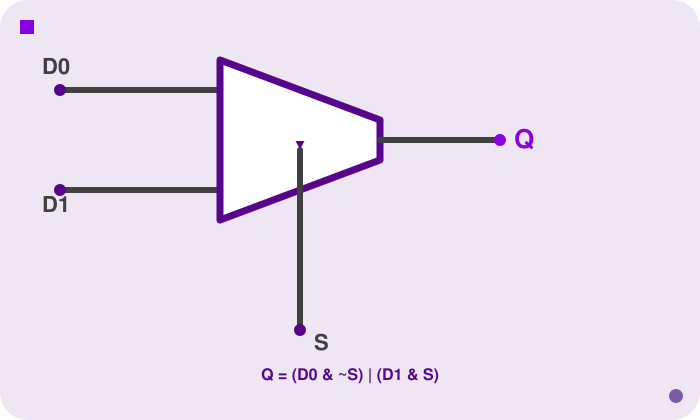
    </img>
</p>

<p align=center>
    <sub>
        <strong>Figure IV</strong>: A 2:1 multiplexer—the trapezoid is the standard mux symbol; the selector enters from below, deciding which of the two inputs reaches the output.
    </sub>
</p>

There are two ways `Q` ends up 1: either `S` is 0 and `D0` is 1, or `S` is 1 and `D1` is 1. That's the SOP form, read directly off the truth table:

```
Q = (D0 & ~S) | (D1 & S)
```

```verilog
module multiplexer2(D0, D1, S, Q);
    input  D0, D1, S;
    output Q;

    assign Q = (D0 & ~S) | (D1 & S);
endmodule
```

More idiomatically, Verilog has a **ternary operator**, `condition ? if_true : if_false`—the same one you already know from C or Python's `x if cond else y`, just reordered. It says the same thing as the SOP form above, more directly:

```verilog
module multiplexer2(D0, D1, S, Q);
    input  D0, D1, S;
    output Q;

    assign Q = S ? D1 : D0;
endmodule
```

Read `S ? D1 : D0` as "if `S`, then `D1`, else `D0`"—which is *exactly* the mux's job description, word for word. This is the version you'll actually write in practice.

A **4:1 mux** picks one of four inputs using a 2-bit selector (2 bits address 4 possibilities, same reasoning as any other binary encoding—`00`, `01`, `10`, `11`):

Notice the selector's width tracks the number of inputs, not the other way around. The 2:1 mux's selector `S` was a single wire because one bit is enough to distinguish two inputs. Here there are four inputs to choose between, and a single bit can only ever tell two things apart, so one bit is no longer enough—you need `S[1:0]`, a 2-bit bus, so that each of the four inputs gets its own code (`00`, `01`, `10`, `11`). Scale this up and the pattern holds: an 8:1 mux needs 3 selector bits (2³ = 8), a 16:1 mux needs 4, and in general an *n*:1 mux needs `log₂(n)` selector bits.

<a id="fg-5"></a>

<p align=center>
    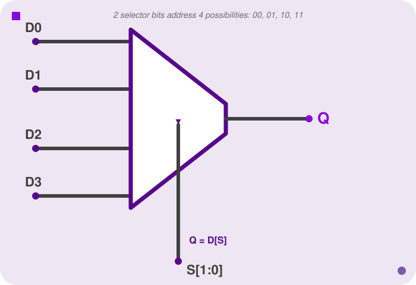
    </img>
</p>

<p align=center>
    <sub>
        <strong>Figure V</strong>: A 4:1 multiplexer—same trapezoid symbol as Figure IV, just four inputs and a 2-bit selector wide enough to address all of them.
    </sub>
</p>

You can chain ternaries to extend the idea:

```verilog
module multiplexer4(D0, D1, D2, D3, S, Q);
    input  D0, D1, D2, D3;
    input  [1:0] S;
    output Q;

    assign Q = (S==0) ? D0 : (S==1) ? D1 : (S==2) ? D2 : D3;
endmodule
```

Read this right-to-left as a fallback chain: "if `S` is 0, `D0`; otherwise, if `S` is 1, `D1`; otherwise, if `S` is 2, `D2`; otherwise (`S` must be 3), `D3`." Each `?:` is itself a tiny 2:1 mux—chaining them is literally building a bigger mux out of smaller ones, the same "compose small pieces into bigger circuits" idea as every other section in this lecture.

Or, if the four inputs are already packed into one 4-bit bus `D` (bus syntax from the [Verilog note](#2)), Verilog lets you index directly with the selector—no ternary chain required:

```verilog
module multiplexer4(D, S, Q);
    input  [3:0] D;
    input  [1:0] S;
    output Q;

    assign Q = D[S];
endmodule
```

`Q = D[S]` is the whole 4:1 mux—the selector isn't just choosing a branch anymore, it's literally an index into the bus. Two worked examples, same `D`, different `S`, to see the index actually move:

Fix `D = 4'b1011` for both. Written out with indices so the bits are easy to pick out: `D[3]=1`, `D[2]=0`, `D[1]=1`, `D[0]=1`.

- **Case A**: `S = 2'b10` (decimal 2). `Q = D[S] = D[2] = 0`.
- **Case B**: `S = 2'b11` (decimal 3). `Q = D[S] = D[3] = 1`.

Same `D`, different selector, different bit reaches `Q`—that's the mux doing its job. And it's the same four cases as the ternary chain above, just expressed as an array lookup instead of a fallback chain: `S` ranges over `00`, `01`, `10`, `11`, and `D[S]` always lands on the matching bit.

This is the pattern you'll see again the moment we start building processors: a register file's read port, an ALU's operation output, a datapath's next-PC value—all of them are "pick one of several signals based on a control input," which is to say, all of them are muxes.

<br>

<a id="7"></a>

## Subtracters

We have an adder, and we want subtraction too. Rather than design new hardware, we're gonna use the magic of two's complement: `A − B = A + (−B)`, and we already know how to compute `−B`—invert every bit, add 1 (that's [Section 0.3](#0-3), literally).

The clever part is *where* the "add 1" goes. Instead of a separate addition step, fold it into the adder's existing `Cin` input:

<a id="fg-6"></a>

<p align=center>
    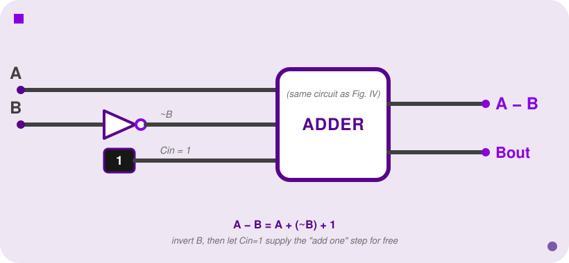
    </img>
</p>

<p align=center>
    <sub>
        <strong>Figure VI</strong>: A subtracter is an adder with <code>B</code> inverted and <code>Cin</code> tied to 1—no new arithmetic hardware, just different wiring of the adder from Figure II.
    </sub>
</p>

```
A − B = A + (~B) + 1
```

Run `B` through a bank of `NOT` gates (one per bit), feed the inverted bits into the adder's `B` input, tie `Cin` to 1, and the adder—unmodified—computes `A − B`. The "invert, add 1" you learned as a paper-and-pencil procedure at the top of the lecture is now sitting directly inside the circuit.

**Worked example:** 5 − 3, in 4-bit two's complement.

```
A = 5   = 0101
B = 3   = 0011
~B      = 1100      (invert every bit)
A + ~B + 1:
    0101
  + 1100
  + 0001
  ------
    0010   = 2   ✓  (5 − 3 = 2)
```

Same adder, same full-adder chain from [Ripple-Carry Adders](#5), just with `B`'s bits inverted first and `Cin` forced to 1 instead of 0.

```verilog
module subtracter(A, B, Diff, Bout);
    input  [3:0] A, B;
    output [3:0] Diff;
    output Bout;

    assign {Bout, Diff} = A + (~B) + 1;
endmodule
```

One new piece of syntax here: `{Bout, Diff}` uses **curly braces**, Verilog's **concatenation** operator—it glues signals together into one wider bus. `A + (~B) + 1` on a 4-bit input can produce a 5-bit result (4 result bits plus a possible carry/borrow out the top), so the left side needs to capture all 5 bits: `Bout` catches the extra top bit, `Diff` catches the remaining 4. Concatenation shows up constantly whenever a computation's result is wider than any single one of its operands.

`Bout` is nothing new, btw—it's literally the same carry-out wire the adder already had, just relabeled and reread. Feed it back into the worked example above: `A=5`, `B=3` produced a carry out of the top bit, so `Bout=1`. Read as a *borrow* flag instead of a carry flag, that carry-out means "`A ≥ B`, no borrow was needed"—which checks out, since 5 − 3 doesn't go negative. Had `B` been larger than `A`, that top-bit carry wouldn't have fired, `Bout` would come out 0, and that 0 is exactly the borrow-occurred signal on paper subtraction. So `Cout` and `Bout` are the same physical bit; only the *interpretation* flips once you're subtracting instead of adding.

<br>

<a id="8"></a>

## Comparators

Why build dedicated comparison hardware instead of just subtracting and eyeballing the result? Because "eyeballing" has to happen *somewhere*, in hardware, with no eyes involved—every `if`, every loop condition, every branch in a real program compiles down to exactly this circuit deciding whether to jump. Two comparison circuits fall out of what we already have, almost for free.

**Equality:** `A == B` exactly when every bit of `A` matches the corresponding bit of `B`. `A XOR B` is 0 wherever the bits match and 1 wherever they differ (straight out of the `XOR` truth table from Week I), so `A == B` exactly when *every* `XOR` output is 0—`NOR` them all together:

```verilog
assign Equal = ~(|(A ^ B));
```

Read this from the inside out. `A ^ B` is a bitwise XOR across the whole bus—one XOR gate per bit position, producing a bus of "did this position differ?" flags. The `|` in front of it here is a **reduction operator**, not the bitwise `OR` we've used everywhere else—`|(some_bus)` ORs together *every bit of that bus into a single bit*: "is at least one position different?" Finally, `~` inverts that single bit: "is *no* position different?"—which is exactly `A == B`.

**Worked example:** 
- `A = 0101`, `B = 0101`. 
- `A ^ B = 0000`. 
- Reduction-OR of `0000` is `0`. 
- Invert: `1`. 
- `Equal = 1`, correctly. 

Now `A = 0101`, `B = 0100`: 
- `A ^ B = 0001`, 
- reduction-OR is `1`, 
- invert is `0`—`Equal = 0`, 
- also correct, since they differ in the last bit.

**Less-than:** reuse the subtracter. `A < B` exactly when `A − B` is negative, which—since we're in two's complement—means exactly when the result's MSB is 1:

```verilog
wire [3:0] diff;
assign diff     = A + (~B) + 1;
assign LessThan = diff[3];   // the sign bit of A - B
```

(A fuller treatment also has to account for overflow corrupting the sign bit on edge cases—out of scope here, but good to know the sign-bit shortcut isn't the *entire* story once you leave this course.)

<br>

<a id="9"></a>

## Shifters

A **shifter** does exactly what it sounds like: it takes a binary value and slides every bit left or right by some number of positions, discarding whatever falls off one end and filling the gap that opens up on the other.

```
1011 shifted left by 1  → 0110   (each bit moves one place left, a 0 fills in on the right)
1011 shifted right by 1 → 0101   (each bit moves one place right, a 0 fills in on the left)
```

Why would a circuit need to move bits sideways instead of computing with them? Three real reasons, roughly in order of how often relevant they are: 
1. shifting is a fast way to multiply or divide by a power of two, without invoking the full adder machinery repeatedly the way ordinary multiplication would; 
2. it's how you extract or align a specific field out of a wider word—pulling one byte out of the middle of a 32-bit register, say; and 
3. it's a building block for things like rotating hashes and ciphers. 

For this course, the first reason is the one that matters practically—but keep the general shape in mind, "move these bits over" turns out to be a surprisingly common primitive.

That example above was specifically a **logical** shift: vacated positions filled with 0, regardless of direction. That's one of two flavours, and the difference matters. In Verilog, logical shift is `<<` (left) and `>>` (right):

```
1011 << 1 = 0110   (drop the MSB, shift in a 0 on the right)
1011 >> 1 = 0101   (drop the LSB, shift in a 0 on the left)
```

**Arithmetic shift** is only different on the right: instead of filling with 0, it fills with *copies of the sign bit*, so a two's complement number keeps its sign. Arithmetic left shift is identical to logical left shift; the distinction only exists on the right.

```
1011 (−5 in 4-bit two's complement) >>> 1 (arithmetic right) = 1101   (−3)
                                                                 ^ the sign bit (1) propagates in, not a 0
```

Compare that to what logical right shift would have done to the same bits: `1011 >> 1 = 0101` = **5**, a large *positive* number—wildly wrong if `1011` was meant to represent −5. Get this backwards on a signed value and you silently corrupt its sign—same category of bug as the truncation warning from [Two's Complement](#0-1). In Verilog, `>>` is logical and `>>>` is arithmetic (the operand also needs to be declared `signed` for `>>>` to behave as you'd expect—if you forget, Verilog treats it as unsigned and you get the logical behaviour anyway).

One catch worth knowing about that "fast division" use case from the top of this section: an arithmetic shift rounds toward negative infinity, not toward zero—another common gotcha if you were expecting C's truncating integer division. `−5 >>> 1 = −3`, not `−2`.

Wait, what? Well, −5 ÷ 2 is exactly −2.5, and there are two equally reasonable ways to turn that into an integer:

- **Truncate toward zero** (what C's `/` does): chop off the fractional part and keep whatever's left, so −2.5 becomes −2.
- **Round toward negative infinity** (what arithmetic shift does): always round *down* on the number line, so −2.5 becomes −3.

For positive numbers these two rules agree—5 ÷ 2 = 2.5 rounds to 2 either way, since "toward zero" and "toward negative infinity" point in the same direction. They only disagree once you cross zero, which is exactly why this bug hides so well: it works in every test case you wrote with positive numbers, then surreptitiously produces the wrong answer the first time a negative one shows up.

The shift itself doesn't "decide" to round this way on purpose—it's just a mechanical consequence of what shifting *is*. Walk the bits:

```
−5 in 4-bit two's complement = 1011

1011 >>> 1:
  shift every bit right by one, sign bit copies in on the left
  1011 → 1101

1101 = −3
```

There's no rounding logic anywhere in that circuit—just bits sliding over. The "round toward negative infinity" behaviour falls out for free from filling with the sign bit, the same way the sign-preservation itself did. If your code assumes `x >>> 1` is interchangeable with `x / 2` (or vice versa) and `x` can ever be negative, that assumption is wrong exactly on odd negative values—an off-by-one that only appears for a subset of your inputs, which is precisely the kind of bug that survives code review and shows up in production instead.

<br>

<a id="10"></a>

## Zero- and Sign-Extension

Here's a concrete version of the problem this section solves: a processor reads a single byte from memory—8 bits—but every register and every ALU input in the machine is 32 bits wide. You can't just drop those 8 bits into the wider slot and leave the rest as garbage; you need to fill the remaining 24 bits with *something* that preserves the original value's meaning. That padding is called **extension**, and it happens every time a smaller value has to interact with wider hardware, which in a real datapath is constantly.

Sometimes you need to widen a value from *n* bits to *m* bits (*m* > *n*) without changing what it means. There are two ways to pad the new bits, and picking the wrong one silently corrupts the value—same category of bug as the last two sections.

**Zero-extend:** pad with 0s on the left. Correct when the value is **unsigned**.

**Sign-extend:** pad with copies of the sign bit (the MSB) on the left. Correct when the value is **two's complement (signed)**.

| 3-bit input | Zero-extend to 8 bits | Sign-extend to 8 bits |
|---|---|---|
| `011` (unsigned 3, signed 3) | `00000011` (= 3 ✓) | `00000011` (= 3 ✓) |
| `111` (unsigned 7, signed −1) | `00000111` (= 7, correct **only if unsigned**) | `11111111` (= −1, correct **only if signed**) |

When the MSB is 0, both methods agree—there's nothing to get wrong. The bug shows up exactly when the MSB is 1: zero-extending a negative two's complement number turns it into a large positive unsigned one, silently.

```verilog
module zero_extend_3_to_8(a, b);
    input  [2:0] a;
    output [7:0] b;

    assign b = {5'b0, a};
endmodule

module sign_extend_3_to_8(a, b);
    input  [2:0] a;
    output [7:0] b;

    assign b = {{5{a[2]}}, a};   // replicate the sign bit (a[2]) 5 times
endmodule
```

`{5'b0, a}` is the concatenation syntax from the Subtracters section: glue a 5-bit constant `0` in front of `a`. `{{5{a[2]}}, a}` looks scarier but is the same idea with one extra trick—`{5{a[2]}}` is Verilog's **replication** syntax, "repeat the single bit `a[2]` five times," which produces a 5-bit value that's either `00000` or `11111` depending on whether the sign bit is 0 or 1. That replicated value is then concatenated in front of `a`, exactly like the zero-extend case, except the padding is copies of the sign bit instead of a hardcoded 0.

If you know the input is two's complement, use sign-extend. If you know it's unsigned, use zero-extend. If you're not sure which, that uncertainty is itself the bug.

<br>

<a id="11"></a>

## The ALU

We now have a small toolbox: adder, subtracter, comparator, shifter, plus the `AND`/`OR` gates from Week I. An **Arithmetic Logic Unit (ALU)** is all of them combined into a single circuit, with an opcode input selecting which operation is active—which is to say, an ALU is a bunch of circuits in parallel feeding a multiplexer, using exactly the ternary-chain idea from [Multiplexers](#6).

<a id="fg-7"></a>

<p align=center>
    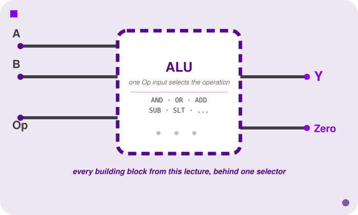
    </img>
</p>

<p align=center>
    <sub>
        <strong>Figure VII</strong>: An ALU as an opaque module (same convention as <a href="/lectures/03-verilog#fg-1">the Verilog module figure</a>)—every circuit from this lecture becomes one selectable operation behind a single <code>Op</code> input.
    </sub>
</p>

```verilog
module alu(A, B, Op, Y, Zero);
    input  [3:0] A, B;
    input  [2:0] Op;
    output [3:0] Y;
    output Zero;

    assign Y = (Op == 3'b000) ? (A & B)          :  // AND
               (Op == 3'b001) ? (A | B)          :  // OR
               (Op == 3'b010) ? (A + B)          :  // ADD
               (Op == 3'b110) ? (A + (~B) + 1)   :  // SUB
               (Op == 3'b111) ? {3'b0, (A + (~B) + 1) < 0} : // SLT
               4'b0;

    assign Zero = (Y == 0);
endmodule
```

This is the 4:1-mux ternary chain from earlier, just with five branches instead of four, and each branch is an entire circuit from this lecture instead of a single wire: `AND`/`OR` from Week I, `ADD` from [The Full Adder](#4), `SUB` from [Subtracters](#7), and `SLT` ("set less than") from [Comparators](#8). Nothing here is new arithmetic—`Op` is purely a selector, choosing which already-built circuit's output reaches `Y`.

**Worked trace:** Suppose `Op = 3'b010` (ADD), `A = 4'b0011` (3), `B = 4'b0001` (1). The ternary chain checks each condition in order:

- `Op == 3'b000`? No.
- `Op == 3'b001`? No.
- `Op == 3'b010`? Yes—so `Y = A + B = 4'b0100` (4), and the chain stops evaluating; the remaining branches are irrelevant for this `Op`.

`Zero = (Y == 0) = (4'b0100 == 0) = 0`.

`Zero` is itself a small comparator ("is the output all 0s?")—used constantly in real processors to implement conditional branches (`if a == b`, under the hood, is usually "subtract, then check `Zero`," reusing the `SUB` branch you just traced through instead of building a separate equality circuit).

**Don't memorise the specific `Op` bit patterns above as if they're fixed**—this is an illustrative ALU, not *the* ALU. The actual encoding for the E15 and E20 processors comes later in the course and won't necessarily match this table. What's worth taking away is the *shape*: one opcode input, a handful of circuits you already understand, a mux choosing between them.

This exact idea—one ALU, selectable operations, a `Zero` flag—is what we'll extend into a real instruction set when we get to the E15 and E20 processors. Everything in this lecture was building toward this box.

<br>

<a id="12"></a>

## Bitwise Operations

Thus far, we've been thinking about gates operating on individual 0s and 1s. But a real program works with _integers_—that is, 32-bit values, 64-bit values, bytes. How do the gate operations we've been studying apply to those?

The answer is a super cute set of operations (and one of the biggest flexes you can pull during programming interviews): **bitwise operations**. That is, applying a Boolean gate independently to a pair of corresponding bits across two integers, with zero interaction between positions.

The latter means that, unlike addition and subtraction, there's no carry, no propagation—each bit column is computed entirely on its own, exactly as if it were a separate single-bit gate. The result is that you can apply AND, OR, XOR, and NOT to whole integers in a single CPU instruction.

This is also different from logical operations like `&&` and `||` in C, which treat any nonzero value as a single "true" and return either 0 or 1 (e.g. in Python, `1`, `True`, and `"Hello"` are all considered to be `True` statements). Bitwise operations work on the raw bit pattern of a value, position by position, giving you precise control over individual bits.

In C: `&` is bitwise AND, `|` is bitwise OR, `^` is bitwise XOR, `~` is bitwise NOT. Do _not_ confuse these with `&&`, `||`, and `!`, please.

<a id="12-1"></a>

### Bitwise AND (`&`)

Fairly straight forward here. For each bit position, the result is 1 if and only if **both** input bits at that position are 1.

**Example: `10 & 6`**

```
  10  →  1 0 1 0
   6  →  0 1 1 0
         ───────
  &      0 0 1 0  →  2
```

`10 & 6 == 2`. The only position where both inputs had a 1 was position 1 (the 2s place).

<a id="fg-8"></a>

<p align=center>
    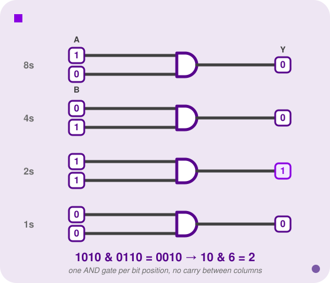
    </img>
</p>

<p align=center>
    <sub>
        <strong>Figure VIII</strong>: Bitwise AND as four independent single-bit AND gates, one per column—the same gate from Lecture 01, just applied position by position with no interaction between columns.
    </sub>
</p>

AND is the standard **masking** tool. If you want to isolate specific bits of a value and zero out everything else, AND the value against a pattern—called a **mask**—that has 1s exactly where you want to look and 0s everywhere else. The AND gate passes through the bits under the 1s and zeros out everything else.

This was pretty relevant not too long ago. The Game Boy joypad register at `$FF00` (`rJOYP`) returns all four button states for the selected group at once, packed into the low nibble. To test just one button, real game code does `AND a, JOYP_DOWN`, masking away every bit except the one you care about. This is the exact same masking pattern I use in [PONG.gb](https://github.com/sebastianromerocruz/PONG.gb) to move the paddle—`AND a, JOYP_DOWN` and `AND a, JOYP_UP` are what actually drive it up and down—applied inside the game loop that runs sixty times a second.

<a id="fg-9"></a>

<p align=center>
    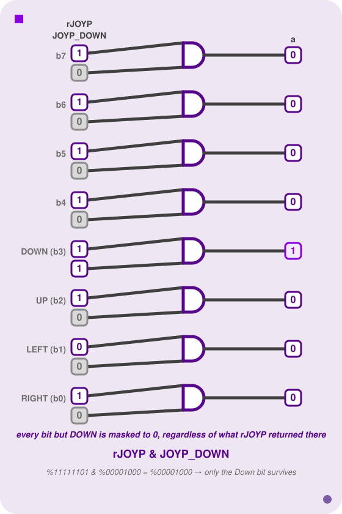
    </img>
</p>

<p align=center>
    <sub>
        <strong>Figure IX</strong>: Masking <code>rJOYP</code> against <code>JOYP_DOWN</code>—one AND gate per bit, same as any other bitwise AND, just with button names instead of place values.
    </sub>
</p>

<a id="12-2"></a>

### Bitwise OR (`|`)

For each bit position, the result is 1 if **either** input bit at that position is 1.

**Example: `10 | 6`**

```
  10  →  1 0 1 0
   6  →  0 1 1 0
         ───────
  |      1 1 1 0  →  14
```

`10 | 6 == 14`. Where AND clears bits, OR **sets** them. OR-ing a value against a mask turns on every bit that is 1 in the mask while leaving all other bits unchanged. This is how you force specific bits on without touching the rest.

<a id="fg-10"></a>

<p align=center>
    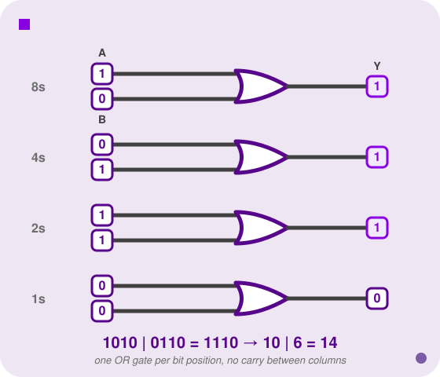
    </img>
</p>

<p align=center>
    <sub>
        <strong>Figure X</strong>: Bitwise OR as four independent single-bit OR gates, one per column.
    </sub>
</p>

<a id="12-3"></a>

### Bitwise XOR (`^`)

For each bit position, the result is 1 if the two input bits **differ**—one 1 and one 0, in either order. Two matching bits, whether `0, 0` or `1, 1`, produce 0.

**Example: `10 ^ 6`**

```
  10  →  1 0 1 0
   6  →  0 1 1 0
         ───────
  ^      1 1 0 0  →  12
```

`10 ^ 6 == 12`. Notice the gate itself is drawn just like OR, with one extra curved line at the inputs—that's not decoration, it's a reminder that XOR agrees with OR everywhere *except* the case where both inputs are 1, where OR says 1 and XOR says 0.

<a id="fg-11"></a>

<p align=center>
    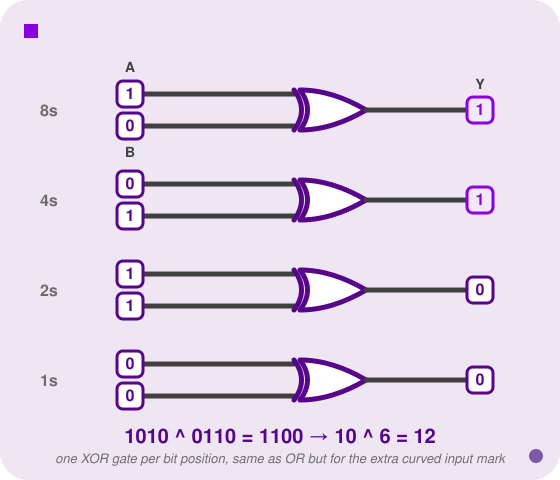
    </img>
</p>

<p align=center>
    <sub>
        <strong>Figure XI</strong>: Bitwise XOR as four independent single-bit XOR gates, one per column—identical to OR except where both inputs are 1.
    </sub>
</p>

XOR has two properties that come up constantly enough to be worth stating outright:

- **`x ^ x == 0`, always.** Anything XORed with itself cancels to zero, bit for bit, no matter what `x` is. This is the classic (if slightly overused) "swap two variables without a temp" trick, and it's also why `x ^ x` is sometimes used as a fast way to zero a register in assembly.
- **XOR is its own inverse.** If `Y = A ^ B`, then `A = Y ^ B` and `B = Y ^ A`. XOR-ing twice with the same value gets you back where you started—`(x ^ mask) ^ mask == x`. This is what makes XOR the natural tool for *toggling* a bit: apply the same mask again, and you flip it right back.

> **Game Boy:** Sprite-flipping on the Game Boy doesn't touch the tile data at all—it just flips the OAM attribute byte's bit 5 (X-flip) or bit 6 (Y-flip) with a `1`-mask XOR, `LD A, [attr] / XOR %00100000 / LD [attr], A`. The PPU reads that bit at draw time and mirrors the tile on the fly. Same idea as the toggle pattern below, just with the SM83's `XOR` instruction instead of C's `^`.

<a id="12-4"></a>

### Bitwise NOT (`~`)

Flips every bit: 0 becomes 1, 1 becomes 0.

**Example: `~6` as a 4-bit unsigned value**

```
   6  →  0 1 1 0
         ───────
  ~      1 0 0 1  →  9
```

There's an important caveat: `~` flips *all* bits in the integer, so the result depends entirely on the bit-width of the type. In C, `int` is typically 32 bits, so `~6` flips all 32 bits—and combined with two's complement, `~x == -(x+1)` for signed integers. `~6` in C is `-7`, not `9`. Keep bit-width in mind whenever you use `~`.

<a id="fg-12"></a>

<p align=center>
    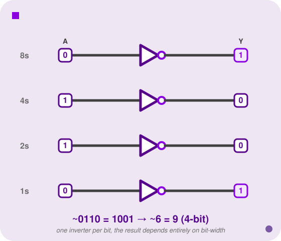
    </img>
</p>

<p align=center>
    <sub>
        <strong>Figure XII</strong>: Bitwise NOT as four independent inverters, one per bit—flip every column and there is nowhere for a "narrower" result to hide, which is why the answer depends entirely on how many bits you started with.
    </sub>
</p>

---

### Practical Applications

These aren't just abstract exercises. The patterns below come up constantly in systems code—in memory allocators, device drivers, hardware register programming, network packet parsing. If you write C close to the hardware, you will write these patterns.

Before the examples, here's the cheat sheet they all boil down to—one row per operator, read as "OP-ing a bit against 1 does *this*, OP-ing it against 0 does *that*":

| Operator | Against `1` | Against `0` |
|----------|--------------|--------------|
| `&` (AND) | leaves the bit alone | **clears** it to 0 |
| `\|` (OR)  | **sets** it to 1     | leaves the bit alone |
| `^` (XOR) | **toggles** it       | leaves the bit alone |

Read down a column and the pattern jumps out: AND and OR each have exactly one masking value (`0` for AND, `1` for OR) and one pass-through value; XOR has no "clear" or "set" value at all, only "flip" (`1`) or "pass-through" (`0`)—which is exactly why XOR is the tool for toggling and the other two aren't.

**Is a number odd or even?**

In binary, the least-significant bit (the 2⁰ place, also called the **LSB**) fully determines parity. An odd number always ends in 1; an even number always ends in 0—because "even" means divisible by 2, and the only bit that contributes the factor of 2¹ or higher is not the last one. We test the LSB by masking with `1`:

```c
bool is_odd(int x) {
    return (x & 1) == 1;
}
```

The parentheses around `x & 1` are essential. In C, `==` has *higher* precedence than `&`, so `x & 1 == 1` parses as `x & (1 == 1)`, which reduces to `x & 1`—accidentally correct here, but wrong in general and confusing always. Parenthesise bitwise sub-expressions explicitly.

**Round down to the nearest multiple of four:**

Any multiple of 4 in binary ends in `...00`—its two least-significant bits are always zero, because 4 = 100₂. To force any integer down to the nearest multiple of 4, we need to zero out its two LSBs while leaving everything else intact. The mask we want has 1s everywhere *except* the last two positions. Since 3 = `...000011`, its bitwise complement is `~3 = ...111100`, which is exactly that mask:

```c
int align_to_4(int x) {
    return x & ~3;
}
```

**Verification** (using 6 bits for clarity):

```
align_to_4(10):  001010 & ~(000011)  =  001010 & 111100  =  001000  =   8
align_to_4(20):  010100 & ~(000011)  =  010100 & 111100  =  010100  =  20
```

For 10 (binary `001010`), the two LSBs `10` get zeroed, giving `001000` = 8. For 20 (binary `010100`), the two LSBs are already `00`, so the value is unchanged.

<a id="fg-13"></a>

<p align=center>
    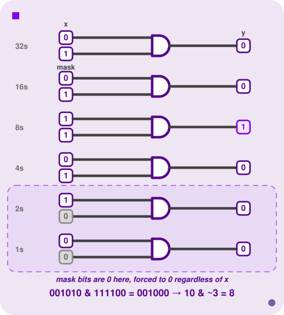
    </img>
</p>

<p align=center>
    <sub>
        <strong>Figure XIII</strong>: <code>align_to_4(10)</code> as a bit-lane AND against the mask <code>~3</code>—wherever the mask has a 0, the output is forced to 0 no matter what <code>x</code> was.
    </sub>
</p>

The general pattern `x & ~(n-1)` aligns `x` down to the nearest multiple of any power-of-two `n`. You will see this in memory allocators, hardware register setup, and cache-line alignment—anywhere a structure needs to start on a boundary that the hardware requires.

**Turn a specific bit on:**

Say you want bit 2 (the 4s place—the *third* bit, counting the LSB as the first) forced to 1, no matter what it currently is, without disturbing any other bit. AND can only clear bits and leave others alone—it can never *set* one. OR is the tool for this: OR the value against a mask that has a 1 in exactly the position you want turned on, and 0s everywhere else. Wherever the mask is 0, OR leaves the original bit untouched; wherever the mask is 1, OR forces a 1.

```c
unsigned int flip_on_bit_2(unsigned int x) {
    return x | (1 << 2);
}
```

`flip_on_bit_2(90)` should give `94`, and `flip_on_bit_2(45)` should give back `45` unchanged, since bit 2 is already 1 there:

```
flip_on_bit_2(90):  01011010 | 00000100  =  01011110  =  94
flip_on_bit_2(45):  00101101 | 00000100  =  00101101  =  45
```

The general pattern `x | (1 << k)` sets bit `k` and leaves every other bit exactly as it was.

**Toggle a specific bit:**

Now say you want bit `k` flipped—on if it was off, off if it was on—and you don't know or care which it currently is. Neither AND nor OR can do this: both have a value that always wins (`0` for AND, `1` for OR), which is precisely what makes them unsuitable for a flip. XOR against `1` is a flip regardless of the starting bit, which is exactly `x ^ x == 0` and its inverse property from [the XOR section](#12-3) put to work:

```c
unsigned int toggle_bit(unsigned int x, int k) {
    return x ^ (1 << k);
}
```

This is the same one-line idiom the Game Boy's `XOR` instruction uses for sprite-flipping, [mentioned above](#12-3)—just spelled `^` instead of `XOR`.

<br>

<a id="13"></a>

## Adders on Real Hardware

Every time [PONG.gb](https://github.com/sebastianromerocruz/PONG.gb)'s ball moves, an adder—somewhere inside the SM83's ALU—does the work. `UpdateBall` does this every single frame:

```asm
ld a, [wYBallDir]
ld b, a
ld a, [wYBall]
add a, b            ; wYBall = wYBall + wYBallDir
ld [wYBall], a
```

`add a, b` is a single instruction, but underneath it is exactly the circuit from this lecture: an 8-bit adder—built, at the gate level, from full adders chained the way [Ripple-Carry Adders](#5) shows. And notice what it's adding: `wYBallDir` is `1` or `−1`, in two's complement, from [the very start of this lecture](#0). Nobody special-cased the subtraction. The same adder that increments the ball's position also decrements it, with zero additional logic—which was the entire point of two's complement in the first place, now made concrete.

Put the two halves of this lecture side by side: `FlipY` *encodes* a negative number (invert, add 1—[Section 0.3](#0-3)), and `UpdateBall` *consumes* one (feed it into an adder that doesn't know or care that it's negative). One circuit, built from gates you understood in Week I, doing every addition and subtraction sixty times a second on real hardware.

<br>

<a id="14"></a>

## Appendix: Deriving the Two's Complement Trick

Back in [But Why Tho?](#0-2), we asserted that `3 + (−3)` wraps to `0000` in 4-bit two's complement and left it there. Here's the actual derivation from "what do we need" down to "why does inverting bits and adding 1 give us that."

**Step 1—what value do we actually need?** Forget the word "negative" for a second and ask a narrower question: what *unsigned* bit pattern, added to `3`, produces a sum that equals to `0` in a 4-bit register? Well, a 4-bit register can only hold `0` through `15`; anything that lands on `16` overflows and the top bit is discarded, leaving `0` behind. So we need:

```
3 + (unsigned value representing −3) = 16 = 2⁴

⟹ (unsigned value representing −3) = 16 − 3 = 13
```

Sure enough, `13 = 1101`—the exact bit pattern we called `−3` in [Fixed Bit-Width](#0-1). That's not a coincidence I'm asking you to accept on faith: `1101` was *defined* to be `−3` precisely because `3 + 13 = 16`, and 16 is exactly the number that vanishes when a 4-bit adder throws away its overflow bit. Generalise this and you get the actual definition of two's complement: the bit pattern for `−x` in *n* bits is whatever pattern represents the unsigned value `2ⁿ − x`.

**Step 2—does "invert the bits" get us there?** Take `x = 3 = 0011` and flip every bit: `1100 = 12`. Add the original and the flipped version together, column by column: every single column pairs a bit with its own opposite, and a bit XOR'd with its opposite is always `1`. So flipping *all* the bits of any *n*-bit number `x` and adding it to `x` always produces an all-1s result—`2ⁿ − 1`:

```
x + flip(x) = 2ⁿ − 1 (every column is a 1, i.e. the all-1s pattern)

⟹ flip(x) = (2ⁿ − 1) − x
```

Check it: `3 + 12 = 15 = 2⁴ − 1`. Confirmed.

**Step 3—fix the off-by-one error.** `flip(x)` gives `(2ⁿ − 1) − x`, but Step 1 said we need `2ⁿ − x`—one more than what flipping alone provides. So add 1:

```
flip(x) + 1 = (2ⁿ − 1 − x) + 1 = 2ⁿ − x
```

Which is exactly the value Step 1 derived. **This is why "invert, add 1" works**—it isn't a mnemonic someone made up, it's the only correction that patches flipping's built-in shortfall. Walk it through with the numbers: `flip(3) + 1 = 12 + 1 = 13`, and `13` is exactly the `2⁴ − 3` we needed.

**Step 4—why does this generalise beyond `x + (−x)`?** Nothing above was special to adding a number to its own negation. Suppose `a` is an ordinary positive value and `b`'s bit pattern is the two's complement encoding of `−c` (so `b`'s *unsigned* value is `2ⁿ − c`). Unsigned addition—the only kind the hardware knows how to do—computes:

```
a + b = a + (2ⁿ − c) = 2ⁿ + (a − c)
```

Discard the overflow bit (i.e. work mod `2ⁿ`, exactly what a fixed-width adder does automatically) and you're left with `a − c`—the correct signed result, whether it's positive or negative, and the adder never once inspected a sign bit to get there. The same `mod 2ⁿ` truncation that looked like a *bug* back in [Fixed Bit-Width](#0-1) is precisely the mechanism that makes two's complement addition correct. That's the whole reason this trick is universal instead of just convenient.

<br>

<sub>**Previous: [Introduction & Logic Gates](/lectures/01-gates)** || **Next: [Verilog](/lectures/03-verilog)**</sub>
