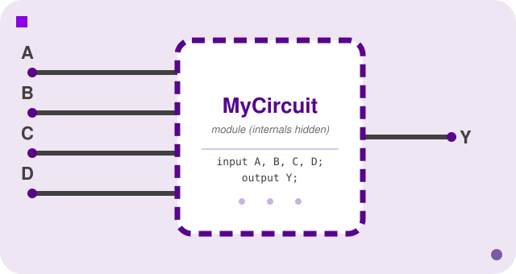
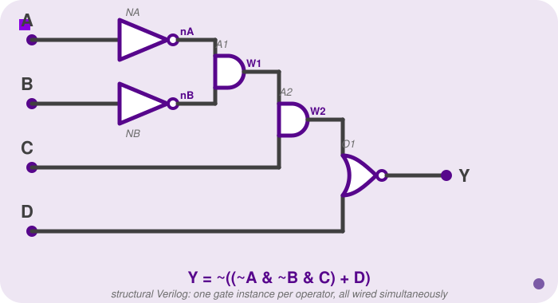
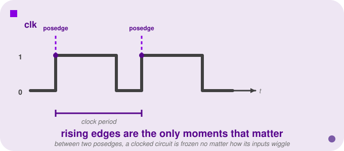
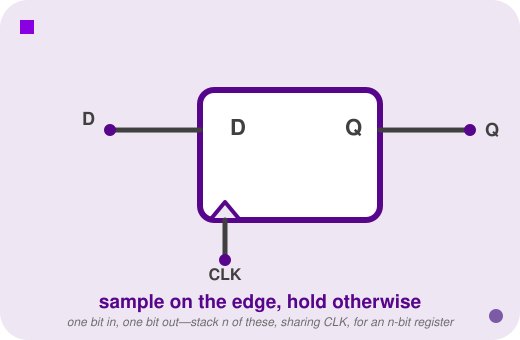
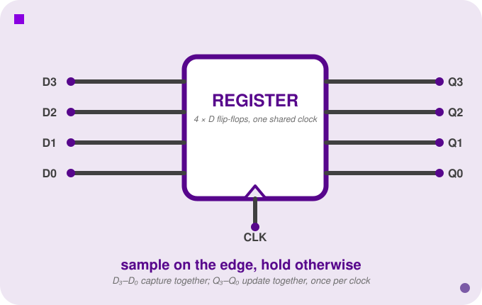
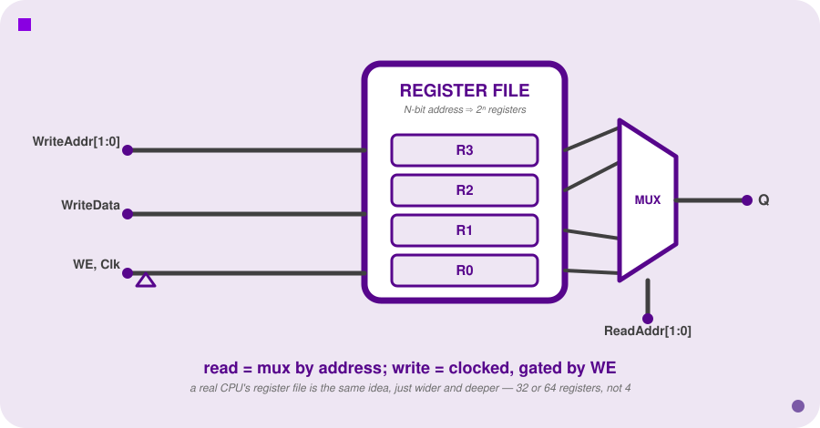
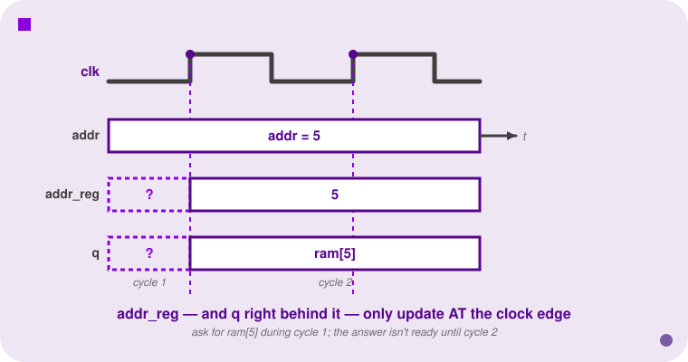

<h2 align=center>Week II & III</h2>

<h1 align=center>Verilog</h1>

<p align=center><strong><em>Song of the day</strong>: <a href="https://youtu.be/tbxXSIBL8S4"><strong><u>Surfin' Boy (Flamingosis Remix)</u></strong></a> by Red Velvet (2026)</em></p>

---

## Sections

1. [**Hardware Description: Verilog**](#1)
    1. [**Structural Verilog**](#1-1)
    2. [**Continuous Assignment Verilog**](#1-2)
    3. [**Synthesis**](#1-3)
2. [**Why Computers Need Memory**](#2)
    1. [**The Clock**](#2-1)
    2. [**Registers**](#2-2)
3. [**Sequential Verilog**](#3)
    1. [**Declaring and Updating Registers**](#3-1)
    2. [**Blocking vs. Non-Blocking Assignment**](#3-2)
    3. [**Register Files and Memory Arrays**](#3-3)

---

Last time we built adders, subtracters, comparators, and eventually an entire ALU—and along the way, you already saw fragments of Verilog, just enough to make sense of a `module` header or an `assign` statement written as a big ternary chain. But we never stopped to learn the language itself: what a module actually *is*, why hardware description code doesn't "run" the way your Python or Java does, or what your actual options are for describing a circuit. Once that's settled, we push further: everything we've built so far is combinational—feed it inputs, get an output, instantly and statelessly—which is enough for an ALU but not enough for a computer, because a computer has to *remember* things. This lecture covers both halves: Verilog properly taught, and the sequential logic (memory, registers, a clock) that turns a pile of combinational circuits into something that can execute a program.

---

<a id="1"></a>

## Hardware Description: Verilog

Hardware engineers don't design chips by drawing schematics by hand and mailing them to a fabrication plant (although we would certainly design with way more intention that way). They write code—but it's a fundamentally different kind of code than anything you've written before (sorry).

Imperative languages, like C or Python or Java, describe a *sequence of steps that happen over time*: do this, then do that, then loop back (hence the Latin root _'imperāre'_, to order someone to do something). A hardware description language does something else entirely: it specifies *what components exist and how they're connected*. There's no "do this _and then_." Everything in the description exists simultaneously, just as physical gates on a chip all exist at the same time.

**Verilog** is one of the two dominant hardware description languages in industry (the other is VHDL). It looks a lot like C, syntactically, which is itself a kind of trap—the syntax is similar but the _modus operandi_ is completely different. When you write Verilog, you are not writing a program that "runs" in the 1114 sense of the word. You are, instead, writing a specification of a circuit that will be built.

We'll use our running example from last lecture—the circuit that computed `Y = ~((~A & ~B & C) + D)`, which we simplified down to `Y = AD̄ + BD̄ + C̄D̄`—to show both ways of writing Verilog.

<br>

<a id="1-1"></a>

### Structural Verilog

**Structural** Verilog is the style that most directly mirrors a circuit diagram: 
- Every gate is explicitly instantiated by name,
- Every internal wire is declared, and
- The connections between them are spelled out one by one. 

If you can read a schematic, you can write structural Verilog from it mechanically.

The fundamental unit of organisation in Verilog is a **module** (kind of like a class in Java): a self-contained component with defined inputs and outputs (i.e. an interface) to the outside world. Think of it the way you think of a function in software—a black box whose internals are hidden from its callers—except that in hardware, many modules can be "running" at the same time, and they're always on. If you've ever dealth with Arduino, you might be making a connection here.

```verilog
module MyCircuit(A, B, C, D, Y);
    input  A, B, C, D;
    output Y;
```

The name after `module` is the module's identifier. The parenthesised list is the **port list**—every signal that crosses the module boundary must appear here. The `input` and `output` declarations specify which direction each signal flows.

<a id="fg-1"></a>

<p align=center>
    
    </img>
</p>

<p align=center>
    <sub>
        <strong>Figure I</strong>: A module as an opaque boundary—the port list (A, B, C, D in, Y out) is the only thing callers ever see; the gates that implement it are hidden inside.
    </sub>
</p>

Internal wires—signals that exist only inside the module to carry values between gates—must be declared explicitly:

```verilog
    wire W1, W2;
```

Then we instantiate the gates. The general syntax for that is:

```
gate_type  instance_name ( output_port, input_port1, input_port2, ... );
```

The **first** argument is always the output; the rest are inputs in order. 

Crucially, the order of these instantiation statements doesn't matter—all gates coexist simultaneously in the final circuit, just as they would on a chip.

Because our circuit inverts `A` and `B` before feeding them into the first `AND`, we need explicit `not` gate instances for those two signals. The final gate is a `NOR`—Verilog has that as a built-in primitive too, so `D` never needs its own inverter; the `nor` instance negates the sum of `W2` and `D` in one step:

```verilog
    not NA (nA, A);            // nA = ~A
    not NB (nB, B);             // nB = ~B
    and A1 (W1, nA, nB);        // W1 = ~A & ~B
    and A2 (W2, W1,  C);        // W2 = W1 & C  =  ~A & ~B & C
    nor O1 (Y,  W2, D);         // Y  = ~(W2 + D)
endmodule
```

<a id="fg-2"></a>

<p align=center>
    
    </img>
</p>

<p align=center>
    <sub>
        <strong>Figure II</strong>: The circuit as structural Verilog builds it, gate by gate—<code>NA</code>/<code>NB</code> invert <code>A</code> and <code>B</code>, <code>A1</code>/<code>A2</code> chain the ANDs into <code>W1</code>/<code>W2</code>, and <code>O1</code>'s <code>NOR</code> combines <code>W2</code> and <code>D</code> in one gate.
    </sub>
</p>

Structural Verilog is lovely and precise, but as you can imagine, it doesn't scale well at all. A circuit of even twice the complexity of ours is already an error-prone nightmare. We something that can, instead, take logic expression (combinational logic) directly without us having to specify how to wire it up.

---

<a id="1-2"></a>

### Continuous Assignment Verilog

It's worth explaining a few things about the term "combinational," because it marks an important conceptual turning point:
- **A combinational circuit is _stateless_**: given the same inputs, it always produces the same output, with no memory of what came before. This is the kind of logic we've been studying.
- **The alternative is _sequential_ logic**: circuits like light switches and registers that _do_ have internal state, whose output depends on both the current inputs _and_ the current state of our switches/registers. 

We'll cover sequential circuits properly [later in this lecture](#2). For now, everything we're building is combinational.

For combinational logic, **continuous assignment** lets us express the function almost directly as a Boolean equation:

```verilog
module MyCircuit(A, B, C, D, Y);
    input  A, B, C, D;
    output Y;

    assign Y = ~((~A & ~B & C) + D);
endmodule
```

Boom, done, that's it.

The `assign` statement basically means: 

> _"`Y` is continuously driven by the value of the expression `~((~A & ~B & C) + D)`."_ 

Whenever any input changes, Y immediately re-evaluates, which better matches the non-imperative programming model we described earlier. The output tracks the inputs at all times (though, of course, irl gates have small propagation delays that matter when you push clock frequencies high enough; more on that later in the semester).

Both versions of `MyCircuit` describe the same exact circuit and produce equivalent hardware. The translation from Boolean notation to Verilog operators is direct:

| Boolean | Verilog |
|---------|---------|
| `Ā`     | `~A`    |
| `AB`    | `A & B` |
| `A + B` | `A \| B`|
| `A ⊕ B` | `A ^ B` |

One more thing about these operators: they aren't limited to single wires. Applied to multi-bit values, each one works **bit by bit**, pairing up the bits in the same position:

```
  4'b1100          4'b1100          4'b1100
& 4'b1010        | 4'b1010        ^ 4'b1010        ~ 4'b1010
---------        ---------        ---------        ---------
  4'b1000          4'b1110          4'b0110          4'b0101
```

So `state | A` on two 4-bit values is four separate OR gates side by side, one per bit position, and `~` flips every bit. You'll see this constantly whenever a register needs to be combined with a mask or a constant.

Operator precedence in Verilog follows C and Python: `~` binds tightest, then `&`, then `^`, then `|`. This matches Boolean precedence (NOT > AND > OR), so expressions translate directly—but, as always, I'd parenthesise explicitly anyway. Silent precedence errors are a pain to find.

Your module declarations should follow this pattern:

```verilog
module module_name (port1, port2, ...);
    input  /* input ports */;
    output /* output ports */;
    wire   /* internal wires, if any */;

    assign output = /* expression */;
endmodule
```

---

<a id="1-3"></a>

### Synthesis

A small note about Verilog, and how it's actually translated into sillicon. Writing correct Verilog is basically your only job. Making it efficient is what a synthesis tool's in turn does.

A **synthesis** tool takes your Verilog description and produces a **netlist**: a lower-level description of the circuit in terms of primitive gates or, for programmable devices, [**lookup tables**](https://en.wikipedia.org/wiki/Lookup_table). This netlist is what gets sent to a manufacturer or loaded onto an [**FPGA**](https://en.wikipedia.org/wiki/Field-programmable_gate_array) (i.e. an integrated circuit). 

A popular open-source synthesis framework is **Yosys**:

```
[Verilog source] ---> [ yosys ] ---> [gate-level netlist + diagram]
```

Two things are worth knowing about what synthesis does:
1. Both Verilog styles—structural and continuous assignment—produce equivalent netlists. The two are literally interchangeable; the choice between them is a matter of readability, not of what hardware gets built.

2. Synthesis tools may **optimise** your circuit. It might reorder gates, merge them, or eliminate redundant logic in ways that preserve the truth table while using fewer transistors. This process is called **logic minimisation**. 

We should take great confort in this. Don't stay up intil five in the morning writing pristine Verilog. Write the correct Boolean function clearly, and trust the tool to find an efficient realisation. 

A correct description that the tool optimises is far better than a hand-optimised description with a two-hours-of-sleep bug.

---

<a id="2"></a>

## Why Computers Need Memory

Everything we've built so far—adders, muxes, the ALU—is combinational: feed it inputs, and it produces an output, instantly and statelessly. An adder doesn't remember the last thing it added. A multiplexer doesn't know what it selected a moment ago. This is enough to build an ALU, but it is not enough to build a computer—because a computer has to remember things. It has to know which instruction it's on. It has to hold the running total of a loop. It has to keep a value around after the inputs that produced it have changed. None of that is possible with circuits that only know "now." This section gives our circuits a past.

Picture a circuit whose job is to sum a stream of numbers, one at a time: it sees 0, then 5, then 25, then −11, and is supposed to output the running total after each one—0, 5, 30, 19. The moment you try to draw this as a combinational circuit, you hit a wall. The output after seeing 25 depends on what came before (5), but a combinational circuit has no "before"—its output is a pure function of its current input, full stop. To track a running sum, the circuit needs to hold onto the value 5 from one moment and bring it forward to combine with 25 at the next. That's not computation in the usual sense. That's *memory*.

Building this machine raises four concrete questions, and answering them is essentially the whole of sequential logic: How do you set the running total's initial value? How does the circuit know exactly when a new input has arrived, as opposed to continuously re-reading a value that hasn't changed? How does it physically hold the running total between inputs? And how do you write any of this down in Verilog? The answers, respectively: a **Reset** signal, a **Clock** signal, a **register**, and the `always @(posedge clk)` construct.

<a id="2-1"></a>

### The Clock

A clock is a signal that flips between 0 and 1 at a steady, repeating rate—the *clock frequency*. The instant it flips from 0 to 1 is called a **rising edge** (or *posedge*); the reverse transition is a **falling edge**. In this course, nearly everything sequential is triggered on the rising edge.

```
Value of clk
1            ┌─────┐     ┌─────┐
             │     │     │     │
0  ──────────┘     └─────┘     └──────
             ↑           ↑
        rising edge  rising edge
             └─── clock period ───┘
```

The clock turns continuous time into discrete *steps*. Between rising edges, nothing in a clocked circuit changes—no matter how much its inputs wiggle around. All the action is concentrated into instantaneous events at clock ticks. This is the foundation everything else in this unit rests on: a sequential circuit doesn't react continuously like a combinational one; it reacts *at moments*, on schedule.

<a id="fg-3"></a>

<p align=center>
    
    </img>
</p>

<p align=center>
    <sub>
        <strong>Figure III</strong>: the clock signal as two full periods, with each posedge marked—everything sequential in this unit is triggered at exactly these instants and nowhere else.
    </sub>
</p>

<a id="2-2"></a>

### Registers

A **register** is a component that, at the instant of a clock edge, captures whatever value is currently on its input (`D`) and holds it steady on its output (`Q`) until the *next* edge. Its physical implementation is called a **D flip-flop**—you don't need to know how a flip-flop is built out of gates (that's a question for Digital Logic), only how it behaves: sample on the edge, hold otherwise.

A single flip-flop looks like this—one data bit in, one data bit out, and the clock triangle marking the edge it samples on:

<a id="fg-4"></a>

<p align=center>
    
    </img>
</p>

<p align=center>
    <sub>
        <strong>Figure IV</strong>: a single D flip-flop—one bit in, one bit out, sampled on the clock edge and held steady otherwise.
    </sub>
</p>

An *n*-bit register is simply *n* of these, one per bit, all wired to the same shared clock line—every flip-flop samples and updates at the exact same instant, because they're all watching the exact same edge. Figure V below shows this for 4 bits: four independent `D`/`Q` pairs, one `CLK` line feeding all four.

<a id="fg-5"></a>

<p align=center>
    
    </img>
</p>

<p align=center>
    <sub>
        <strong>Figure V</strong>: a 4-bit register as four D flip-flops sharing one clock line—every bit samples its D input and updates its Q output at the same instant, on the same edge.
    </sub>
</p>

Before a register has ever been reset or written, its contents are **undefined**—not zero, not anything in particular, just unknown. That's why our summing machine needs a **Reset** input: a 1-bit signal that, when asserted, forces the register to a known starting value (usually zero) rather than leaving it to chance.

---

<a id="3"></a>

## Sequential Verilog

<a id="3-1"></a>

### Declaring and Updating Registers

Here is the summing machine from above, written out in full:

```verilog
module summer(clk, Reset, A, Q);
    input clk;
    input Reset;
    input [7:0] A;
    output [7:0] Q;
    reg [7:0] Value;
    assign Q = Value;

    always @(posedge clk)
        if (Reset)
            Value <= 8'b0;
        else
            Value <= Value + A;
endmodule
```

Every piece of this maps onto the four questions from the last section. Walk through it line by line:

- **`reg [7:0] Value;`** declares an 8-bit register—something that *holds* a value across clock edges, in contrast to a `wire`, which is just a continuously driven connection with no memory of its own.
- **`always @(posedge clk)`** says "run the following code exactly once, at the instant the clock rises."
- **`if (Reset) / else`** is ordinary-looking imperative code, but it's deciding what `Value` should become *next*: zero if `Reset` is asserted, otherwise the old value plus the new input `A`.
- **`<=`** is **non-blocking assignment**—"schedule this to become the new value of the register"—and it only ever appears inside a clocked `always` block.
- **`assign Q = Value;`** is an ordinary continuous connection that exposes the register's current contents to the rest of the circuit at all times.

This gives us the single most important rule in this unit, and the one most likely to trip you up if you forget it:

> A `wire` has no past. `assign S = S + 1;` describes an impossible circuit—there is no "old S" for the expression to read, because a wire's value is just whatever is driving it *right now*. A `reg`, by contrast, genuinely has a past: `Q <= Q + 1;` inside an `always @(posedge clk)` block is perfectly correct, because `Q` is backed by a flip-flop holding last cycle's value while this cycle's new value is computed.

It's worth being honest about what's happening underneath. If you ran this module through a synthesis tool like Yosys, you'd see the `if`/`else` compiled down into a real multiplexer (selecting between the reset value and the computed next value) feeding the `D` input of a real D flip-flop, whose `Q` output feeds right back into the combinational logic that computes the next value. Sequential Verilog isn't a fundamentally different kind of circuit from combinational Verilog—it's combinational logic with its output looped back through a register. You are **not** expected to reason at this gate level; the point is just to know that the abstraction you're writing in (`reg`, `<=`, `always`) is a faithful, synthesizable description of real hardware, not a programming-language fiction.

<a id="3-2"></a>

### Blocking vs. Non-Blocking Assignment

Verilog actually gives you two assignment operators inside an `always` block: `=` (**blocking**) and `<=` (**non-blocking**). For a single, isolated assignment, they behave identically. The difference only shows up—and matters enormously—when a block contains *multiple* assignments that reference each other.

Blocking assignment executes immediately, line by line, exactly like a normal imperative program: the second line sees the already-updated value from the first. Non-blocking assignment evaluates every right-hand side first, using each register's value *as it stood before this clock edge*, and only commits all the results simultaneously once the block finishes. The cleanest illustration is the classic register swap:

```verilog
// Non-blocking: a genuine swap
always @(posedge clk) begin
    A <= B;   // schedules A := old B
    B <= A;   // schedules B := old A (reads A's PRE-edge value)
end
```

```verilog
// Blocking: NOT a swap
always @(posedge clk) begin
    A = B;    // A becomes B immediately
    B = A;    // B becomes the NEW A: which is just the old B again
end
```

With `<=`, both lines read the registers' values from *before* this edge and the swap genuinely happens. With `=`, the second line sees the first line's result already applied, and `A` and `B` end up equal—the swap silently fails. The practical rule: use `<=` for registers inside clocked logic. It matches the physical reality that real flip-flops all sample and update together, on the same clock edge, regardless of the order you happened to type the assignments in.

<a id="3-3"></a>

### Register Files and Memory Arrays

Every register we've built so far has its own name—`Value`, `A`, `B`—wired into the circuit by hand at design time. That's fine for one or two registers, but it stops working the moment a circuit needs *many* interchangeable registers and has to pick one of them at runtime, by number, based on what an instruction says. This is going to matter immediately: a real processor needs a handful of general-purpose registers, and every instruction names which one it wants via a short numeric field. You can't wire several separately-named registers into "whichever one the instruction says"—you need a single addressable block that behaves like one component with a numeric selector, not several independent components with independent names.

That's a problem we've already solved once. Selecting one of several signals by an address is exactly what a [multiplexer](/lectures/02-adders#6) does—the only difference here is that the thing being selected is a register's stored value, not a bare wire, and there's a write side to design too, not just a read side. Put those two pieces together—registers, plus mux-style addressed selection—and you get a **register file**.

A **register file** is a small array of registers with multiple independent access ports—typically a couple of read ports and one write port, each consisting of an address line and a data line. Walk through what each side actually needs:

- **Reading** register `k` is a mux: feed every register's output into a mux, and let the read-address line be the mux's selector. Exactly the `D[S]` indexing you already know—just with `D` being an array of registers instead of a plain data bus.
- **Writing** register `k` needs three things, not one: a destination address, the data to store, and a write-enable signal, all synchronized to a clock edge. Without write-enable, *every* register would try to capture the data line on every clock edge, no matter which one the address actually named—so write-enable is what turns "write the data bus" into "write only the addressed register, this cycle."

<a id="fg-6"></a>

<p align=center>
    
    </img>
</p>

<p align=center>
    <sub>
        <strong>Figure VI</strong>: A register file as registers plus a mux—the write port (address, data, write-enable, all clocked) on the left, the read port (address into a mux) on the right. Four cells shown, but the shape is identical at 32 or 64.
    </sub>
</p>

An *N*-bit address can address `2^N` registers—the exact same reasoning as an *n*-bit mux selector or an *n*-bit ROM address earlier in the course. Four registers only need a 2-bit address (`2² = 4`); a real CPU's register file works identically, just wider and deeper—32 or 64 registers, addressed by 5 or 6 bits instead of 2.

**From a handful of registers to RAM.** A register file is still small—four registers, thirty-two registers, something you could plausibly draw by hand as individual flip-flops. But plenty of things a processor needs to store—a whole program's worth of data, a framebuffer, a stack—are far too large for that. A **memory array** is the same read/write/address structure as a register file, generalised to however many words you need: what you'd call RAM.

```verilog
module memory_array(data, addr, we, clk, q);
    input [7:0] data;
    input [5:0] addr;
    input we, clk;
    output [7:0] q;

    reg [7:0] ram[63:0];
    reg [5:0] addr_reg;

    always @(posedge clk) begin
        if (we)
            ram[addr] <= data;
        addr_reg <= addr;
    end

    assign q = ram[addr_reg];
endmodule
```

This one's worth reading in full—every line pulls its weight, ports included, so let's not skip any of them the way we could get away with once `module`/`input`/`output` had already sunk in:

- **`module memory_array(data, addr, we, clk, q);`** declares the component and its five-signal interface. Nothing here says direction yet—that's the next four lines' job.
- **`input [7:0] data;`** is the value that gets written *into* memory on a write—8 bits wide, driven from outside, this module only ever reads it.
- **`input [5:0] addr;`** is the address—which of the memory's slots you're reading from or writing to. Six bits addresses `0` through `63`, `2⁶ = 64` locations, which is exactly why the array two lines down has 64 slots: the address width and the array's depth are sized to match each other on purpose, same relationship as a program counter and the ROM it indexes.
- **`input we, clk;`** are two 1-bit controls. `we` (write-enable) says whether a write is allowed to happen this cycle at all; `clk` is what makes this module sequential instead of combinational in the first place.
- **`output [7:0] q;`** is the data that comes back out on a read—driven *by* this module, read by whatever's outside it.
- **`reg [7:0] ram[63:0];`** is the memory itself. Mind the bracket positions: `[7:0]` *before* the name is the width of one word (8 bits); `[63:0]` *after* the name is how many words there are (64). Put together: 64 words, 8 bits each, indexed `ram[0]` through `ram[63]`—the register file idea from a moment ago, just with 64 slots instead of 4.
- **`reg [5:0] addr_reg;`** is a second, entirely separate register, the same width as `addr` but holding no data of its own—its only job is to remember which address was asked for.
- **`always @(posedge clk) begin ... end`** opens the clocked block; `begin`/`end` groups the two statements inside it into one unit, the same role curly braces play in C, needed here because more than one thing happens per edge.
- **`if (we) ram[addr] <= data;`** is the write: at the clock edge, if `we` is asserted, take the *current* `addr`, index into `ram`, and load `data` into that one slot. Every other one of the 63 remaining words is completely untouched, this cycle or any other, unless it's *itself* the addressed one on some future write.
- **`addr_reg <= addr;`** has no `if` in front of it, and it isn't nested inside the one above either—look at the indentation, it's a sibling statement to the `if`, not a child of it. That means it fires **every cycle**, unconditionally, regardless of what `we` says. Whatever `addr` is at this edge, `addr_reg` captures it and holds it until the next one.
- **`assign q = ram[addr_reg];`** is an ordinary continuous connection, outside the clocked block entirely—no `<=`, always active. Look closely at what it indexes: `addr_reg`, the *latched* address from the line above, not `addr` directly.

That last detail is easy to skim past, so trace it concretely. Suppose on cycle 1 you set `addr = 5` (and `we = 0`, just reading). Before the edge, `addr_reg` still holds whatever address was requested *last* cycle, so `q` is still showing you old data—`ram[5]` hasn't reached the output yet. At the clock edge, `addr_reg` becomes `5`. Only now does `q` follow: it's `assign`ed combinationally from `ram[addr_reg]`, so the instant `addr_reg` changes, `q` updates right along with it—during cycle 2, not cycle 1. Ask for a value on one cycle, and the answer isn't ready until the next one.

Writes obey the exact same one-cycle rhythm, gated by `we` instead of just riding along unconditionally—but notice a read and a write can still happen in the *same* cycle, at two different addresses, without stepping on each other. `ram[addr] <= data` and `addr_reg <= addr` are two independent non-blocking assignments sitting in the same `always` block, so both of them read this cycle's *pre-edge* values and commit together at the edge—the exact simultaneity you already know from [blocking vs. non-blocking](#3-2).

<a id="fg-7"></a>

<p align=center>
    
    </img>
</p>

<p align=center>
    <sub>
        <strong>Figure VII</strong>: <code>addr</code> is asserted throughout cycle 1, but <code>addr_reg</code>—and <code>q</code> right behind it—only update at the clock edge. The value requested in cycle 1 isn't readable until cycle 2.
    </sub>
</p>

That one-cycle delay between asking for a value and getting it is a small thing here, but it's the seed of a much bigger idea you'll meet again when we cover caches: memory has latency, and a real processor has to be designed around that fact rather than pretending it isn't there.

---

Registers and a clock are all you need, in principle, to build something that executes a *program*—a chip whose behaviour changes from one clock cycle to the next because it's reading instructions out of memory, rather than computing one fixed function forever. That's exactly where we're headed [next lecture](/lectures/04-e15): the smallest possible version of that idea, small enough to trace by hand.

---

<sub>**Previous: [Adders](/lectures/02-adders)** || **Next: [The E15 Processor](/lectures/04-e15)**</sub>
