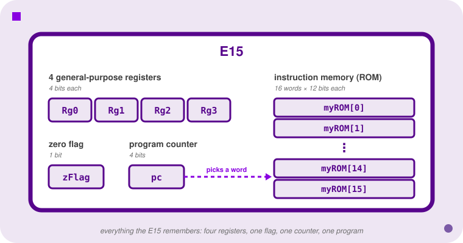
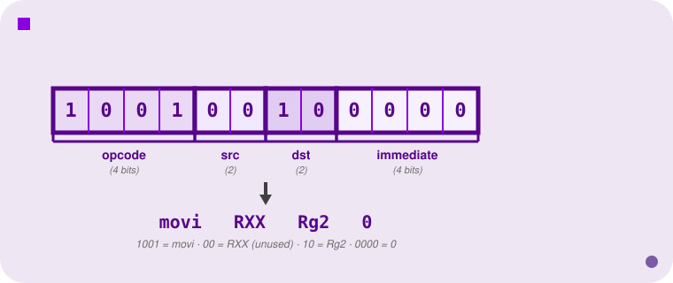
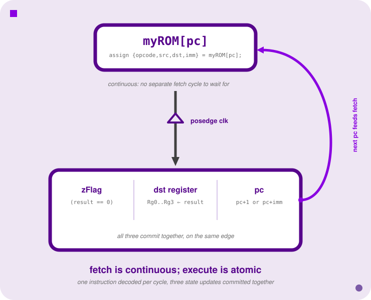

<h2 align=center>Week IV</h2>

<h1 align=center>The E15 Processor</h1>

<p align=center><strong><em>Song of the day</strong>: <a href="https://youtu.be/GwwLo72zMO4"><strong><u>Strangers</u></strong></a> by Majid Jordan (2026), recommended by Akshita P.</em></p>

---

## Sections

1. [**The E15 Processor**](#1)
    1. [**From Bits to Assembly**](#1-1)
    2. [**Instruction Format**](#1-2)
    3. [**The Instruction Set**](#1-3)
    4. [**Fetch and Execute**](#1-4)
    5. [**Tracing a Full Program**](#1-5)
    6. [**Overflow and Wraparound**](#1-6)
    7. [**E15 in Verilog**](#1-7)

---

[Last time](/lectures/03-verilog), we gave our circuits a past: a clock, registers, a way to hold state across cycles. Registers and a clock are all you need, in principle, to build something that executes a *program*—a chip whose behaviour changes from one clock cycle to the next because it's reading instructions out of memory, rather than computing one fixed function forever. The **E15** is the smallest possible version of that idea: a 4-bit toy processor with four registers and a sixteen-word program memory, small enough to trace by hand, on a single clock cycle, from reset.

---

<a id="1"></a>

## The E15 Processor

<a id="1-1"></a>

### From Bits to Assembly

Before defining anything formally, let's peek inside the machine we're about to build. A processor runs a program by reading it out of a memory, one instruction at a time, and a memory only ever holds one thing: bits. Here's what a complete (tiny) program looks like sitting in the E15's instruction memory, exactly as stored:

```
100100100000
100100010001
101001100000
111100100111
001100001110
000000000000
```

That's six 12-bit words—an entire tiny program, and completely unreadable as written. Group each word into hex and it's marginally better:

```
920
911
a60
f27
30e
000
```

Still meaningless without a decoder ring. What you actually want is a way to talk about instructions symbolically instead of as raw bit patterns—that's **assembly language**: a human-readable name for every distinct pattern the processor understands.

```
{movi, RXX, Rg2, 4'b0000}
{movi, RXX, Rg1, 4'b0001}
{add,  Rg1, Rg2, 4'b0000}
{cmpi, RXX, Rg2, 4'b0111}
{jnz,  RXX, RXX, 4'b1110}
{jmp,  RXX, RXX, 4'b0000}
```

Don't worry about decoding `movi`, `Rg2`, or the rest yet; the next few sections define every piece. All that matters here is the *idea*: same six instructions, same six bit patterns underneath—assembly doesn't change what the processor executes, only what a *human* can read. And if you squint, this specific program corresponds, roughly, to code you already know how to read:

```c
int rg2 = 0;
int rg1 = 1;
while (true) {
    rg2 += rg1;
    if (rg2 == 7)
        break;
}
while (true) {}   // every E15 program ends this way -- more on why later
```

That's the whole ladder this lecture climbs: raw bits → hex → assembly → something that reads like a program you'd actually write. Nothing at the bottom of that ladder ever goes away—assembly and pseudocode are just two different names for exactly the same bit patterns, chosen for two different audiences.

<a id="1-2"></a>

### Instruction Format

Inside the E15 there are four 4-bit general-purpose registers (`Rg0`–`Rg3`), a 1-bit zero flag (`zFlag`), a 4-bit program counter (`pc`), and an instruction memory—a ROM of exactly sixteen 12-bit words, `myROM[0]` through `myROM[15]`. Sixteen words is not an arbitrary choice: a 4-bit program counter can address exactly 2⁴ = 16 locations, so the program counter and the ROM's depth are sized to match each other exactly.

<a id="fg-1"></a>

<p align=center>
    
    </img>
</p>

<p align=center>
    <sub>
        <strong>Figure I</strong>: everything the E15 remembers: four 4-bit registers, a 1-bit zero flag, a 4-bit program counter, and a sixteen-word instruction ROM.
    </sub>
</p>

Every instruction is a fixed 12-bit word, laid out identically regardless of which instruction it is:

<a id="fg-2"></a>

<p align=center>
    
    </img>
</p>

<p align=center>
    <sub>
        <strong>Figure II</strong>: the 12-bit word <code>100100100000</code> split into its four fixed-width fields and decoded—every instruction spends all 12 bits, whether or not it needs them.
    </sub>
</p>

That word decodes as `{movi, RXX, Rg2, 4'b0000}`—opcode `movi` (1001), source ignored (`RXX`), destination `Rg2` (10), immediate value 0. Registers are encoded `Rg0=00, Rg1=01, Rg2=10, Rg3=11`, and `RXX=00` is a placeholder meaning "this field isn't used by this instruction." Every instruction, even ones that don't need a source register or an immediate value, still spends those bits—the encoding is fixed-width for every instruction, in exchange for uniformly simple decoding logic. That's a real architectural trade-off, and it's the same one E20 makes next week, and that RISC instruction sets make in general.

<a id="1-3"></a>

### The Instruction Set

The eleven E15 opcodes fall cleanly into four families:

| Family | Opcodes | Effect |
|---|---|---|
| **Jump** | `jmp`, `jz`, `jnz` | Set `pc = pc + imm`, unconditionally (`jmp`), if `zFlag` is set (`jz`), or if `zFlag` is clear (`jnz`). |
| **Move** | `movi`, `mov` | Store a value into `dst`: a literal immediate (`movi`) or the contents of `src` (`mov`). |
| **Arithmetic** | `addi`/`add`, `subi`/`sub` | Add or subtract an immediate or register value into/from `dst`, storing the result back in `dst`. |
| **Compare** | `cmpi`, `cmp` | Subtract, but discard the numeric result—only `zFlag` is updated (1 if equal, 0 otherwise). `dst` itself is left unchanged. |

That family table tells you what each *group* does; here's the precise binary encoding and a one-sentence description for each of the eleven opcodes individually—the actual reference you'd reach for while hand-assembling or disassembling a program:

| Opcode | Binary | Description |
|---|---|---|
| `jmp`  | `0000` | Add the given immediate value to the program counter. |
| `jz`   | `0010` | Add the given immediate value to the program counter if `zFlag` is true. |
| `jnz`  | `0011` | Add the given immediate value to the program counter if `zFlag` is false. |
| `movi` | `1001` | Move the given immediate value into the given destination register. |
| `mov`  | `1000` | Move the given source register's value into the given destination register. |
| `addi` | `1011` | Add the given immediate value into the given destination register. |
| `add`  | `1010` | Add the given source register's value into the given destination register. |
| `subi` | `1101` | Subtract the given immediate value from the given destination register. |
| `sub`  | `1100` | Subtract the given source register's value from the given destination register. |
| `cmpi` | `1111` | Compare the given immediate value to the given destination register and set `zFlag` accordingly. |
| `cmp`  | `1110` | Compare the given source register's value to the given destination register and set `zFlag` accordingly. |

Eleven opcodes only need 4 bits to number them (`2⁴ = 16` possible values), so five 4-bit patterns go completely unused—there's no `1111` used twice, and no opcode `0001`, `0100`, `0101`, `0110`, or `0111` at all. That's not a mistake to hunt for; it's just headroom nobody happened to need.

Here's the program from the last section, written the way you'll actually see it—as a list of `{opcode, src, dst, imm}` tuples:

```
{movi, RXX, Rg2, 4'b0000}   // Rg2 = 0
{movi, RXX, Rg1, 4'b0001}   // Rg1 = 1
{add,  Rg1, Rg2, 4'b0000}   // Rg2 += Rg1
{cmpi, RXX, Rg2, 4'b0111}   // compare Rg2 to 7; set zFlag
{jnz,  RXX, RXX, 4'b1110}   // if zFlag == 0, jump back
{jmp,  RXX, RXX, 4'b0000}   // infinite loop: end of program
```

Notice the `i`-suffixed instructions (`movi`, `addi`, `subi`, `cmpi`) take their second operand directly from the instruction's immediate field, while their plain counterparts (`mov`, `add`, `sub`, `cmp`) take it from a register named in `src`. Whichever field an instruction doesn't use is simply ignored: the immediate instructions ignore `src` (which is why you write `RXX` there), and the register-form instructions ignore the immediate (usually written `4'b0000`). This immediate-vs-register split shows up in every instruction set you'll meet this semester, including x86: a constant baked into the instruction is fast and simple but limited in range (only 4 bits here—values 0 through 15), while a register operand has full width but has to be loaded there first.

> Every arithmetic and compare instruction sets `zFlag`. Every move and jump instruction leaves it untouched. `cmp`/`cmpi` look like subtraction but are not: the destination register itself is never modified, only `zFlag` is.

<a id="1-4"></a>

### Fetch and Execute

So far we've only described the E15 from the *outside*: what instructions look like, and what each one is supposed to do. That tells you what a program means, but not how a chip actually carries it out, and assembly can't tell you that, because assembly is the program, not the machine running it. To describe the machine, we need a way to describe hardware. That's exactly what [last lecture's Verilog](/lectures/03-verilog) is for, and it turns out we already have every piece we need: a combinational part (`assign`, always tracking its inputs) and a clocked part (`always @(posedge clk)`, updating state once per edge). The E15 is nothing more than those two ideas, arranged so that each clock edge executes exactly one instruction.

Every processor, the E15 included, spends its whole life repeating the same two-step routine, and the two steps have names. **Fetch** means going to memory and getting the next instruction: the program counter (`pc`) says which slot of the ROM to look at, and whatever is stored there comes back to be decoded into its opcode and operands. **Execute** means actually doing what that instruction says: computing a result, updating a register or the zero flag, and working out where the *next* instruction lives. Fetch, execute, fetch, execute, forever: that's all a program running on a processor is.

In the E15's Verilog, fetch is the combinational half. The current instruction is read out of ROM continuously, indexed by the program counter:

```verilog
assign {opCode, src, dst, immData} = myROM[pc];
```

Because this is a continuous `assign`, the instruction's fields update the instant `pc` changes—there's no separate "fetch cycle" you have to wait for. Execute is the clocked half. On every rising clock edge, three things happen together, as one atomic step:

1. **`zFlag` updates**, for the six arithmetic/compare opcodes, based on whether the ALU's result was zero.
2. **The destination register updates**, for the six instructions that write one, by selecting among `Rg0`–`Rg3` according to the `dst` field.
3. **`pc` updates**, to either `pc + 1` (the default, for every non-jump instruction) or `pc + imm` (for jump instructions, conditionally gated on `zFlag` for `jz`/`jnz`).

<a id="fg-3"></a>

<p align=center>
    
    </img>
</p>

<p align=center>
    <sub>
        <strong>Figure III</strong>: fetch is a continuous read that tracks <code>pc</code> at all times; execute is the atomic bundle of three updates that commits once per posedge, and it's the new <code>pc</code> that closes the loop back into the next fetch.
    </sub>
</p>

It's worth tracing this by hand once with real numbers, because the result is less obvious than it sounds. Suppose `pc = 0101` (5) and the instruction there is `{jz, RXX, RXX, 4'b0011}`, and suppose `zFlag` happens to be 1. The next `pc` is **not** `pc + 1 + imm`—it's `pc + imm` directly: `0101 + 0011 = 1000`. The ordinary "advance by one" increment is entirely replaced by the jump calculation, not added on top of it. This is the single easiest detail to get wrong when tracing E15 code by hand, so it's worth committing to memory explicitly.

The E15 actually contains *two* arithmetic units working in parallel every cycle: `dataALU`, which performs whatever arithmetic the current instruction asks for, and a second, dedicated `pcALU`, which is permanently configured to add and does nothing but compute the next program counter. The unit that does "real" computation and the unit that decides what instruction comes next are physically separate circuits—a pattern you'll see again, in a far more elaborate form, when we get to pipelining.

<a id="1-5"></a>

### Tracing a Full Program

Individual instructions are easy once you know the format. The real skill is tracing a whole program, cycle by cycle, and keeping every register's value straight as it changes underneath you. Here's a complete ten-instruction program:

```
myROM[0] = {movi, RXX, Rg1, 4'b0011};   // Rg1 = 3
myROM[1] = {add,  Rg1, Rg1, 4'b0000};   // Rg1 += Rg1
myROM[2] = {add,  Rg1, Rg1, 4'b0000};   // Rg1 += Rg1
myROM[3] = {movi, RXX, Rg2, 4'b1100};   // Rg2 = 12
myROM[4] = {cmp,  Rg1, Rg2, 4'b0000};   // compare Rg1 to Rg2
myROM[5] = {jz,   RXX, RXX, 4'b0011};   // if equal, skip ahead 3
myROM[6] = {movi, RXX, Rg2, 4'b0001};   // Rg2 = 1
myROM[7] = {jmp,  RXX, RXX, 4'b0000};   // halt
myROM[8] = {movi, RXX, Rg2, 4'b0000};   // Rg2 = 0
myROM[9] = {jmp,  RXX, RXX, 4'b0000};   // halt
```

That's ten instructions, but the ROM has sixteen cells. A real program assigns a value to *all* sixteen, not just the ones it uses: the remaining six (`myROM[10]` through `myROM[15]`) are filled with the same `{jmp, RXX, RXX, 4'b0000}`, so that every cell holds a well-defined instruction. We've left them out of the listing above to keep it short, but they're there.

Before tracing a single cycle, notice this is again just a familiar shape wearing E15 clothing:

```c
int rg1 = 3;
rg1 += rg1;
rg1 += rg1;
int rg2 = 12;
if (rg1 == rg2)
    rg2 = 0;
else
    rg2 = 1;
while (true) {}
```

Now trace it, one clock cycle per row. `Rg1`/`Rg2`/`zFlag` show the value *after* that cycle's edge:

| Cycle | `pc` | Instruction | `Rg1` | `Rg2` | `zFlag` |
|:-:|:-:|---|:-:|:-:|:-:|
| 1 | 0 | `movi Rg1, 0011` | 3 | ? | ? |
| 2 | 1 | `add Rg1, Rg1` | 6 | ? | 0 |
| 3 | 2 | `add Rg1, Rg1` | 12 | ? | 0 |
| 4 | 3 | `movi Rg2, 1100` | 12 | 12 | 0 |
| 5 | 4 | `cmp Rg1, Rg2` | 12 | 12 | **1** |
| 6 | 5 | `jz +3` | 12 | 12 | 1 |
| 7 | 8 | `movi Rg2, 0000` | 12 | 0 | 1 |
| 8 | 9 | `jmp +0` | 12 | 0 | 1 |

Two moments in that table are worth stopping on:

- **Cycle 5** is where `zFlag` finally becomes meaningful. `Rg1` and `Rg2` are both `12`, `cmp` subtracts them internally, gets `0`, and sets `zFlag = 1`—without touching either register (that's the whole point of `cmp` versus `sub`).
- **Cycle 6→7** is the payoff: `jz` reads `zFlag = 1` from the *previous* cycle and jumps `pc` from `5` straight to `5 + 3 = 8`, skipping the `movi Rg2, 0001` at address 6 entirely. If `Rg1` and `Rg2` hadn't matched, `zFlag` would have been `0`, the jump wouldn't fire, and execution would have fallen through to address 6 instead.

Final state: `Rg1 = 12`, `Rg2 = 0`, and the processor spins forever on the self-jump at address 9—exactly matching the pseudocode's `rg1 == rg2` branch and its trailing `while (true) {}`.

<a id="1-6"></a>

### Overflow and Wraparound

E15 registers are 4 bits wide, which means they can represent unsigned values from 0 to 15—nothing more. What happens when arithmetic pushes past either end of that range?

```
Calculating Rg0 = Rg0 - 1, starting from Rg0 = 0000:

   0000
 - 0001
 -------
   1111      ← subtracting 1 from 0 wraps to 15, the largest representable value

Calculating Rg1 = Rg1 + 1, starting from Rg1 = 1111:

   1111
 + 0001
 -------
   0000      ← adding 1 to 15 wraps to 0; the carry-out bit is simply discarded
```

This is **wraparound**: arithmetic on a fixed bit width is really arithmetic modulo 2ⁿ, and the two ends of the number line connect to each other. It isn't an error condition or something the hardware flags for you—it happens silently, every time, by design.

The exact same thing happens to the program counter itself. If the last instruction in ROM, at address 15, executes and doesn't jump, the next `pc` is `1111 + 1 = 0000`—execution silently resumes at the *beginning* of the program. This is precisely why every well-formed E15 program must end with an explicit infinite loop, `{jmp, RXX, RXX, 4'b0000}` (jump to self, forever): without it, the program counter doesn't stop, doesn't crash, and doesn't error—it just quietly starts over.

**How does a jump "go back"?** Wraparound has one more consequence, and it's about jumps. Let's follow the loop program from [The Instruction Set](#1-3) to see it, since a loop is where jumps really matter. Number the instructions from 0, because those numbers are the addresses `pc` holds:

| Address | Instruction | What it does |
|---|---|---|
| 0 | `{movi, RXX, Rg2, 4'b0000}` | `Rg2 = 0` |
| 1 | `{movi, RXX, Rg1, 4'b0001}` | `Rg1 = 1` |
| 2 | `{add,  Rg1, Rg2, 4'b0000}` | `Rg2 += Rg1` |
| 3 | `{cmpi, RXX, Rg2, 4'b0111}` | compare `Rg2` to 7, set `zFlag` |
| 4 | `{jnz,  RXX, RXX, 4'b1110}` | if `zFlag == 0`, jump back |
| 5 | `{jmp,  RXX, RXX, 4'b0000}` | jump to itself: end of program |

The `jnz` sits at address 4, and the loop body we want to repeat starts at address 2, the `add`. But the instruction only carries a 4-bit immediate, `1110`, and a jump's rule is always the same: `pc = pc + imm`. There's no "subtract" and no separate "go backward" mode, so how does adding a number ever move `pc` *down*? Just do the addition in 4 bits:

```
   0100     ← pc = 4
 + 1110     ← imm = 14 (unsigned)
 ------
  10010     ← 18 needs five bits...
   0010     ← ...but pc is only 4 bits wide, so the top bit is discarded: pc = 2
```

That's wraparound doing the work. Adding 14 to a 4-bit number is the same as subtracting 2, because the arithmetic is modulo 16 (`+14 ≡ −2`). Read as a signed 4-bit number, `1110` *is* −2, which is exactly what the comment means by "jump back": two instructions backward, landing on address 2, the `add`.

So the whole loop runs like this:

- **Addresses 2, 3, 4** run in order: add, compare, then `jnz`.
- **If `Rg2` isn't 7 yet,** `zFlag` is 0, so `jnz` fires and `pc` goes back to 2 for another pass.
- **When `Rg2` reaches 7,** `cmpi` sets `zFlag = 1`, `jnz` doesn't fire, and `pc` falls through to address 5.
- **At address 5,** `jmp` with immediate `0000` computes `pc + 0`, which is itself, so the program parks on that instruction forever.

The rule to take away: **a jump immediate is a signed offset**. Small positive values skip forward, values from `1111` down to `1000` (−1 to −8) jump backward, and it all works with the same adder, no special hardware.

<a id="1-7"></a>

### E15 in Verilog

Everything above describes *behaviour*. This section is the actual Verilog that implements it, piece by piece. It comes from the starter file you'll be given for the E15 homework, which is deliberately *incomplete*: four small pieces are left blank for you to fill in, and we'll point them out as we go.

A reassurance before you absolutely freak out: **you will not be asked to memorise or reproduce any of this.** The starter file arrives with nearly all of it already written; the only parts you'll write yourself are the four blanks flagged below (`operand1`, `operand2`, `pcIncr`, and `storeVal`), and everything you need to work those out is in the opcode tables above. This section exists to show you that the behaviour above isn't magic: every idea in it is something you've already met, sitting in real code. Read it to see how the pieces connect, not to learn it by heart.

**The ALU.** The E15 needs exactly one arithmetic building block, reused twice over:

```verilog
module simpleALU(
    input        addNotSub,
    input  [3:0] src, dst,
    output       zFlag,
    output [3:0] res);
    wire Cout;

    fourbit_adder the_adder(dst, addNotSub ? src : ~src, ~addNotSub, res, Cout);
    assign zFlag = !(res);
endmodule
```

This is nothing new—it's [the subtracter pattern from the Adders lecture](/lectures/02-adders#7), wearing a toggle. Walking through it line by line:

- **`module simpleALU(` ... `);`** declares the component. Notice the ports are declared *inside* the header, direction and width together, instead of listing names first and declaring `input`/`output` on separate lines below. Same thing, more compact.
- **`input addNotSub,`** is a single control bit that picks the operation: `1` means add, `0` means subtract. (The name says it: "add, not sub.")
- **`input [3:0] src, dst,`** are the two 4-bit operands, declared together because they share a width. `dst` is the left-hand operand, the one that gets added to or subtracted from.
- **`output zFlag,`** is a 1-bit result flag: `1` when the answer is zero, `0` otherwise.
- **`output [3:0] res);`** is the 4-bit answer itself.
- **`wire Cout;`** is the adder's carry-out. It has to be declared because the adder has a port to hand it to, but nothing ever reads it: E15 arithmetic is modulo 16, so the carry is simply discarded, exactly the [wraparound](#1-6) you just saw.
- **`fourbit_adder the_adder(dst, addNotSub ? src : ~src, ~addNotSub, res, Cout);`** instantiates the adder you already built, with arguments in that module's own port order (inputs first, outputs last):
    - `dst` goes in as the first operand, unchanged.
    - `addNotSub ? src : ~src` is a 2:1 mux, written as a ternary: pass `src` straight through when adding, or its bitwise inverse when subtracting.
    - `~addNotSub` is the carry-in, so it's `0` when adding and `1` when subtracting. That `1` is the "+1" in two's complement: flipping every bit of `src` gives `-src - 1`, one short of the true negative, so the carry-in supplies the missing 1.
    - `res` and `Cout` catch the sum and the carry-out.
- **`assign zFlag = !(res);`** is a continuous assignment, always active. `!` is *logical* NOT: applied to a multi-bit value it gives `1` only when every bit is `0`, and `0` as soon as any bit is `1`. So `zFlag` is true exactly when the result is all zeros.

Put together, the trick is that one adder does both jobs. Adding: the second input is `src`, carry-in is `0`, so `res = dst + src`. Subtracting: the second input is `~src`, carry-in is `1`, so `res = dst + (~src) + 1`, which is two's complement for `dst − src`. Same four-bit adder, same wiring, switched by a single control bit.

**Why two copies?** Remember that every clock edge does two arithmetic jobs *at once*. An instruction like `add` needs the ALU to compute `Rg2 + Rg1` for the register, while, on that very same edge, the program counter also needs its own new value, `pc + 1` (or `pc + imm` for a jump). One adder can only answer one question at a time, so the E15 simply builds the circuit twice: one copy for the instruction's data, one copy dedicated to the program counter. The processor instantiates `simpleALU` like this:

```verilog
simpleALU dataALU(addNotSub, operand1, operand2, aluOutputZero, aluOutput);
simpleALU pcALU(1'b1, pc, pcIncr, pcz, pcRes);
```

Each line reads the same way as any module instantiation you've written: the module type (`simpleALU`), a name for this particular copy (`dataALU`, `pcALU`), then the wires plugged into its ports, matched *by position* to `simpleALU`'s own port list: `addNotSub`, `src`, `dst`, `zFlag`, `res`, in that order.

- **`dataALU`** is the general-purpose copy. Its `addNotSub` wire changes with the current opcode (`1` for `add`/`addi`, `0` for `sub`/`subi`/`cmp`/`cmpi`), `operand1` and `operand2` land on `src` and `dst`, and its two outputs are the result (`aluOutput`) and whether that result was zero (`aluOutputZero`). That zero output is exactly what the `zFlag <= aluOutputZero;` line in the execute block later latches.
- **`pcALU`** is the hardwired copy. Its first argument is the *constant* `1'b1`, so it can only ever add. It adds `pc` and `pcIncr`, where `pcIncr` is `1` for an ordinary instruction and the jump's immediate when a jump fires, and its result `pcRes` is what the execute block later assigns to `pc`. Its zero output, `pcz`, is wired to a name but nothing ever uses it. (Addition is commutative, so it doesn't matter that `pc` lands on `src` and `pcIncr` on `dst`.)

The wires `operand1`, `operand2`, and `pcIncr` are three of the four blanks in the starter file (`storeVal`, below, is the fourth): each is left as a placeholder for *you* to define, based on the current opcode and immediate. For now, just read them as "whichever value this instruction needs here." What matters is the structure: two identical circuits, one general-purpose and one hardwired to a single fixed role, so that the instruction's work and the "what comes next" bookkeeping happen in parallel instead of taking turns.

**Naming the opcodes and registers.** Verilog's `parameter` keyword works like a named constant—similar to C++'s `const`—so the assembly mnemonics can be written directly into the source instead of memorizing bit patterns everywhere:

```verilog
parameter
   Rg0 = 2'b00, Rg1 = 2'b01,
   Rg2 = 2'b10, Rg3 = 2'b11,
   RXX = 2'b00;

parameter
  jmp  = 4'b0000, jz   = 4'b0010, jnz = 4'b0011,
  movi = 4'b1001, mov  = 4'b1000,
  addi = 4'b1011, add  = 4'b1010,
  subi = 4'b1101, sub  = 4'b1100,
  cmpi = 4'b1111, cmp  = 4'b1110;
```

Notice `subi` written out here in binary matches exactly the value from [the opcode table above](#1-3)—these `parameter` lines *are* that table, just expressed as Verilog instead of prose.

**The processor's state.** Every piece of mutable storage described in [Instruction Format](#1-2) has to actually be declared somewhere:

```verilog
reg [3:0] pc;              // Program Counter
reg       zFlag;           // Zero flag
reg [3:0] r0, r1, r2, r3;  // Registers

reg [11:0] myROM [15:0];   // ROM (holds program)
```

That `myROM` declaration uses exactly the bracket-position convention from [last lecture's memory array](/lectures/03-verilog#3-3): `[11:0]` before the name is the width of *one* word (12 bits), `[15:0]` after the name is *how many* words there are (16)—the register width and the program-counter width from Instruction Format, made literal in code.

```verilog
initial begin
    `include "program1.v"   // load the program
    pc = 4'b0000;           // initialize the program counter
end
```

This runs once, when the processor is "turned on." The `include` brings in a separate file that fills in every element of `myROM`, all sixteen cells, including the ones the program never reaches; after this block runs, `myROM` never changes again for the rest of execution. Only `pc` is explicitly initialized here—`r0`–`r3` and `zFlag` are left with **no defined initial value**, exactly the "a register's contents are undefined before its first write" warning from the Verilog lecture, now showing up as a real design decision in real hardware.

**Fetch**, which you've already seen, now sits in its full context:

```verilog
wire [3:0] opCode;
wire [1:0] src, dst;
wire [3:0] immData;

assign {opCode, src, dst, immData} = myROM[pc];
```

**Execute**, the atomic three-part update, written out as actual `case` statements instead of prose:

```verilog
always @(posedge clk) begin
    // update zero flag
    case (opCode)
        addi, add, subi, sub, cmpi, cmp:
            zFlag <= aluOutputZero;
    endcase

    // update destination register
    case (opCode)
        movi, mov, add, addi, sub, subi:
            case (dst)
                Rg0: r0 <= storeVal;
                Rg1: r1 <= storeVal;
                Rg2: r2 <= storeVal;
                Rg3: r3 <= storeVal;
            endcase
    endcase

    // update program counter
    pc <= pcRes;
end
```

Read this against the three-item list from [Fetch and Execute](#1-4) and it should feel completely familiar, just spelled out: the first `case` is "for the six arithmetic/compare opcodes, latch the ALU's zero output." The second is "for the six instructions that write a register, pick which one"—and that inner `case (dst)` is exactly [the register-file write logic](/lectures/03-verilog#3-3) from last lecture, a mux selecting one of four registers by a 2-bit address, just written with `case` instead of drawn as a mux symbol. `storeVal` is the fourth blank in the starter file: it stands for whichever value this instruction is supposed to store, and deciding what that is for each opcode is part of your job. The third line, unconditional, always fires: `pc` advances every single cycle, no matter what instruction just ran.

---

The E15's fetch–execute loop—read an instruction, decode it, update some registers and a flag, advance the program counter, repeat every clock cycle—is the complete skeleton of every processor we'll study this semester, including the one in your laptop. E20 next week adds a richer instruction set and a real memory hierarchy on top of exactly this same loop; the multi-stage pipelines we cover after the midterm are this same loop split across several overlapping clock cycles instead of one. Even GPU "cores" run a version of this loop, just thousands of them at once, in lockstep, on data instead of scalar instructions. Once you can trace the E15 by hand, you have, in miniature, the thing every later topic in this course is a more elaborate version of.

---

<sub>**Previous: [Verilog](/lectures/03-verilog)** || **Next: [The E20 Processor & Assembly Language](/lectures/05-e20)**</sub>
