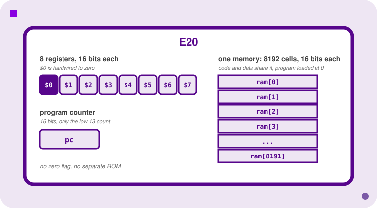
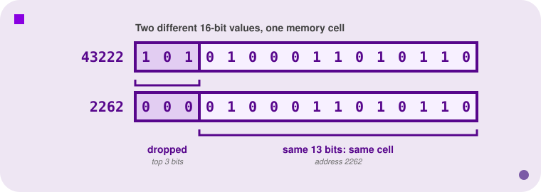
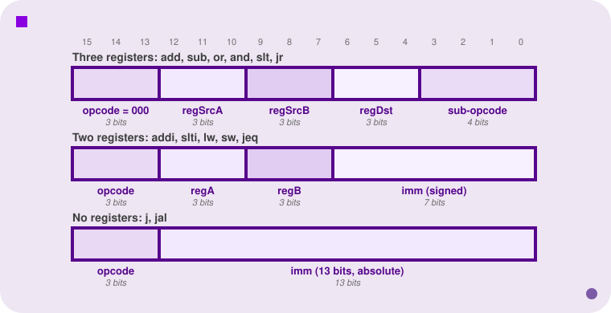

<h2 align=center>Week V</h2>

<h1 align=center>The E20 Processor & Assembly Language</h1>

---

## Sections

1. [**Why E15 Isn't Enough**](#1)
2. [**What's Inside the E20**](#2)
    1. [**Registers and the Program Counter**](#2-1)
    2. [**Memory**](#2-2)
    3. [**E15 vs. E20, Side by Side**](#2-3)
3. [**The E20 Instruction Set**](#3)
    1. [**Three Registers**](#3-1)
    2. [**Two Registers**](#3-2)
    3. [**No Registers**](#3-3)
4. [**Pseudo-Instructions and Directives**](#4)
5. [**Labels**](#5)
6. [**Reading E20 Programs**](#6)
7. [**Memory in Action: `lw` and `sw`**](#7)
8. [**Signed, Unsigned, and Wraparound**](#8)
9. [**Machine Code Translation**](#9)
    1. [**The Three Formats**](#9-1)
    2. [**The Opcode Table**](#9-2)
    3. [**Translating, Step by Step**](#9-3)
    4. [**`jeq` Is the Odd One Out**](#9-4)

---

[Last time](/lectures/04-e15), we built a processor small enough to trace on a napkin: four registers, sixteen instructions of ROM, twelve-bit instructions. Great for seeing the whole fetch-execute loop at once. Not great for writing anything you'd call a program. This week we keep the exact same skeleton (registers, a program counter, an instruction fetched and executed every clock cycle) and give it enough room to breathe. Meet the **E20**.

---

<a id="1"></a>

## Why E15 Isn't Enough

Three things make the E15 a toy:

* **Four registers**, so you're constantly shuffling values in and out of the only storage you have.
* **Sixteen words of ROM**, so a loop and the code around it barely fit together.
* **Nowhere to put data.** The E15's ROM holds instructions and only instructions; there's no memory the program can read *and write*.

The E20 fixes all three, and it also gets a more expressive assembly language and a more complicated machine-code encoding to go with them. That last part is probably the toughest part: more capability means more bits to organise, and we'll spend the last section of the lecture on basically only that.

A way to read the rest of this lecture: **almost every feature of the E20 exists because of a specific problem**. There are only 16 bits per instruction, only 8 opcodes to hand out, no flags, and no way to name a place in memory. Each section below starts with the problem, and then shows the E20's answer. If you ever catch yourself asking "why on earth is it designed like that?", go back to the problem; it's usually a bit-budget problem in disguise.

---

<a id="2"></a>

## What's Inside the E20

<a id="2-1"></a>

### Registers and the Program Counter

<p align=center>
    
</p>
<p align=center><sub>Everything the E20 remembers: eight 16-bit registers, a program counter, and one 8192-cell memory.</sub></p>

The E20 has **eight 16-bit registers**, named `$0` through `$7`. Register `$0` is special: it is *read-only*, hardwired to zero. Writes to it are thrown away into oblivion. That leaves **seven** general-purpose read/write registers, `$1` through `$7`.

_Whyyyy_, you ask, _would you build a register that can only ever be zero?_ Here's the problem it solves. A program constantly needs constants (e.g. to start a counter at 10, to compare against 0, etc.) and constantly needs to copy values between registers. But **the processor only has 8 opcodes** (more on that in section 9), so a dedicated "load constant" instruction, a dedicated "copy register" instruction and a dedicated "compare with zero" instruction would burn a large fraction of them.

A permanent zero gets all three for free: load 34 into `$1` with

```asm
addi $1, $0, 34`  # (zero plus 34)
```

Copy `$2` into `$1` with

```asm
add $1, $2, $0  # ($2 plus zero)
```

Test "is `$4` zero?" by comparing it against `$0`. One register, several instructions we no longer need. We'll see shortly that the assembler even gives the first trick its own name.

There's also a **16-bit program counter** (`pc`) holding the address of the instruction currently executing. Just like E15, no instruction can name `pc` directly; it only ever moves by incrementing to the next instruction or by being overwritten by a jump.

The problem? Only the low 13 bits of `pc` actually matter. We'll see why next.

<a id="2-2"></a>

### Memory

The E20 has **8192 memory cells**, each **16 bits** wide, addressed `0` through `8191`. That's an array with 2¹³ elements, so an address needs exactly 13 bits.

Two things to notice, both different from the E15:

**One memory, for both code and data.** The problem E15 had was that it could compute, but it had nowhere to keep anything. Its ROM held the program and could never be written, so a program couldn't have variables, arrays, or a list of results. The obvious fix, giving the E20 a *second* memory just for data, works, but a single shared memory is simpler to build and more flexible (a program's split between code and data isn't fixed by the hardware).

So the E20 has a single memory, and the program itself is *loaded into it, starting at address 0*. The `pc` starts at 0, the first instruction lives at address 0, and any data your program uses lives in the same array, further along.

**Registers are wider than addresses.** The problem here is a mismatch between two good decisions. 16 bits is a comfortable width for a register: values up to 65535, and it matches the instruction size. But 8192 cells is all the memory the design needs, and that takes only 13 bits to address. So what do we do when a 16-bit register value is used as a 13-bit address?

The E20's answer is the cheapest possible one: just ignore the extra bits. So whenever a 16-bit value is used as an address (including in the `pc`), **the top 3 bits are ignored**. Address 43222 and address 2262 are the same cell, because they share the same low 13 bits:

<p align=center>
    
</p>
<p align=center><sub>Only the low 13 bits of an address select a cell, so 43222 and 2262 land in the same place.</sub></p>

<a id="2-3"></a>

### E15 vs. E20

|  | **E15** | **E20** |
|---|---|---|
| **Instruction width** | 12 bits | 16 bits |
| **Registers** | 4 × 4 bits (`Rg0`–`Rg3`) | 8 × 16 bits (`$0`–`$7`, and `$0` is always 0) |
| **Program counter** | 4 bits | 16 bits (low 13 bits used) |
| **Where instructions live** | 16-word ROM | Shared memory, 8192 × 16 bits |
| **Data memory** | None | The same shared memory  |
| **Zero flag** | Yes, `zFlag` | No; comparisons write their result into a register |
| **Instruction formats** | One | Three |
| **Immediate** | 4 bits | 7 bits (signed) or 13 bits (jumps) |

What stays the same is the important part. Both machines fetch an instruction at `pc`, decode it, update some state and move `pc`. Both are fixed-width: every instruction is the same size, which keeps decoding simple. If you can trace the E15, you can trace the E20; there's just more state to keep track of.

---

<a id="3"></a>

## The E20 Instruction Set

The E20 has **13 real instructions**. Before the list, two ideas to have in your head:

* **An instruction is a tiny command with operands.** The name says what to do (e.g. `add`), and the operands say which registers or numbers to do it with. Every instruction here reads at most two registers, writes at most one, and then moves the `pc`.
* **The instructions fall into groups by *how many registers they name*.** That grouping is not an accident: it is exactly how the 16 bits are carved up in machine code (section 9). If you remember which group an instruction is in, you already know what its machine code looks like.

Why is the instruction set *this* small and *this* shaped? Because of a bit budget. An instruction has to fit in **16 bits**, and it has to name its operands *inside those bits*. A register costs 3 bits to name (8 registers); a memory address costs 13. Keep that arithmetic in mind, because it explains most of what follows: for instance, an `add` that took three *memory addresses* would need 39 bits and simply would not fit.

A note on naming: in the syntax below, `regDst` is the register that *receives* a result, `regSrcA`/`regSrcB` are registers that get *read*, and `imm` is a plain number written right in the instruction (an "immediate", because it's available immediately, no register lookup needed).

<a id="3-1"></a>

### Three Registers

```
add $regDst, $regSrcA, $regSrcB      # regDst = regSrcA + regSrcB
sub $regDst, $regSrcA, $regSrcB      # regDst = regSrcA - regSrcB
and $regDst, $regSrcA, $regSrcB      # regDst = regSrcA & regSrcB   (bitwise)
or  $regDst, $regSrcA, $regSrcB      # regDst = regSrcA | regSrcB   (bitwise)
slt $regDst, $regSrcA, $regSrcB      # regDst = 1 if regSrcA < regSrcB, else 0
jr  $reg                             # pc = value in $reg
```

Note the destination comes **first**, just like an assignment (`$3 = $1 + $2` is written `add $3, $1, $2`). Two things about the arithmetic ones: the destination can be the same register as a source (`add $1, $1, $2` is `$1 += $2`, and that's perfectly fine), and writing to `$0` does nothing.

A concrete pass through each one, with `$1 = 6` (`0110`) and `$2 = 3` (`0011`):

| Instruction | Result | Why |
|---|---|---|
| `add $3, $1, $2` | `$3 = 9` | `6 + 3` |
| `sub $3, $1, $2` | `$3 = 3` | `6 - 3` |
| `and $3, $1, $2` | `$3 = 2` | `0110 & 0011 = 0010`, bit by bit |
| `or  $3, $1, $2` | `$3 = 7` | `0110 \| 0011 = 0111`, bit by bit |

**`slt` ("set if less than")** is how the E20 does comparisons. Programs need to make decisions ("is this counter finished?", "is `x` smaller than `y`?"), so the processor needs some way to *remember the answer* between the comparison and the jump that acts on it. The E15 remembered it in a hidden `zFlag` that `cmp` set and `jz` read. That works, but a flag is a single hidden bit that almost every instruction overwrites, so you have to jump on it right away or lose it. The E20 has no flags at all: `slt` just writes a **1 or a 0 into a register you choose**, and you branch on that register whenever you like. Because the answer sits in an ordinary register, you can keep it around, combine it with other answers (`and` two conditions together), or use it as a value. For example, if `$1 = 3` and `$2 = 8`, then `slt $4, $1, $2` sets `$4 = 1` (3 < 8), while `slt $4, $2, $1` sets `$4 = 0` (8 is not < 3).

**`jr` ("jump register")** jumps to whatever address is currently *in* a register: `pc = $reg`. The problem it solves: `j` has its destination fixed inside the instruction, so a `j` always goes to the same place. That's no use if the destination depends on how you got here, such as returning from a helper function that's called from ten different places. `jr` lets the destination change while the program runs. It only needs one register, so the assembler fills the other two operand slots with the zero register. For example, if `$7 = 12`, then `jr $7` sets `pc = 12` — and if some earlier instruction had put a different value in `$7`, `jr $7` would go somewhere else instead, without the instruction itself changing at all.

<a id="3-2"></a>

### Two Registers

```
addi $regDst, $regSrc, imm           # regDst = regSrc + imm
slti $regDst, $regSrc, imm           # regDst = 1 if regSrc < imm, else 0
lw   $regDst, imm($regAddr)          # regDst = memory[regAddr + imm]
sw   $regSrc, imm($regAddr)          # memory[regAddr + imm] = regSrc
jeq  $regA, $regB, imm               # if regA == regB, pc = imm
```

The immediate here is a **7-bit signed** number, so it ranges from −64 to 63. That's small: `addi $1, $1, 100` is not a legal instruction. (To get a bigger constant into a register, you'd have to build it in pieces.)

**`addi`** is `add` with a constant instead of a second register: `addi $2, $1, 10` means `$2 = $1 + 10`. Use a negative immediate to subtract. For example, with `$1 = 5`: `addi $2, $1, 10` sets `$2 = 15`, and `addi $2, $1, -2` sets `$2 = 3`.

**`slti`** is `slt` against a constant: `slti $5, $4, 10` sets `$5 = 1` if `$4 < 10`, otherwise 0. With `$4 = 6`, `slti $5, $4, 10` sets `$5 = 1`; with `$4 = 12`, the same instruction sets `$5 = 0`.

**`jeq` ("jump if equal")** solves the most basic problem in programming: doing something *different depending on the data*. Without a conditional jump, a program would run the same instructions in the same order every time, forever, and couldn't loop or choose. `jeq` compares two registers and, *only if they hold the same value*, jumps to the target; otherwise the `pc` just moves on to the next instruction. `jeq $1, $0, done` reads as "if `$1` is zero, go to `done`". This is the E20's only conditional branch. Everything else (`<=`, "not equal", loops that stop) is built out of `jeq` and `slt`. Concretely: with `$1 = 0`, `jeq $1, $0, done` jumps, since `0 == 0`; with `$1 = 4`, the exact same instruction just falls through to the next line instead, since `4 != 0`.

For instance, take "jump if `$1 <= $2`". There's no `<=` instruction, but `$1 <= $2` is just the opposite of `$2 < $1`, and *that* `slt` can test directly:

```asm
slt $3, $2, $1      # $3 = 1 if $2 < $1, else 0
jeq $3, $0, target  # $3 == 0 means "$2 < $1" was false, i.e. $1 <= $2: jump
```

`slt` computes the strict `<` you need; `jeq $3, $0, ...` then jumps exactly when that condition is false, which is exactly when `$1 <= $2` holds.

**`lw` ("load word") and `sw` ("store word")** solve two problems at once. First, seven registers isn't enough to hold everything a program cares about, so values have to live in memory and be brought in when needed. Second, the bit budget: an `add` that could take memory addresses directly would need three 13-bit addresses (39 bits), so instead **only `lw` and `sw` touch memory, and everything else works on registers**, which cost just 3 bits each to name. The pattern is: load the values you need into registers, compute, store the results back. The address is always computed as **an immediate plus a register**:

```
lw $2, 4($0)   # address = 4 + $0     = 4    -> $2 = memory[4]
lw $2, 4($3)   # address = 4 + (value in $3) -> $2 = memory[4 + value in $3]
sw $2, 0($3)   # memory[value in $3] = $2
```

Concretely: say `memory[4] = 30` and `$3 = 6`. Then `lw $2, 4($0)` sets `$2 = 30` (address `4 + 0`). `lw $2, 4($3)` instead sets `$2` to whatever's in `memory[10]` (address `4 + 6`) — a completely different cell, just because the address came from a register instead of `$0`. And `sw $2, 0($3)` writes `$2`'s current value into `memory[6]` (address `0 + 6`, i.e. just wherever `$3` points).

Using `$0` as the register gives you a fixed address (`4($0)` is "cell 4"). Using another register lets the address change while the program runs, which is how you'll walk through an array later: keep the current address in a register and bump it up by one each time. Read `imm($reg)` as:

> "start at `$reg`, then go `imm` cells further".

<a id="3-3"></a>

### No Registers

```
j   imm   # pc = imm
jal imm   # $7 = pc + 1, then pc = imm
```

With no register fields to pay for, these two get a huge **13-bit** immediate, enough to reach every one of the 8192 cells. **`j`** is an unconditional jump straight to an absolute address (in practice, a label): `j beginning` means `pc = beginning`, no questions asked. For example, `j 5` sets `pc = 5` immediately, no matter what's in any register or what instruction came before it.

**`jal` ("jump and link")** solves the "how do I come back?" problem for `j`. Suppose you want to run a helper routine and then carry on where you left off. A plain `j` gets you *there* but forgets where *here* was. `jal` is `j` plus a bookmark: before jumping, it stashes the address of the *next* instruction (`pc + 1`) in `$7`. That's the address you'd want to come back to. A later `jr $7` jumps right back there. That pairing (`jal` to go, `jr $7` to return) is how functions will work, and we'll dig into it next lecture; for now, just know what each one does.

Concretely: say `jal helper` sits at address 2. Executing it sets `$7 = 3` (the address right after itself) and then `pc = helper`. Whatever runs at `helper` can later execute `jr $7` to land back on address 3 — the instruction right after the `jal` — even though `helper` itself has no idea where it was called from until that moment.

The three jumps at a glance, since they're easy to mix up:

| Instruction | Jumps to | Conditional? | Where the target lives |
|---|---|---|---|
| `j imm` | `imm` | No | Inside the instruction (absolute) |
| `jeq a, b, imm` | `imm` | Yes: only if `a == b` | Inside the instruction (encoded as an offset) |
| `jr $reg` | value in `$reg` | No | In a register, so it can change at runtime |

---

<a id="4"></a>

## Pseudo-Instructions and Directives

Two problems, one section.

- **Problem 1: the processor has only 8 opcodes, and lots of things you'd like to say aren't among them.** (The 13 instructions from section 3 already use up all 8: 7 opcodes hold one instruction each, and the 8th, `000`, is shared by all six three-register instructions via a sub-opcode—the full story is in section 9.2.) Want to load a constant? Do nothing for a cycle? Stop? Each would deserve an instruction, and there's no room for them.
- **Problem 2: a program needs data, and there's no instruction that puts data into memory at load time.**

Problem 1's fix comes from the **assembler**: the program that turns your assembly text into the machine code the processor actually runs (we'll do that translation by hand in section 9).

It lets you write a few convenient shorthands that aren't real instructions, and quietly rewrites each one into a real instruction before the processor ever sees it. Each of those shorthands is called a **pseudo-instruction**. The processor has no idea `movi` exists; it only ever sees the `addi` it got turned into.

| Pseudo-instruction | The assembler turns it into | Why it works |
|---|---|---|
| `movi $reg, imm` | `addi $reg, $0, imm` | `$0 + imm` is just `imm` |
| `nop` | `add $0, $0, $0` | Adds zeros and writes to `$0`, which ignores the write |
| `halt` | `j` *to its own address* | Jumps to itself forever |

The `halt` one deserves our attention, because it solves another real problem. A processor never stops fetching: after the last instruction of your program, the `pc` marches on into whatever happens to be in the next memory cells (usually zeros, or your data, executed as if it were code). You need a way to *park* the machine at the end. The E20 has no "stop" wire, so the trick is to park it in place: **a halted E20 is one that loops forever on one instruction**. Halting is a convention, not a mechanism. In the assembler's eyes it looks like:

```
endofprogram: j endofprogram
```

Now the second problem. Say your program needs a variable that starts out as 30. You *could* write

```asm
movi $1, 30
sw $1, 8($0)
```
at the top of the program, but that spends two instructions and a register just to set up one cell, and you'd repeat it for every piece of data. It would be much better if the number were simply *already in memory* when the program starts. The tool for that is a **directive**, an instruction to the *assembler*, not the processor:

```
.fill imm
```

`.fill` plops a 16-bit value directly into memory at the current location, "in the place where an instruction would normally be". The value can be positive, negative, zero, or a label. It's how you set aside cells of data next to your code: `.fill 30` reserves one memory cell and puts 30 in it. Later, an `lw` can read that cell like any other (section 7 does exactly this).

Notice the difference in kind: `add` and `lw` are instructions the *processor* executes while the program runs. `.fill` is an instruction to the *assembler*, and it takes effect once, when the program is assembled and loaded into memory. Nothing "executes" a `.fill`. (In fact, if the `pc` ever ran into one, it would try to execute the data as if it were an instruction. Put your `halt` before your data!)

---

<a id="5"></a>

## Labels

Here's the problem. Every jump needs a target address, and every `lw`/`sw` needs the address of the data. In the E20, those are numbers: instruction 4, cell 8, and so on. To write a jump by hand you have to count how many instructions come before the target. That's tedious, but worse, **it breaks the moment you edit the program**: insert one instruction near the top and every address after it shifts by one, so every jump and every data reference below it is now wrong, and you have to find and fix all of them.

A **label** solves this by letting you give an address a *name*. You say "jump to `done`", and the assembler does the counting (and the recounting, every time you edit).

* A label is declared by writing its name followed by a colon, **before** any instruction, pseudo-instruction or directive.
* Its **value is the address of the thing it precedes**. If it precedes nothing (say, at the very end of the program), its value is the address the *next* instruction would have occupied.
* Names start with a letter or underscore, continue with letters, underscores or digits, need at least one character, and are **not case-sensitive**.
* A label can be used anywhere an immediate can, as long as its value fits in that field.

A label has a **name** (arbitrary) and a **value** (an address). Keep those two apart; it will matter in a minute.

Here's the difference in practice. Without labels, a loop looks like this:

```
    movi $1, 10
    jeq  $1, $0, 4       # what's at address 4? go count...
    addi $1, $1, -1
    j    1               # ...and address 1?
    halt
```

With labels, you name the spots and let the assembler work out the numbers:

```
    movi $1, 10
beginning:
    jeq  $1, $0, done
    addi $1, $1, -1
    j    beginning
done: halt
```

Same program, but if you insert a line at the top, the labelled version still works (the assembler just recounts), while the numeric one is now broken. Labels are the reason nobody writes assembly by counting. And notice they aren't only for jumps: a label on a `.fill` gives your *data* a name, which is the closest thing assembly has to a variable name.

---

<a id="6"></a>

## Reading E20 Programs

Time to read some code. First, straight-line arithmetic:

```
# Some simple math stuff
addi $1, $0, 5        # $1 := 5
addi $2, $1, -2       # $2 := $1 + (-2)
add  $3, $1, $2       # $3 := $1 + $2

addi $4, $0, 55       # $4 := 55
sub  $5, $4, $1       # $5 := $4 - $1
sub  $4, $5, $4       # $4 := $5 - $4

or   $6, $2, $5
and  $7, $2, $5

halt                  # end the program
```

Trace it one line at a time:

| Address | Instruction | What changes |
|---|---|---|
| 0 | `addi $1, $0, 5` | `$1 = 5` |
| 1 | `addi $2, $1, -2` | `$2 = 3` |
| 2 | `add $3, $1, $2` | `$3 = 8` |
| 3 | `addi $4, $0, 55` | `$4 = 55` |
| 4 | `sub $5, $4, $1` | `$5 = 50` |
| 5 | `sub $4, $5, $4` | `$4 = 50 - 55`, which is **65531** (see [section 8](#8)) |
| 6 | `or $6, $2, $5` | `3 \| 50 = 51`, so `$6 = 51` |
| 7 | `and $7, $2, $5` | `3 & 50 = 2`, so `$7 = 2` |
| 8 | `halt` | `pc` stays at 8 forever |

Final state: `$1=5, $2=3, $3=8, $4=65531, $5=50, $6=51, $7=2`. **How is it like E15?** Same idea: a list of simple instructions, run top to bottom. **How is it different?** Three-operand instructions, register names with `$`, a destination that can differ from both sources, and comments with `#`.

Second, a program with a loop, where labels really shine:

```
# A simple loop, counting down from 10
    movi $1, 10              # initialize counter to 10
beginning:
    jeq  $1, $0, done        # if $1 == $0, go to done
    addi $1, $1, -1          # decrement $1
    j    beginning           # go to top of loop
done: halt                   # we've finished
```

Count instruction addresses: `movi` is at 0, `jeq` at 1, `addi` at 2, `j` at 3, `halt` at 4. So **`beginning` has value 1** and **`done` has value 4**. (Labels are an address, not a place in the source text: `beginning:` sits on a line by itself and simply takes the address of the next instruction.)

What does it do? It sets `$1` to 10, then repeatedly checks "is `$1` zero yet?" If so, jump to `done` and halt. If not, subtract one and jump back up. Final state: `$1 = 0`, `pc = 4`, every other register untouched.

---

<a id="7"></a>

## Memory in Action: `lw` and `sw`

Memory starts out full of zeros (with one enormous caveat in a moment). You change a cell with `sw`, and read one with `lw`. Both compute their address as **an immediate plus a register**:

```
movi $1, 34
sw   $1, 4($0)       # address = 4 + $0 = 4, so memory[4] = 34
lw   $2, 4($0)       # $2 = memory[4], so $2 = 34
```

Now a caveat. I lied a little: memory is not *all* zeros at the start. Remember, **the program is loaded into memory, starting at address 0**. Consider:

```
lw   $2, 4($0)
halt
```

Its machine code, sitting in memory:

| Address | Machine code (binary) | Decimal | Assembly |
|---|---|---|---|
| 0 | `1000000100000100` | 33028 | `lw $2, 4($0)` |
| 1 | `0100000000000001` | 16385 | `halt` |
| 2 to 7 | `0000000000000000` | 0 | (empty) |

The program *is* the first few cells of memory. A cell doesn't know whether it's an instruction or data; that depends purely on whether the `pc` fetches it or a `lw` reads it. (Also note the cell at address 4 is still 0 here, so `$2` ends up 0. It's whatever is in the cell.)

Now a program that puts labels and memory together:

```
    lw  $1, var1($0)     # read from address var1 + 0
    lw  $2, var2($0)     # read from address var2 + 0
    and $3, $1, $2       # AND the values together
    or  $4, $1, $2       # then OR them together
    sw  $3, var3($0)     # write the AND result into memory
    movi $5, var3        # put the ADDRESS (not the value!) in $5
    addi $6, $5, var4
    halt                 # program ends

var1:
    .fill 30
var2:
    .fill 5
var3:
    .fill 0
var4:
```

The code takes addresses 0 through 7, so `var1 = 8`, `var2 = 9`, `var3 = 10`, `var4 = 11`. (`var4` precedes nothing, so it takes the next free address.) Trace:

| Instruction | Effect |
|---|---|
| `lw $1, var1($0)` | `$1 = memory[8] = 30` |
| `lw $2, var2($0)` | `$2 = memory[9] = 5` |
| `and $3, $1, $2` | `30 & 5 = 4`, so `$3 = 4` |
| `or $4, $1, $2` | `30 \| 5 = 31`, so `$4 = 31` |
| `sw $3, var3($0)` | `memory[10] = 4` |
| `movi $5, var3` | `$5 = 10` (the *address*) |
| `addi $6, $5, var4` | `$6 = 10 + 11 = 21` |

Final state: `$1=30, $2=5, $3=4, $4=31, $5=10, $6=21, $7=0`, and `memory[10]` now holds 4.

The subtle line is `movi $5, var3`: it puts the **address** 10 in `$5`, not the value stored there. A label's value is always an address. To get at what's *stored* there, you need an `lw`.

---

<a id="8"></a>

## Signed, Unsigned, and Wraparound

The problem: a register holds 16 bits and nothing else. It has no "this is a negative number" flag. So when a program computes something like `3 − 5`, what does the register *contain*, and, just as important, when your *simulator* prints it, what number should it show? The processor doesn't care; the human reading the screen does, so we have to pick a convention.

Start `$1 = 3`, then run `addi $1, $1, -5`. What's in `$1`? Crash? A random number? −2? Zero?

First, a two's complement refresher. To write a negative number, take the positive version, **flip every bit, then add 1**. For 5: `0000000000000101` flips to `1111111111111010`, plus 1 gives `1111111111111011`. That's `-5`. The processor doesn't need a separate way to subtract: adding that pattern *is* subtracting 5.

So the binary is unambiguous: `3 = 0000000000000011`, and `-5 = 1111111111111011`. Add them and you get `1111111111111110`, which is `-2` in two's complement. That's the right *bit pattern*. But a bit pattern isn't inherently signed or unsigned; how you *display* it is a choice. Here are the three readings of the same numbers:

| Decimal (unsigned) | Decimal (signed) | Binary (two's complement) |
|---|---|---|
| 3 | 3 | `0000000000000011` |
| 65531 | -5 | `1111111111111011` |
| 65534 | -2 | `1111111111111110` |

**By convention here, E20 registers are always displayed as unsigned decimal integers.** So `$1` shows **65534**. This is the **wraparound** effect: with fixed-width binary, small negative numbers wrap around to large positive ones (and vice versa). Picture a 16-bit register as a clock face with 65536 positions instead of 12: count past 65535 and you're back at 0, count *below* 0 and you land at 65535. Subtracting 5 from 3 walks you three steps back to 0 and two more past it, landing on 65534. Mathematically, every result is taken **mod 65536**. It's what happened to `$4` in our math program (`50 - 55 = 65531`), and it happens in every language with fixed-width integers. C and C++ do this too: try it.

Be careful about one thing: `slt` and `slti` treat their operands as **unsigned**. So `-1` (that is, 65535) is *not* less than 0 as far as `slt` is concerned.

---

<a id="9"></a>

## Machine Code Translation

Every assembly instruction has a 16-bit machine-code encoding: the actual pattern of bits stored in memory and fetched by the processor. Translating between the two by hand is a core skill here, and it's how you'll be tested. It looks intimidating, but it's a *lookup and fill-in-the-boxes* procedure, with exactly one tricky instruction (`jeq`). Keep the **E20 manual** (Brightspace, instruction set from p. 11) open while you do it.

<a id="9-1"></a>

### The Three Formats

Here's the problem. Every instruction must fit in 16 bits, but instructions need very different things. `add` needs three registers (9 bits) and no immediate. `addi` needs two registers (6 bits) and a small constant. `j` needs one big address (13 bits) and no registers. A *single* layout with room for all of that at once (3 registers **and** a 13-bit address) would need 22+ bits. And if you shrink it to fit 16 bits, you either cripple `j` (it can't reach the whole memory) or cripple `addi` (its constant is too small to be useful).

The E20's answer: **don't use one layout; use three, and let the opcode say which one applies.** That's why the instructions were grouped by register count. **Each group gets its own layout of the 16 bits**, spending the bits where that group needs them.

<p align=center>
    
</p>
<p align=center><sub>Bit 15 is on the left. The fewer registers an instruction names, the more bits are left over for the immediate.</sub></p>

* **Three registers:** 3-bit opcode (always `000`), three 3-bit register fields, then a 4-bit **sub-opcode** that says *which* three-register instruction it is.
* **Two registers:** 3-bit opcode, two 3-bit register fields, and a 7-bit signed immediate.
* **No registers:** 3-bit opcode and a 13-bit immediate.

This is the same tradeoff as before (fixed width, so the decoder stays simple), except instead of wasting the same fields in every instruction, the E20 spends its bits differently depending on what an instruction actually needs.

<a id="9-2"></a>

### The Opcode Table

A second problem lives here. The opcode field is only **3 bits, which gives just 8 opcodes**, but the E20 has 13 instructions. Something has to give. Look at the table and notice what's cheap: the three-register instructions (`add`, `sub`, `or`, `and`, `slt`, `jr`) all fit in *one* format, and that format has 4 spare bits at the end that nothing else needs. So all six share the single opcode `000`, and the last 4 bits, the **sub-opcode**, say which of the six it is. Seven of the eight opcodes go to the remaining instructions, one each.

| Opcode | Instruction | | Sub-opcode (`000` family) | Instruction |
|---|---|---|---|---|
| `000` | three-register family | | `0000` | `add` |
| `001` | `addi` | | `0001` | `sub` |
| `010` | `j` | | `0010` | `or` |
| `011` | `jal` | | `0011` | `and` |
| `100` | `lw` | | `0100` | `slt` |
| `101` | `sw` | | `1000` | `jr` |
| `110` | `jeq` | | | |
| `111` | `slti` | | | |

For the two-register instructions, the first register field is the **source/address** register and the second is the **destination** (for `lw`, the register that receives the value; for `sw`, the register being stored). That's the order the *bits* are in, not the order you write them in assembly. The manual has the exact field order for each instruction; check it every time.

<a id="9-3"></a>

### Translating, Step by Step

**Assembly to machine code** is always the same recipe:

1. **Find the format** by counting how many registers the instruction names (3, 2, or 0).
2. **Look up the opcode** in the table above (and the sub-opcode too, for the three-register family).
3. **Write each register as 3 bits** (`$0` = `000`, `$1` = `001`, ..., `$7` = `111`), in the order the manual says.
4. **Write the immediate** in the right width: 7 bits (two's complement if negative), or 13 bits for `j`/`jal`. For `jeq`, first convert it to an offset (section 9.4).
5. **Concatenate** the fields, and check you have exactly 16 bits.

We've already seen one: `lw $2, 4($0)` became `1000000100000100`. Broken apart:

```
100    000    010    0000100
lw     $0     $2     imm = 4
       (addr) (dest)
```

The opcode for `lw` is `100`. The address register `$0` is `000`, the destination `$2` is `010`, and the immediate 4 is `0000100`. Notice the field order: **the bits put the address register before the destination register**, even though the assembly text writes the destination first. That's the kind of thing to double-check in the manual every time.

**Negative immediates** need a bit of care. Take `addi $1, $1, -1` from the countdown loop. Opcode `001`, source `$1` = `001`, destination `$1` = `001`. For the immediate, -1 in 7-bit two's complement is `1111111` (flip the bits of `0000001` to get `1111110`, add 1). So:

```
001 001 001 1111111     = 9471
```

And `j beginning` (with `beginning = 1`) has no registers, so the whole 13-bit immediate is the address:

```
010 0000000000001     = 16385
```

**Machine code to assembly** is the same thing backwards: read the top 3 bits to get the opcode, which tells you the format, then slice up the rest. Try `1010010110000010`, split as 3 / 3 / 3 / 7:

```
101 001 011 0000010
```

* Opcode `101` is `sw`.
* The first register field, `001`, is the address register: `$1`.
* The second, `011`, is the register being stored: `$3`.
* The immediate `0000010` is 2.

So it's `sw $3, 2($1)`: store `$3` into the memory cell whose address is `$1 + 2`. It changes one memory cell, and no registers except that `pc` moves to the next instruction.

The decoding tip that saves the most time: **the opcode alone tells you the whole layout.** `000` means look at the last 4 bits too. `010` and `011` mean a 13-bit address follows. Anything else means two registers and a 7-bit immediate.

<a id="9-4"></a>

### `jeq` Is the Odd One Out

Every other instruction encodes its immediate exactly as written. **`jeq` does not**, and the reason is another bit-budget problem. `jeq` names two registers (6 bits), which leaves only 7 bits for the target. But an address takes 13 bits, so a 7-bit *absolute* address could only ever reach the first 128 cells of memory. Useless for a program that lives anywhere else.

The observation that rescues it: **conditional jumps almost always go a short distance.** An `if` skips a few instructions; a loop goes back a few instructions. Nobody `jeq`s from address 10 to address 6000. So instead of "go to address 4", the instruction says "go this many instructions forward or backward from *here*", and a small signed number is plenty for that.

First, a reminder: for any ordinary instruction, the `pc` simply moves to the next one, i.e. `pc = pc + 1`. That's the default we've been relying on since section 2.1.

So why does `jeq`'s formula have a `+ 1` baked into it too? Because by the time an instruction is being executed, the processor has already committed to that default: the *next* instruction is `pc + 1`, and that's the point the offset counts *from*, not the `jeq`'s own address. When `jeq` succeeds, the processor computes:

```
pc = pc + 1 + rel_imm
```

So to *encode* a `jeq`, you need to invert that, solving for `rel_imm`:

```
rel_imm = target − pc − 1
```

where `pc` is the address of the `jeq` itself. Take the `jeq` in our countdown loop. It sits at address 1, and its target `done` has value 4:

```
rel_imm = 4 − 1 − 1 = 2
```

Two instructions past the *next* one (`addi` at 2, `j` at 3), landing at 4. Encoded: opcode `110`, `$1` = `001`, `$0` = `000`, `rel_imm` = `0000010`:

```
110 001 000 0000010     = 50178
```

The whole countdown program in machine code:

| Address | Assembly | Machine code | Decimal |
|---|---|---|---|
| 0 | `movi $1, 10` | `0010000010001010` | 8330 |
| 1 | `jeq $1, $0, done` | `1100010000000010` | 50178 |
| 2 | `addi $1, $1, -1` | `0010010011111111` | 9471 |
| 3 | `j beginning` | `0100000000000001` | 16385 |
| 4 | `halt` (`j 4`) | `0100000000000100` | 16388 |

A **backward** jump works the same way, just with a negative answer. Suppose we had written the loop's last instruction as `jeq $0, $0, beginning` at address 3 (instead of `j beginning`). Then `rel_imm = 1 − 3 − 1 = −3`, which in 7-bit two's complement is `1111101`:

```
110 000 000 1111101
```

Check it by running it forwards: `pc + 1 + rel_imm = 3 + 1 − 3 = 1`. It lands on `beginning`. Always do that check; it catches nearly every off-by-one.

A few things follow from a relative offset:

* **A negative offset is a backward jump.** The 7-bit two's complement immediate ranges from −64 to 63, so `jeq` reaches 64 instructions back or 63 forward from the *next* instruction. (A backward jump is just a negative offset: no wraparound trick required, unlike the E15's 4-bit jumps.)
* **`jeq` can only reach nearby code, but `j` can reach anywhere.** If a target is more than 64 instructions away, `jeq` simply can't encode it; the assembler will refuse.
* **`jeq $0, $0, label` always jumps**, because `$0` always equals `$0`. It's a free *relative* unconditional jump.
* **Labels save you from all this arithmetic in real assembly.** You write `jeq $1, $0, done`; the assembler works out the 2. You only do it by hand when translating to machine code yourself.

---

Next time we put all of this to work: conditionals and loops in E20 assembly, arrays with `.fill` and labels, and functions built from `jal` and `jr`. That last one runs into a genuinely nasty problem the moment one function calls another, and the fix, a stack in memory, is one of the most important ideas in computer architecture.

---

<sub>**Previous: [The E15 Processor](/lectures/04-e15)** || **Next: [E20 Assembly Programming](/lectures/06-e20-assembly-programming)**</sub>
