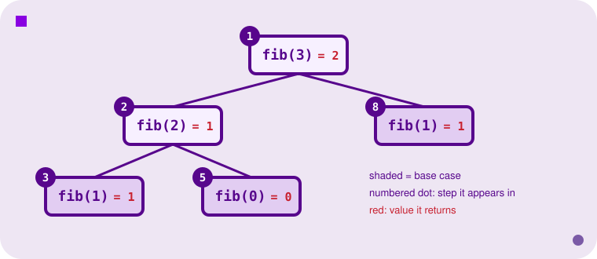
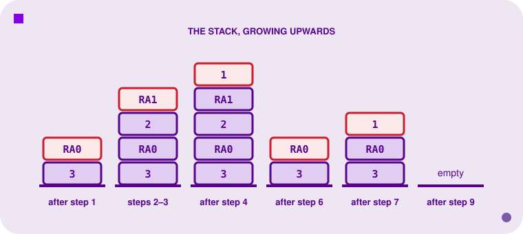

<h2 align=center>Week V</h2>

<h1 align=center>E20 Assembly Programming</h1>

---

## Sections

1. [**From Instructions to Programs**](#1)
2. [**Conditionals: If/Else in E20**](#2)
3. [**Loops: For and While Patterns**](#3)
4. [**Arrays: Reading, Writing, and Iterating**](#4)
    1. [**Checking a Palindrome with Two Pointers**](#4-1)
5. [**Subroutines: `jal` and `jr`**](#5)
6. [**The Return-Address Problem**](#6)
7. [**Recursion and the Case for a Stack**](#7)
8. [**Tracing a Complete Program**](#8)

---

Last week gave you the E20's instruction set: registers, memory, arithmetic, and the raw mechanics of jumping. That's the language, but not the programming—knowing what `jeq` does isn't the same as knowing how to write a loop with it. This week is about the second thing. We'll take the small set of primitives from last time—`slt`, `jeq`, `lw`/`sw`, `jal`/`jr`—and assemble them into the control-flow patterns you already know from higher-level languages: `if`/`else`, `for`, `while`, arrays, and function calls. Every one of these patterns is something you've used a thousand times without thinking about it.

---

<a id="1"></a>

## From Instructions to Programs

E20 has no `if`, no `for`, no `while`, and no `function`. It has exactly one thing that changes control flow based on a condition (`jeq`), one thing that changes control flow unconditionally (`j`), one thing that changes control flow through a register (`jr`), and one thing that changes control flow *and* remembers where it came from (`jal`). Every structured pattern you'll ever write in E20—no matter how it reads in a higher-level language—compiles down to some arrangement of those four primitives.

This isn't a limitation particular to E20; it's true of every processor you'll ever program close to the metal, including the one in your laptop. A compiler's entire job, in the control-flow department, is exactly this translation: take `if (x < y) { ... } else { ... }` and lower it into a comparison instruction plus a couple of jumps. Once you've done this translation by hand a few times, you'll never see an `if` statement the same way again—you'll see it as "compare, then jump." It's magical.

---

<a id="2"></a>

## Conditionals: If/Else in E20

Consider the simplest possible conditional:

```
if (Reg1 == 0) {
    Reg1 += 2;
} else {
    Reg1 += 1;
}
```

`jeq` gives you equality-and-branch in one instruction, so the "then" branch is direct. The subtlety is what happens to the "else" branch—the code that runs when the condition is *false*, which is to say, whenever `jeq` does nothing. E20 doesn't jump on failure; the program counter just advances to the next line as if the comparison never happened. Concretely:

```asm
movi $1, 5                    # $1 := 5, the value the condition will test (movi is shorthand for addi $1, $0, 5)
jeq $1, $0, they_are_equal    # compare $1 with $0 (which is always 0): if $1 == 0, jump to the "then" code
addi $1, $1, 1                # not jumped, so $1 != 0: this is the else branch, $1 := $1 + 1
j done                        # IMPORTANT: unconditionally skip over the "then" code below

they_are_equal:               # label: the address of the next instruction (start of the "then" branch)
addi $1, $1, 2                # only reached by the jeq above, i.e. when $1 == 0: $1 := $1 + 2

done:                         # label: both branches rejoin here, and the program carries on
halt                          # stop the processor
```

That `j done` is not optional—it's the entire mechanism that makes this an if/else instead of an if-then-fallthrough. Without it, execution would run the "then" branch's addition and then fall straight through into the "else" branch's addition too, doing both. Every two-armed conditional you write in assembly needs this shape: condition, conditional jump to arm B, arm A's code, unconditional jump past arm B, arm B's code. Miss the unconditional jump and your `if`/`else` becomes an `if`/`then-always`.

`jeq` only tests equality, so anything else—less-than, greater-than, less-or-equal—has to be built by combining it with `slt`. `slt $1, $2, $3` computes a boolean (`$2 < $3`) into a register; `jeq` then branches on whether that boolean is 0 or 1:

```asm
movi $2, 3              # $2 := 3
movi $3, 8              # $3 := 8
slt $1, $2, $3          # $1 := 1 if $2 < $3, else 0 (jeq only tests equality, so we first make "<" a 0 or 1)
jeq $1, $0, not_less    # $1 == 0 means "$2 < $3" was false, so $2 >= $3: jump to the else code

addi $2, $2, 1          # fall-through, only when $2 < $3: the "then" branch, $2 := $2 + 1
j done                  # skip over the else code below

not_less:               # label: the else branch starts here
addi $2, $2, 2          # only reached when $2 >= $3: $2 := $2 + 2

done:                   # label: both paths rejoin here
halt                    # stop the processor
```

Greater-than-or-equal is literally the opposite of less-than, which is exactly what the `not_less` branch already computes. Less-or-equal takes one more step: check equality first, and only fall through to the `slt` check if the values differ.

---

<a id="3"></a>

## Loops: For and While Patterns

A loop is a conditional that jumps *backwards* instead of forward. That's the whole idea—everything else is bookkeeping. Two shapes come up constantly.

**Counted loop** (you know the number of iterations in advance, or can compute it, i.e. a `for`-loop):

```
movi $1, 2               # $1 := loop counter, starts at 2 (movi is shorthand for addi $1, $0, 2)
movi $2, 0               # $2 := a running total, starts at 0
loop:                    # label: the top of the loop, the address the backward jump returns to
    jeq  $1, $0, done    # TEST FIRST: if the counter has reached 0, leave the loop (a forward jump to done)
    addi $2, $2, 5       # the body: add 5 to the running total
    addi $1, $1, -1      # counter := counter - 1
    j loop               # jump back to the top: the test runs again before the next lap
done:                    # label: execution continues here once the loop is over
    halt                 # stop the processor
```

**Sentinel loop** (you loop until you see a specific value, e.g. a zero-terminated array, i.e. a `while`-loop):

```
movi $1, 0                # $1 := index into the array, starts at element 0
loop:                     # label: the top of the loop
    lw   $2, myarray($1)  # $2 := the memory cell at address myarray + $1 (the current element)
    jeq  $2, $0, done     # if that element is 0 (the sentinel), stop: jump out of the loop
    addi $1, $1, 1        # index := index + 1: moves to the next element, and counts the elements seen so far
    j loop                # jump back to the top
done:                     # label: we land here once the sentinel has been read
    halt                  # stop the processor

myarray:                  # label: the address of the first element
    .fill 7               # myarray[0]
    .fill 4               # myarray[1]
    .fill 0               # myarray[2]: the sentinel
```

Trace the counted loop: the body runs exactly twice, so `$2` ends at 10. Trace the sentinel loop: it reads 7, then 4, then the sentinel 0, so `$1` ends at 2, the number of elements before the sentinel.

Both shapes have the same skeleton: a label marking the top of the loop, a test that can exit the loop, the body, and an unconditional jump back to the top. Worth internalising this pattern by hand once, because you'll type it dozens of times this semester: **test-then-body-then-jump-back**, not the reverse. If you put the test after the body instead of before, you've written a `do`/`while`, which runs at least once even when the condition is false from the start—usually not what you want.

---

<a id="4"></a>

## Arrays: Reading, Writing, and Iterating

An array is nothing but a sequence of adjacent memory cells and a label marking where it starts. There's no array *type* in E20: just a convention. Declare a block of `.fill` values under one label, and treat offsets from that label as indices.

Here's a program that **copies** one zero-terminated array into another, which exercises both halves of the section title: reading an element (`lw`) and writing one (`sw`), with the same index.

```
movi $1, 0                # $1 := index, starts at 0 (the first element of both arrays)

loop:                     # label: the top of the loop
    lw   $2, src($1)          # READ:  $2 := the cell at address src + $1, i.e. src[$1]
    sw   $2, dst($1)          # WRITE: the cell at address dst + $1 := $2, i.e. dst[$1] := $2
    jeq  $2, $0, done         # if the value we just copied was the 0 sentinel, we're finished
    addi $1, $1, 1            # otherwise move the index on by one element
    j loop                    # and go around again
done:                         # label: reached right after the sentinel has been copied
    halt                      # stop the processor (halt is a jump to itself, forever)

src:                          # label: the address of the first source element
    .fill 8                   # src[0]
    .fill 6                   # src[1]
    .fill 0                   # src[2]: the sentinel that ends the array
dst:                          # label: the address of the first destination cell
    .fill 9                   # dst[0]: a placeholder, overwritten by the copy
    .fill 9                   # dst[1]: placeholder
    .fill 9                   # dst[2]: placeholder (receives the sentinel)
```

The mechanism doing all the work here is `lw $2, src($1)`: a memory reference where the immediate part (`src`) is fixed and the register part (`$1`) changes every iteration. `src($1)` means:

> "The address `src`, plus whatever's currently in `$1`."

As `$1` counts 0, 1, 2, 3, ..., the effective address walks `src`, `src+1`, `src+2`, ... one cell at a time. That's the entire idea of indexed addressing: an array isn't a special hardware feature, it's just base-plus-offset addressing where the offset happens to change in a loop. And because `sw $2, dst($1)` uses the *same* index with a different base, the two arrays move in lockstep: one index register drives both.

Notice the order inside the loop: the copy happens *before* the sentinel test, so the zero gets copied too (`dst` ends up `8, 6, 0`, not `8, 6, 9`). If you test first and copy after, the terminator never arrives and anyone reading `dst` later would run off the end. This is the one place the "test-then-body" rule from Section 3 bends on purpose.

<a id="4-1"></a>

### Checking a Palindrome with Two Pointers

Copying only ever needs one index walking forward. A palindrome check needs two pointers walking towards each other: a good next step up in complexity.

The idea: keep a pointer at the front and a pointer at the back, compare the elements they point to, and if they match, move the front pointer forward and the back pointer backwards. If you reach the middle without finding a mismatch, it's a palindrome. If you find one mismatch, you can stop right away. Here's `items`, three elements, front pointer starting at the label and back pointer computed by hand as "the label's address, plus two" (since the last of three elements sits two cells past the first). The answer goes in the cell `ispal`: 1 for a palindrome, 0 for not.

```
movi $1, items          # $1 := front pointer: the ADDRESS of items (movi can load a label's value)
movi $2, items          # $2 := back pointer: starts at items too...
addi $2, $2, 2          # ...then nudged to the last element: items + 2 (three elements, so two cells on)

loop:                   # label: the top of the loop
    slt  $3, $1, $2              # $3 := 1 if front < back (still pairs left to check), else 0
    jeq  $3, $0, yes             # $3 == 0: front reached or passed back, so every pair matched

    lw   $4, 0($1)               # $4 := the element at address $1 (the front one)
    lw   $5, 0($2)               # $5 := the element at address $2 (the back one)
    jeq  $4, $5, same            # if the two are equal, this pair matches: go and move the pointers
    movi $6, 0                   # they differ: the answer is 0, "not a palindrome"
    j    done                    # and there's no point checking further, so jump to the end

same:                            # label: a matching pair, so keep checking
    addi $1, $1, 1               # front pointer moves one cell forward
    addi $2, $2, -1              # back pointer moves one cell backward
    j    loop                    # check the next pair

yes:                             # label: reached only when the loop ended without a mismatch
    movi $6, 1                   # the answer is 1, "it is a palindrome"
done:                            # label: both outcomes meet here, with the answer in $6
    sw   $6, ispal($0)           # store the answer into the memory cell labelled ispal
    halt                         # stop the processor

items:                           # label: the address of the first element
    .fill 4                      # items[0]
    .fill 9                      # items[1]: the middle element
    .fill 4                      # items[2]
ispal:                           # label: the cell that receives the answer
    .fill 9                      # placeholder, overwritten by the sw above
```

Trace it and `ispal` ends up 1. Change the last element of `items` from 4 to 5 and it ends up 0: the very first pair (4 and 5) mismatches, so the loop stops after one pass and never looks at the middle.

Two things are worth pausing on.

1. First, notice `$1` and `$2` hold *addresses*, not indices this time: `movi $1, items` loads the numeric address the label `items` represents directly, and `0($1)` then means "the memory cell at exactly that address," with no separate index register needed. This is a different (and, once you get used to it, more direct) way to walk memory than the offset-from-a-fixed-base pattern in the copying example above. Both are valid, and which one you reach for depends on whether it's more natural to think in terms of "index into an array" or "a pointer wandering through memory."

2. Second, notice that **one** exit check is enough, even though the array could have an even or an odd number of elements. With three elements the two pointers land on the exact same cell (the middle one), and `slt $3, $1, $2` is 0 when the values are *equal*, so the loop stops there, correctly, since a middle element always matches itself. With an even number of elements the pointers never share a cell: they cross past each other in one step, and `slt` is 0 then too. `slt` asking "is front *strictly* before back?" quietly covers both cases at once. Try tracing a four-element array by hand to see the crossing case, and then try replacing `slt` with a `jeq`-only test to see exactly which case it would miss.

---

<a id="5"></a>

## Subroutines: `jal` and `jr`

Every loop and conditional so far has been flat—flow moves around within one block of code, but never leaves and comes back. A **subroutine** is different: it's a chunk of code invoked from possibly many places, that always returns to wherever it was called from. In a higher-level language:

```c
int quadruple(int x) 
{
    return x * 4;
}

int main() 
{
    int a = quadruple(1);
    int b = quadruple(5);
    return 4 * a + b;   // uses the *value returned*, not the argument
}
```

The subtlety this hides from you is exactly what assembly forces you to confront: `quadruple` returns to a *different* place on each call (back to the first call site, then the second)—so "where do I return to" can't be baked into `quadruple`'s code as a fixed jump target. It has to be computed at the moment of the call and remembered until the moment of the return.

E20 solves this with a dedicated register and two instructions:

- **`jal label`** ("jump and link") does two things in one instruction: it stores the address of the *next* instruction (the one right after the `jal`) into `$7`, and then jumps to `label`.
- **`jr $reg`** ("jump to register") jumps to whatever address is currently sitting in `$reg`. Called as `jr $7` right after a `jal`, it jumps back to exactly the instruction after that `jal`.

E20 has no argument-passing or return-value convention built into the hardware; by convention, this course passes the argument in `$1` and the result back in `$1` too—`quadruple` overwrites the register it was handed:

```asm
movi $1, 1               # the first call's argument: $1 := 1 (by our convention, arguments go in $1)
jal  quadruple           # $7 := the address of the next line, then jump to quadruple. On return, $1 = 4
add  $2, $0, $1          # copy the result somewhere safe: $2 := 4 (the second call will overwrite $1)

movi $1, 5               # the second call's argument: $1 := 5
jal  quadruple           # $7 := the address of the NEXT line (different from last time), jump. On return, $1 = 20

add  $4, $2, $1          # combine the two results: $4 := 4 + 20 = 24 (the 4*1 + 4*5 from the C code)
halt                     # stop the processor

quadruple:               # label: the subroutine's entry point, where both jals land
    add $1, $1, $1       # $1 := 2 * $1 (adding a register to itself doubles it)
    add $1, $1, $1       # $1 := 2 * $1 again, so 4 * the original argument
    jr  $7               # jump to the address in $7: back to whichever jal called us
```

Trace it: the first `jal` sets `$7` to the address of `add $2, $0, $1` and jumps into `quadruple`, which doubles `$1` twice (1 → 2 → 4) and returns there via `jr $7`; `$2` becomes 4. The second `jal` reuses the exact same `quadruple` code, this time returning to the *second* `add`; `$1` goes 5 → 10 → 20. Final answer: `$4 = 4 + 20 = 24`. One subroutine, two call sites, two different return addresses—computed fresh each time, not fixed in the code.

`jal` and `jr` are a matched pair, and `$7` is the thread connecting them: `jal` writes the return address, `jr $7` reads it back. Everything about how subroutines behave in E20 falls out of that one fact.

---

<a id="6"></a>

## The Return-Address Problem

What happens if `sub1` calls a *second* subroutine, `sub2`, before returning?

```asm
main:                   # label: the caller
    jal sub1            # $7 := the address of the halt below (call it A), then jump to sub1
    halt                # where sub1 should return to, and the program ends

sub1:                   # label: a subroutine
    movi $2, 9          # some work inside sub1: $2 := 9
    jal sub2            # PROBLEM: this overwrites $7 with the address of the next line (call it B)!
    movi $3, 8          # more work inside sub1: $3 := 8 (reached when sub2 returns)
    jr   $7             # returns to wherever $7 points NOW (B)... NOT back to main (A), which has been lost

sub2:                   # label: the nested subroutine
    movi $4, 7          # some work inside sub2: $4 := 7
    jr   $7             # returns to wherever $7 points: here, correctly, back into sub1
```

Trace it by hand and the problem is pretty clear: `jal sub1` sets `$7` to the address right after itself (call it address A, back in `main`). Partway through `sub1`, `jal sub2` runs—and `jal` *always* overwrites `$7`, unconditionally, with the address right after itself (call it address B, inside `sub1`). By the time `sub2` returns via `jr $7`, `$7` correctly holds B, so control returns to `sub1` as intended. But now `sub1` itself has lost its own return address entirely—the value A that used to be in `$7` is gone, "clobbered" (actual terminology) by `sub2`'s call. When `sub1` finally reaches its own `jr $7`, `$7` no longer holds A; it holds whatever `sub2` most recently touched it to. Execution goes somewhere, but not back to `main`.

This is a direct, structural consequence of having exactly one link register. A single register can hold exactly one return address at a time—which means at most one "pending call" can be in flight before something gets overwritten. Nested calls (a subroutine calling another subroutine) put two pending calls in flight simultaneously, and E20's hardware, as given, has nowhere to put the second one. The same problem, more severely, rules out **recursion**: a subroutine calling *itself* is nested calls taken to the extreme, with an unbounded number of pending returns needing to be remembered at once. Plain E20 subroutines genuinely cannot recurse.

The fix is exactly what the diagnosis suggests: if `$7` is about to be overwritten by a nested call, save its value somewhere safe *first*, and restore it right before returning.

```
main:                       # label: the caller
    jal  sub1               # $7 := the address of the halt below (call it A), then jump to sub1
    halt                    # where sub1 should return to, and the program ends

sub1:                       # label: a subroutine
    sw   $7, saved_ra($0)   # save our return address into memory before it's at risk
    movi $2, 9              # some work inside sub1: $2 := 9
    jal  sub2               # safe now: sub2 can freely clobber $7, because we have a copy
    movi $3, 8              # more work inside sub1: $3 := 8 (reached when sub2 returns)
    lw   $7, saved_ra($0)   # restore our return address from memory back into $7
    jr   $7                 # NOW this returns to main, correctly

sub2:                       # label: the nested subroutine
    movi $4, 7              # some work inside sub2: $4 := 7
    jr   $7                 # returns into sub1 (the address that sub2's own jal wrote)

saved_ra:                   # label: the one memory cell we reserve for the saved return address
    .fill 0                 # starts at 0; sw overwrites it with the real return address
```

This works, but notice what it costs: `saved_ra` is one specific, hard-coded memory cell, which means this exact trick breaks the instant `sub1` might call itself (both the outer and inner call would fight over the same `saved_ra` cell) or the instant two different subroutines both try to use it. A *general* solution needs a return address stored somewhere that naturally supports many pending calls _stacked_ on top of each other, each with its own private storage—which is, not coincidentally, exactly what a **stack** is for. E20 doesn't give you one built in. Real architectures do, and you'll meet it properly when we get to x86 later in the semester: a dedicated stack pointer register, and `push`/`pop`/`call`/`ret` instructions that manage arbitrarily deep nesting automatically. Everything you just did by hand with `saved_ra` is what a hardware stack does for you, generalised to any depth.

---

<a id="7"></a>

## Recursion and the Case for a Stack

The `saved_ra` trick from the last section fixes *one* level of nesting. It does not fix **recursion**—a subroutine calling itself—because recursion is nesting with no fixed depth: you don't know ahead of time how many pending calls will be in flight at once, so you can't hand each one its own hard-coded memory cell in advance. What you need instead is storage that grows and shrinks automatically as calls go deeper and come back: a **stack**.

E20 has no stack built into the hardware—no dedicated stack-pointer register, no `push`/`pop` instructions. But nothing stops you from *simulating* one by convention: reserve a register to track the address of the next free cell (call it the **top of stack**), and build "push" and "pop" out of ordinary `sw`/`lw` plus an increment or decrement:

```
# push $reg: store it at the top of the stack, then bump the pointer up
sw   $reg, 0($6)         # Mem[$6] := $reg ($6 is our stack pointer: it holds the next free address)
addi $6, $6, 1           # $6 := $6 + 1, so the pointer now points at the next free cell

# pop into $reg: bump the pointer down, then load from the new top
addi $6, $6, -1          # $6 := $6 - 1, so the pointer now points at the last value pushed
lw   $reg, 0($6)         # $reg := Mem[$6], the value that was pushed last
```

This is bookkeeping the *programmer* does by hand in E20; real architectures (x86, later in the semester) give you this exact mechanism as hardware primitives, with a dedicated stack-pointer register and `push`/`pop`/`call`/`ret` instructions that do it automatically.

**The convention for a recursive call:** before every recursive call, push whatever you'll still need afterwards—your own argument (you'll need it again once the recursive call returns) and your own return address (the recursive call is about to clobber `$7`). After the call returns with its result, pop them back, and if you're about to make a *second* recursive call, push the first call's result too, so it survives.

Trace `fib(3)` (with the usual `fib(0) = 0`, `fib(1) = 1`, `fib(n) = fib(n-1) + fib(n-2)`) under this convention:

1. **`fib(3)`** pushes its argument (3) and its return address, then calls `fib(2)`.
2. **`fib(2)`** pushes its argument (2) and its return address, then calls `fib(1)`.
3. **`fib(1)`** is a base case: no recursion, no pushing. It returns `1` directly.
4. Back in `fib(2)`: the result of `fib(1)` is `1`. Push it (so it survives the next call), then call `fib(0)`.
5. **`fib(0)`** is a base case too: it returns `0` directly.
6. Back in `fib(2)`: pop `fib(0)`'s result (`0`) and `fib(1)`'s saved result (`1`), sum them (`1`), pop its own return address and argument off the stack, and return `1` to `fib(3)`.
7. Back in `fib(3)`: the result of `fib(2)` is `1`. Push it, then call `fib(1)` a second time (the *other* term in `fib(3) = fib(2) + fib(1)`).
8. **`fib(1)`** is a base case again: returns `1`.
9. Back in `fib(3)`: pop this second `fib(1)`'s result (`1`) and the saved `fib(2)` result (`1`), sum them (`2`), pop its own return address and argument, and return `2` to whoever called `fib(3)`.

<p align=center>
    
</p>
<p align=center><sub>The calls made by <code>fib(3)</code>, numbered by the step of the trace above in which each one appears. Shaded boxes are base cases: no recursion, no pushing.</sub></p>

Two snapshots of the stack make the shape concrete. At the deepest point of the recursion (step 3, right as `fib(1)` is about to return), the stack holds two complete, still-pending frames:

| Address | Value | Belongs to |
|---|---|---|
| top − 4 | `3` | `fib(3)`'s argument |
| top − 3 | *(return address into whatever called `fib(3)`)* | `fib(3)`'s return address |
| top − 2 | `2` | `fib(2)`'s argument |
| top − 1 (top) | *(return address into `fib(3)`)* | `fib(2)`'s return address |

Four cells, one pair per pending call—exactly the capacity a single register (`$7`) doesn't have. By the time step 9 finishes, every one of those cells has been popped back off, in the reverse order they went on, and the stack is empty again.

<p align=center>
    
</p>
<p align=center><sub>The stack at six moments of the trace (top cell in red). <code>RA0</code> is <code>fib(3)</code>'s return address, <code>RA1</code> is <code>fib(2)</code>'s. It peaks at five cells and ends empty.</sub></p>

This is the whole idea, generalised: **a stack turns "one return address" into "as many return addresses as you have memory for," at the cost of the programmer (or, on a real machine, the hardware) managing push and pop discipline instead of a single fixed slot.** `fib(3)` only goes three calls deep; nothing about the mechanism changes if it went thirty, or three thousand—the stack just grows and shrinks further. That's the capability plain E20 subroutines are missing, and it's the single biggest reason real ISAs build a hardware stack in rather than leaving it to software convention.

---

<a id="8"></a>

## Tracing a Complete Program

Let's put everything together: conditionals, loops, and arrays, in one program that counts how many elements of a zero-terminated array are at least 10.

```
main:                   # label: the start of the program
    movi $1, 0              # $1 := index into the array, starts at element 0
    movi $2, 0              # $2 := count of elements that are >= 10, starts at 0

loop:                   # label: the top of the loop
    lw   $3, myarray($1)    # $3 := the current element, the cell at address myarray + $1
    jeq  $3, $0, done       # if it is 0 (the sentinel), we've seen the whole array: jump to done
    slti $4, $3, 10         # $4 := 1 if the element is less than 10, else 0
    jeq  $4, $0, big        # $4 == 0 means element >= 10: jump over to the code that counts it
    j    next               # element < 10: nothing to count, so skip the counting instruction
big:                    # label: the element is >= 10
    addi $2, $2, 1          # count := count + 1
next:                   # label: both paths meet here to move to the next element
    addi $1, $1, 1          # index := index + 1
    j    loop               # back to the top for the next element

done:                   # label: the sentinel was reached
    sw   $2, count($0)      # store the final count into the memory cell labelled count
    halt                    # stop the processor

myarray:                # label: the address of the first element
    .fill 10                # myarray[0]
    .fill 3                 # myarray[1]
    .fill 0                 # myarray[2]: the sentinel
count:                  # label: the cell that receives the answer
    .fill 0                 # starts at 0; sw overwrites it with the count
```

Trace it by hand once. `$1` and `$2` start at 0. The loop walks 10 and 3 in turn. For 10, `slti` asks whether 10 is *strictly* less than 10: it isn't, so `$4` is 0, the `jeq $4, $0, big` *does* fire, and `$2` becomes 1. So "at least 10" includes 10 itself. For 3, `slti` gives `$4 = 1`, so the `jeq` does *not* fire, and `j next` skips the count. Then the sentinel 0 is reached and the loop exits, storing `count = 1`.

Notice this program is built entirely from patterns from earlier in this note: the sentinel loop from Section 3, the array-walking `lw` from Section 4, and the if-inside-a-loop idiom from Section 2, nested one level deeper (the `if` lives inside the loop body rather than standing alone). This is the actual skill this week is building: not memorising any one pattern, but recognising that complex programs are just these small idioms, composed.


---

<sub>**Previous: [The E20 Processor & Assembly Language](/lectures/05-e20)** || **Next: [The E20 Single-Cycle Datapath](/lectures/07-e20-single-cycle-implementation)**</sub>
