<h2 align=center>Week VI</h2>

<h1 align=center>The E20 Single-Cycle Datapath</h1>

<strong><em>Song of the day</strong>: <a href="https://youtu.be/YYwiO_tGmT0"><strong><u>Cash Wednesday</u></strong></a> by Skylar Spence (2015), recommended by Eliot K.</em>

---

## Sections

1. [**From Instructions to Circuits**](#1)
2. [**The Four Base Components**](#2)
    1. [**How to Read the Labels**](#2-0)
    2. [**Memory**](#2-1)
    3. [**The Register File**](#2-2)
    4. [**The ALU**](#2-3)
    5. [**The Program Counter**](#2-4)
3. [**Wiring the Fetch Path**](#3)
4. [**Decoding the Instruction**](#4)
5. [**The Register File's Two Jobs**](#5)
6. [**Feeding the ALU**](#6)
7. [**Memory Access: Closing the Loop for `lw`/`sw`**](#7)
8. [**The Program Counter's Four Suitors**](#8)
9. [**The Control Module**](#9)
10. [**Tracing Instructions Through the Whole Machine**](#10)
11. [**The Cost of "Single-Cycle"**](#11)

---

If someone tells you to jump, your legs just do it. You don't consciously route signals down your spinal cord. Now type `jeq $1, $2, somewhere` into the assembler and hit go. How does a slab of silicon *know* what to do with that?

For the last two weeks, the E20 has been a black box: you write `add $1, $2, $3`, and *something* in there makes it true. Assembly is the steering wheel and the pedals. This week we pop the hood, going from **operator** to **mechanic**, and we build the engine **one wire at a time**.

---

## From Instructions to Circuits

Here's the one rule for this lecture:

> **Every wire we draw must be justified by an instruction that needs it.** No ghost wires.

We're not designing a processor from scratch, and we're not adding lines because they make the schematic look nice. We're building the *minimum* circuit that makes the instruction set from Weeks 4 and 5 physically real:

- `add` reads two registers and writes one, so the register file needs (at least) two read ports and one write port.
- `lw` computes an address and then reads memory at it, so the ALU needs to be wired to memory's address input.
- `jeq` conditionally overwrites the program counter, so the PC needs more than one possible next value, plus something to choose between them.

If you can't name the instruction that demands a wire, the wire doesn't exist.

---

## The Four Base Components

Picture a workbench with four islands of hardware on it. Each island has labelled **ports**: named inputs and outputs, exactly like a Verilog module's port list from Week 2. And nothing moves between islands except along a drawn wire. No wireless, no telepathy.

    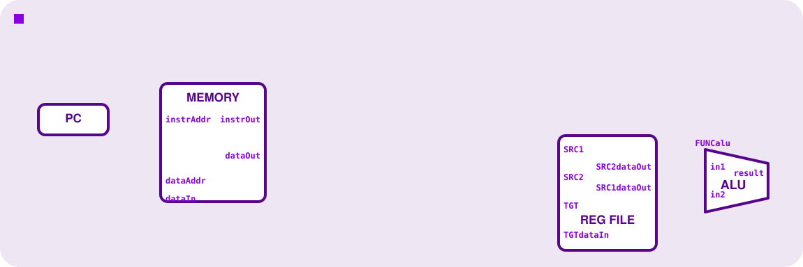

The bench: memory, the program counter, the register file and the ALU. No wires yet, so if we turned it on, nothing would happen.

### How to Read the Labels

The port and signal names in this lecture look cryptic at first, tbh, but they're all abbreviations built from a handful of pieces. Here's the decoder ring, so nothing later in the lecture is a mystery:

| Name | Stands for | What it is |
|---|---|---|
| **PC** | program counter | the register holding the address of the current instruction |
| **ALU** | arithmetic logic unit | the circuit that adds, subtracts, ANDs, ORs and compares |
| **instrAddr** | instruction address | memory input: *which cell* to fetch an instruction from |
| **instrOut** | instruction out | memory output: the instruction that was fetched |
| **dataAddr** | data address | memory input: *which cell* `lw`/`sw` want to touch |
| **dataIn** | data in | memory input: the value `sw` wants to store |
| **dataOut** | data out | memory output: the value read at `dataAddr` (what `lw` loads) |
| **SRC1**, **SRC2** | source 1, source 2 | register file inputs: the *names* of the two registers to read |
| **SRC1dataOut**, **SRC2dataOut** | source data out | register file outputs: the *values* stored in those two registers |
| **TGT** | target | register file input: the *name* of the register to write |
| **TGTdataIn** | target data in | register file input: the *value* to write into that register |
| **rA**, **rB**, **rC** | register fields A, B, C | the three 3-bit register-name fields of an instruction |
| **func** | function | the 4-bit sub-opcode that tells apart `add`, `sub`, `and`, ... (they share one opcode) |
| **imm7**, **imm13** | immediate, 7 or 13 bits | a constant stored inside the instruction itself |
| **MUX** | multiplexer | a circuit that picks one of several inputs and passes it along |
| **EQ** | equal | ALU output telling control whether the comparison came out equal (the ALU result was zero) |

The **control signals** (the outputs of the control module) follow one more naming convention: a `MUX` prefix followed by the wire it controls, or a `WE` prefix, or `FUN`:

| Signal | Stands for | What it decides |
|---|---|---|
| **FUNCalu** | function of the ALU | which operation the ALU performs (add, subtract, and, or, slt) |
| **MUXalu** | mux at the ALU | whether the ALU's second input is a register or the immediate |
| **MUXpc** | mux at the PC | which of four candidates becomes the next PC |
| **MUXrf** | mux at the register file | which field names the second register to read: `rA` (0) or `rC` (1) |
| **MUXtgt** | mux for the target value | which value gets written into the target register (ALU, memory, or `pc+1`) |
| **MUXdst** | mux for the destination | which register field names the destination (`rB`, `rC`, or `7`) |
| **WErf** | write enable, register file | 1 = the register file writes on this clock edge, 0 = it ignores the write |
| **WEdmem** | write enable, data memory | 1 = memory writes at `dataAddr` on this clock edge (`sw` only), 0 = it doesn't |

Two spellings to keep straight: `TGT` names the *register* being written, and `TGTdataIn` is the *value* going into it; likewise `SRC1` is a register *name* going in, and `SRC1dataOut` is that register's *value* coming out. Names go in, values come out.

### Memory

    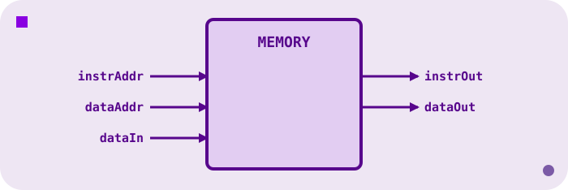

MEMORY, with its instruction-fetch port and its data port.

Think of memory as a giant wall of post office boxes: 8192 cells, but with *two* completely independent sets of ports bolted on:

- **The instruction-fetch port:** `instrAddr` in, `instrOut` out. Read-only, driven by the program counter. You hand the postmaster a slip of paper with a box number, and they hand back an instruction.
- **The data port:** `dataAddr`, `dataIn`, `dataOut`. This is what `lw` and `sw` use.

There's no separate code memory and data memory. This is the "unified memory" idea from Week 4: one array, two doors. The machine doesn't know whether a cell holds an instruction or a variable; it depends on which door you knocked on.

### The Register File

    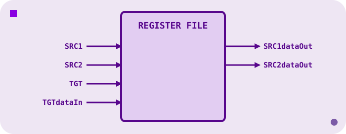

REGISTER FILE: two read ports, one write port.

The register file is a tiny, intensely fast set of mailboxes sitting right next to the ALU. It holds `$0` through `$7`. Why have it at all, if memory exists? Distance and physics: main memory is vast, and driving a signal down those long wires takes time. The ALU can't afford to wait on it for every addition.

- **Reading:** a register **name** goes into `SRC1` (or `SRC2`) and that register's **value** comes out of `SRC1dataOut` (or `SRC2dataOut`). Combinational: no clock edge needed.
- **Writing:** a name on `TGT`, a value on `TGTdataIn`, and if the (implicit) write-enable is on, the value lands in that register on the next clock edge.

### The ALU

    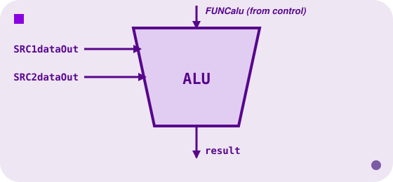

ALU: two data inputs, one result, and a function-select from control.

The calculator: two 16-bit inputs, one 16-bit result, and a hidden **function-select** (add? subtract? AND? OR? less-than?) that the control module will drive. The key thing about the ALU is how *little* it knows. It has no idea what instruction is running. All of an instruction's personality lives outside it, in the wiring and control signals that feed it.

### The Program Counter

The program counter is the bookmark in your code: one 16-bit register holding the address of the current instruction (only the low 13 bits matter, per Week 4). Simplest component, most contested one: by the end, four different values will want to be the next PC.

---

## Wiring the Fetch Path

Before the machine can add anything, it has to *find* the instruction. Where does the instruction live, and what do you have to hand memory to get it back? 

It lives in memory, and you need an address to get it back. The PC holds the address.

So the first wire is obvious: the PC straight into `instrAddr`. Say the PC outputs `100`. That voltage travels down the wire, memory looks up cell 100, and the instruction pops out of `instrOut`.

    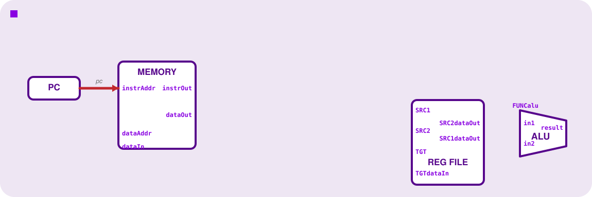

The first wire: PC to instrAddr.

That wire fetches instruction 100. What happens on the next clock tick if that's all we've wired? Nothing changes: the PC is still 100, so we fetch the same instruction forever.

We need something that advances the PC. In the example the PC went from 0 to 1 all by itself, so we need an adder. What goes *into* it? The number it must add one to: the current PC. Where does its output go? Back into the PC, to be stored at the end of the cycle. It isn't a whole ALU, just hardwired logic that adds one: a **`+1` adder**.

    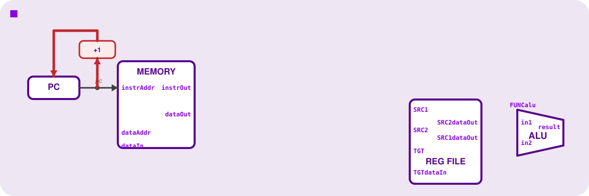

Adding +1: the PC feeds both memory and the adder, and the adder feeds back into the PC.

While memory is busy fetching instruction `100`, the adder is already whispering "the next one is `101`" into the PC's ear. On the clock edge the PC latches it, and the loop repeats. That's exactly the E15's fetch step from Week 3, drawn as hardware: `pc <- pc + 1`, every single cycle. Jumps will complicate this later (Section 8), but the *default* next PC is always one more than this one.

---

## Decoding the Instruction

Say memory hands back 16 bits for `add $3, $1, $2`. Which part do you look at first to know what kind of instruction it is? The top three bits: the _opcode_.

Whatever comes out of `instrOut` is just 16 wires carrying high or low voltage. The hardware tells an `add` from a `jal` by slicing, by bit position. There are three layouts (Week 4):

    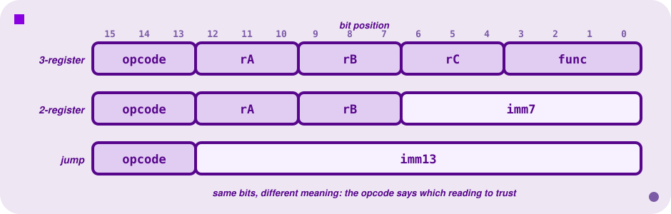

The same 16 bits, read three different ways depending on the opcode.

- **Three-register** (`add`, `sub`, ...): `opcode`, then `rA`, `rB`, `rC`, and a 4-bit `func` in bits 3 to 0.
- **Two-register** (`addi`, `lw`, `jeq`, ...): `opcode`, `rA`, `rB`, and then bits 6 to 0 merge into a single 7-bit signed `imm7`. It swallows the `rC` and `func` territory so a constant can live inside the instruction.
- **Jump** (`j`, `jal`): `opcode`, and then registers are abandoned: bits 12 to 0 become one 13-bit `imm13`. Thirteen bits is exactly enough to name any of the 8192 cells, which is *why* the E20 has 8192 cells. The width of the instruction sets the size of the machine.

Nothing in the wires says which reading is right. That's the opcode's job, and it's why it's **always the top 3 bits, in every layout**. If the opcode moved around, the hardware would need to know the layout *before* it could find the opcode, which is a paradox. Keeping it fixed means decoding starts the instant the bits leave memory.

Drawn on our canvas, the instruction coming out of memory is just a ribbon of fields, with brackets showing where `imm7` and `imm13` live:

    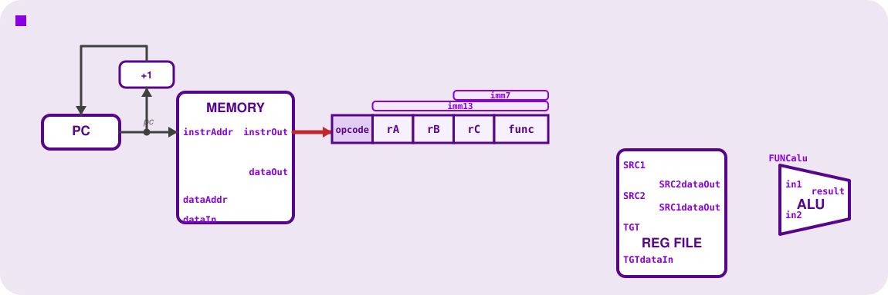

The instruction leaves memory and is sliced into fields.

---

## The Register File's Two Jobs

For `add $3, $1, $2`: which two registers does the instruction *read*, and which one does it *write*? In the bits, which fields hold them? 

- The first two register fields, `rA` and `rB` read.
- The third, `rC`, writes.

**Reading** is the easy half. `rB` goes straight into `SRC1`, and `rA` goes into `SRC2` (through a small mux we'll meet at the end of this section). Their values come out ready for the ALU.

    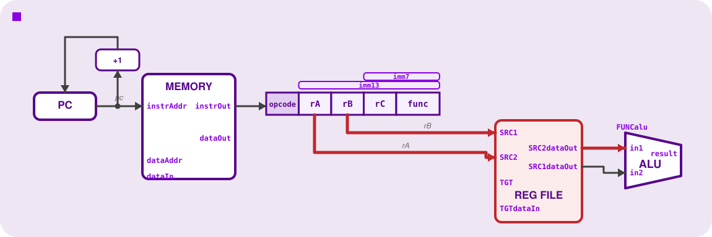

Reading: rB to SRC1, rA to SRC2. The values flow out toward the ALU.

**Writing** is where it gets spicy. 

`addi $1, $2, 5` also writes a register. Which field of its bits names the destination this time? The second, `rB`. 

So now the write port's `TGT` needs `rC` for `add` but `rB` for `addi`: one port, two possible sources. And `jal` writes `$7`, a destination that isn't even *in* the instruction. Three sources, one port. What do you put in front of it?

A **mux**. `MUXdst` selects between `rB`, `rC`, and the hardwired constant `7`, and its output feeds `TGT`.

    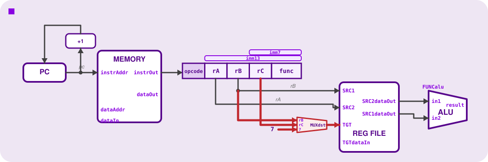

MUXdst: which register name reaches TGT.

A mux needs a select line, so what decides which input it picks? Ask what the instruction itself contains that tells an `add` apart from an `addi`: the **opcode**. Something has to turn "opcode in" into "select value out", with no memory involved: that's a **combinational circuit**, and we'll meet it later as the *control module*.

This is the pattern to internalise for the rest of the lecture:

> **Whenever two or more instructions need the same wire to carry different values, the answer is a mux, and something has to drive its select line.**

Picture a railway switch yard: one track leads into a tunnel, but several trains want to go through. The mux is the switch on the tracks, the select line is the lever.

    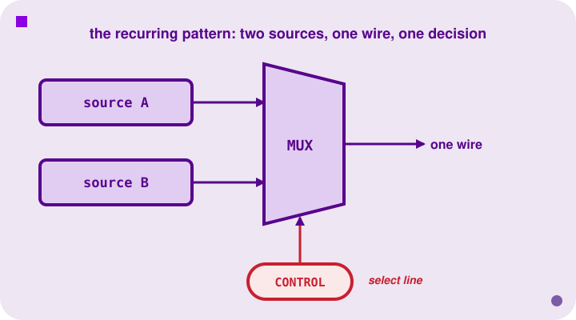

Every mux in this datapath is this same shape, over and over.

A smaller mux sits on the read side: `MUXrf` chooses which field names the second register read, `rA` (0) or `rC` (1). No E20 instruction reads `rC` (it is only ever a destination), so every instruction sets `MUXrf` to 0. The manual's diagram includes it anyway, and it shows up as a column in the truth table.

    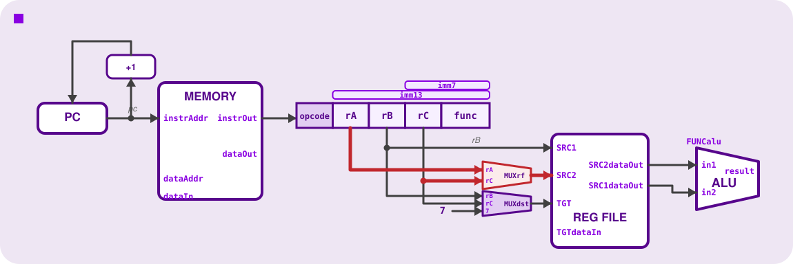

MUXrf sits on the read side: it chooses which field (rA or rC) names the second register read. Every instruction picks rA.

---

## Feeding the ALU

`SRC2dataOut` (the value of `rA`) goes straight into the ALU for every instruction that uses the ALU. The *other* input forks.

For `add $3, $1, $2`, which field names the register whose value is the ALU's other input (the one that is not `rA`)? And what does `addi` want there instead?

For `add` it is the `rB` field, so the **value** of `rB`, coming out of `SRC1dataOut`; `addi` wants its immediate.

One port, two things that want it: `add`, `sub`, `and`, `or`, `slt` want the value of `rB`, while `addi`, `slti`, `lw`, `sw` want the **immediate**. You can't just solder both wires onto it (hello, short circuit, hello, garbage data). Before we add the mux, the immediate needs fixing.

There's one wrinkle. Registers are 16 bits wide, but `imm7` is only 7. A 7-bit value doesn't fit a 16-bit track, so it first passes through **sign-extend**: hardwired logic that pads the front with copies of the sign bit. 

How do you expand `1111111` (that's -1) to 16 bits so it still means -1? Copy the sign bit: sixteen 1s. Zero-extending would give 127, which is a bug.

    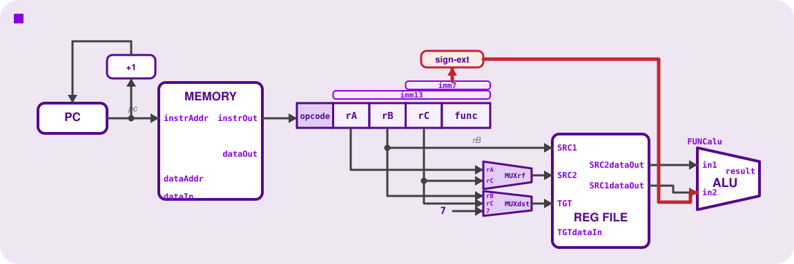

The immediate leaves the instruction and passes through sign-extend, so it arrives at the ALU as a 16-bit value. It now competes with SRC1dataOut for the ALU's other input.

Now both trains are 16 bits wide, and the collision is real: the register value and the immediate both want the ALU's other input. So we add the mux. `MUXalu` chooses between the value of `rB` (from `SRC1dataOut`) and the sign-extended immediate.

    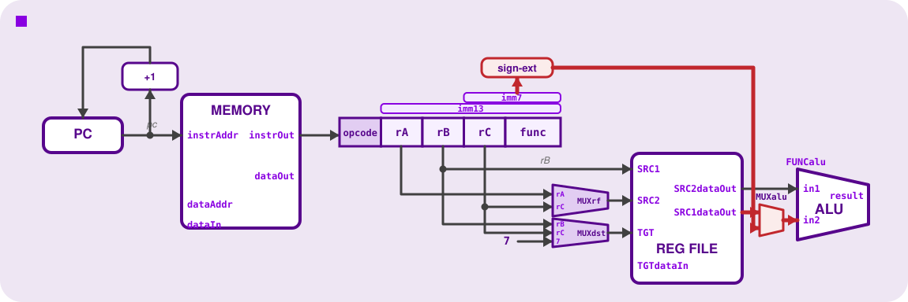

MUXalu chooses between SRC1dataOut and the sign-extended immediate for the ALU's other input.

Once both inputs are wired, something neat happens: `add`, `sub`, `and`, `or`, `addi` all become the *same* circuit path. The only thing that differs is `FUNCalu`, which tells the ALU which operation to perform.

---

## Memory Access: Closing the Loop for `lw`/`sw`

Alright, let's talk about memory. 

`lw $1, 4($2)` has to compute the address `$2 + 4` before it can read memory. Which piece of hardware you've already wired does register-plus-immediate? It's the ALU, with its function set to add.

That's the best hardware reuse in the lecture: no second adder for addresses. The ALU's output just goes into memory's `dataAddr`.

**Remember:** memory has *two* address ports. The PC already drives `instrAddr`, and its whole job is fetching instructions. `lw` and `sw` want a *variable*, so the ALU's output goes into `dataAddr`, the data port.

    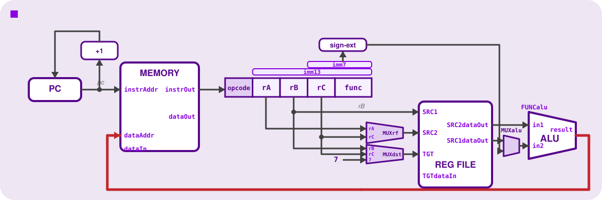

The ALU's result feeds dataAddr: no new arithmetic hardware.

Now the two memory instructions split.

**`sw`** also needs the *value* being stored, which is the value of `rB`, coming out of `SRC1dataOut`. Wire it to `dataIn`. Address set, data set, control turns on the memory write-enable, the clock ticks, and memory saves it.

    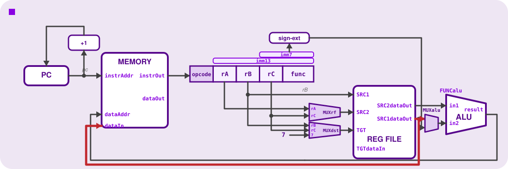

sw: the register value on SRC1dataOut also goes to memory's dataIn.

**`lw`** reads instead: memory looks up `dataAddr` and the value comes out of `dataOut`. It has to be written into a register through `TGTdataIn`. 

What's already feeding `TGTdataIn`? The ALU's output, for `add` and friends. So memory's `dataOut` wants the same port. Two streams, one door: you know the answer by now.

    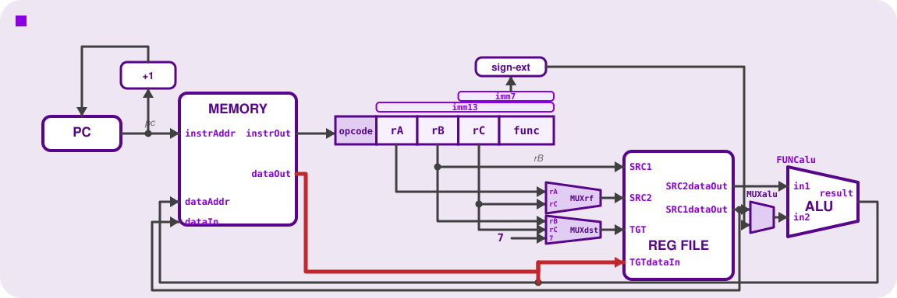

Two streams, one door: the ALU's result and memory's dataOut both want TGTdataIn.

`MUXtgt`: the final bouncer before the register file, deciding *what value* gets written. So far it picks between the ALU's output (arithmetic) and memory's `dataOut` (`lw`). A third input is coming in the next section, for `jal`.

    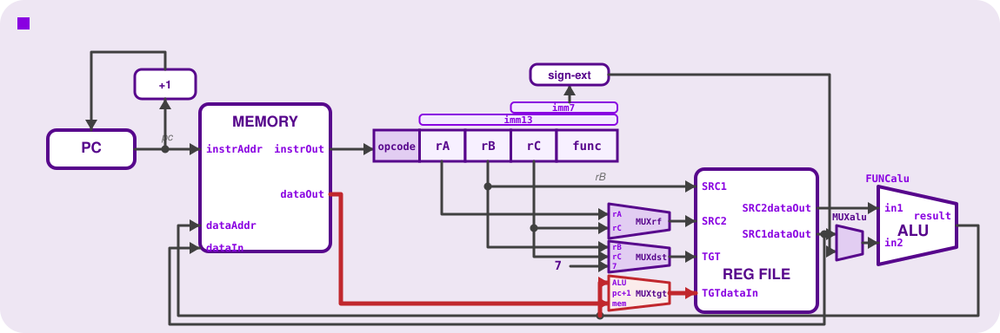

lw: memory's dataOut reaches TGTdataIn through MUXtgt.

---

## The Program Counter's Four Suitors

Section 3 wired `pc + 1` as *the* next PC. Plot twist: it isn't, it's the *default*. Real programs have loops and functions, so four values compete to be the next `pc`, and a final mux, `MUXpc`, picks the winner under the control module's direction:

| Instruction | Next PC | Where it comes from |
|---|---|---|
| (default: no jump) | `pc + 1` | the `+1` adder from Section 3 |
| `j`, `jal` | `imm13`, zero-extended | the instruction's own 13-bit field, bypassing the ALU entirely |
| `jr` | value of `rA` | routed *through* the ALU (added to `$0`, i.e. passed through unchanged) |
| `jeq` (when equal) | `pc + 1 + imm7` (sign-extended) | a **second** adder, separate from the `+1` adder |

We add them one at a time.

**Suitor 1: the default.** `MUXpc` goes in front of the PC, and the `+1` adder becomes its first input.

    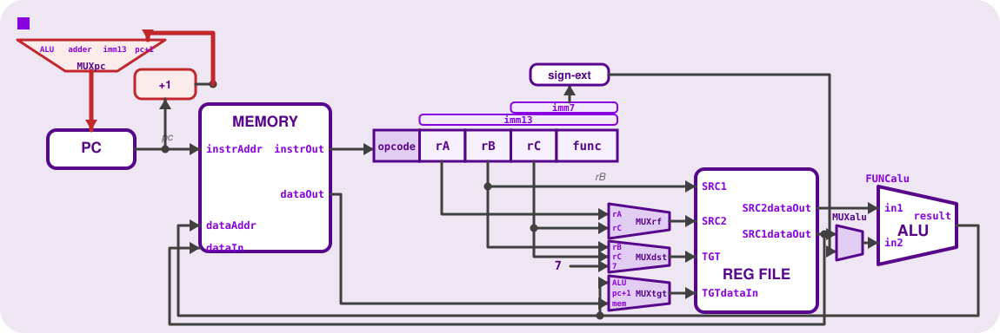

MUXpc in front of the PC. pc+1 is now just its first suitor.

**Suitor 2: `j` and `jal`.** They jump to an absolute address: the instruction's own 13-bit field, zero-extended and sent straight into `MUXpc`, bypassing the ALU.

    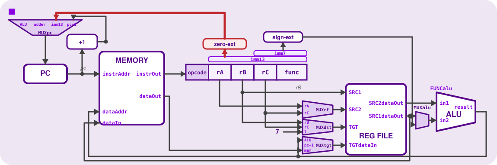

imm13, zero-extended, goes straight into MUXpc.

**Suitor 3: `jr`.** It needs a register's value in the PC. The easiest way is to send it through the ALU, adding `$0` (anything plus zero is itself), and wire the ALU's output into `MUXpc`. That's an engineering choice, not a law of nature: you could have built a dedicated wire.

    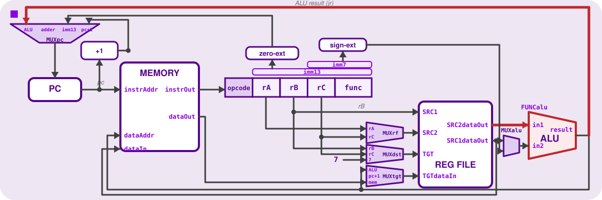

jr: the register's value passes through the ALU and into MUXpc.

**`jal`'s breadcrumb.** `jal` jumps away, but it must leave a way back. The E20's convention is that the breadcrumb is `pc + 1`, saved in `$7`. Where does `pc + 1` already live? At the output of the `+1` adder! So we wire it to a **third input of `MUXtgt`**. For `jal`: `MUXtgt` selects `pc + 1`, `MUXdst` selects the literal `7`, `WErf` is asserted, and `$7 <- pc + 1` commits on the same clock edge that `MUXpc` sends the PC to `imm13`.

    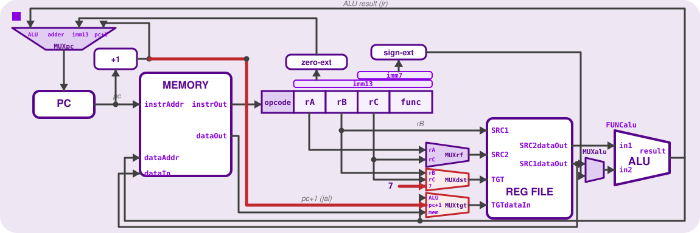

jal: pc+1 reaches MUXtgt, and MUXdst picks 7, so the return address lands in $7.

**Suitor 4: `jeq`.** The ALU can subtract `rA - rB` to test equality.

Who computes the branch *target*, `pc + 1 + imm7`? Not the ALU: it's busy subtracting. We need a separate **branch adder**, fed by `pc + 1` and the sign-extended `imm7`, with its sum going to `MUXpc`.

    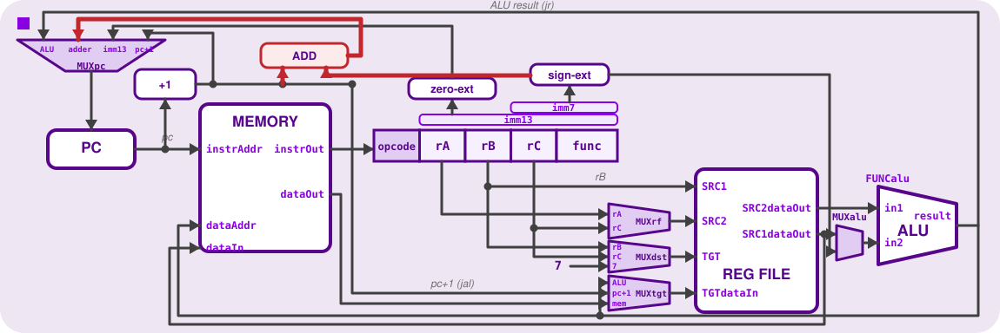

The branch adder: pc+1 plus the sign-extended imm7, into MUXpc.

And yes, before you ask: the branch adder computes `pc + 1 + imm7` on **every** cycle, even when you're running a boring `add`. It's computing garbage, constantly. Isn't that wasteful? That's software brain talking. Electricity doesn't wait to find out whether it's needed. It's a running faucet: the water comes out regardless, and the mux is the drain that either catches it or lets it go. Waiting to decide would only slow the clock down.

Last piece: whether the branch happens. The ALU subtracts, and if the result is zero the registers were equal. It reports that on a dedicated **`EQ`** wire (the manual defines it as "the ALU's result was zero"), and `EQ` flows **backwards**, from the ALU into the control module. It's the only signal in the datapath that flows from a computation back to the brain.

    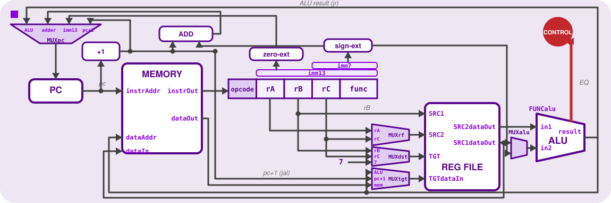

EQ flows from the ALU back to the control module.

> This is worth sitting with. `jeq`'s condition and `jeq`'s destination are computed by two different pieces of hardware **in the same cycle**, and neither waits for the other, because both only need inputs that were available the moment the instruction was decoded. That's what "single-cycle" *means*: everything a cycle needs, it computes in parallel.

---

## The Control Module

Count what we've accumulated:

- **Muxes:** `MUXdst`, `MUXalu`, `MUXtgt` (ALU, memory, or `pc+1`), `MUXrf`, and `MUXpc`.
- **The ALU's function:** `FUNCalu`.
- **Two write-enables:** `WErf` for the register file and `WEdmem` for data memory. `sw` needs `WEdmem` on; every *other* instruction needs it off, or you'd silently corrupt memory on every `add`.

Who pulls all these levers? The **control module**, and it's remarkably dumb. It's the combinational circuit we hinted at in Section 5: no state, no memory, inputs `opcode`, `func` and `EQ`, outputs every control line.

    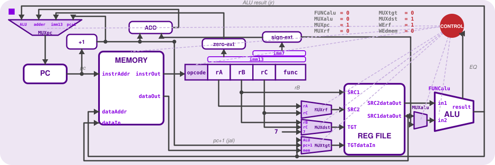

The control module reaches every mux, the ALU and both write-enables (dotted lines). The readout shows its outputs for add.

    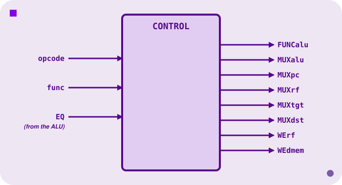

The control module: opcode, func and EQ in, every control line out.

Its behaviour is exactly a truth table, the same combinational construct from Week 1, just with more columns:

| opcode & func | EQ | FUNCalu | MUXalu | MUXpc | MUXrf | MUXtgt | MUXdst | WErf | WEdmem |
|---|---|---|---|---|---|---|---|---|---|
| `add` | DC | 0 | 0 | 1 | 0 | 0 | 1 | 1 | 0 |
| `sub` | DC | 1 | 0 | 1 | 0 | 0 | 1 | 1 | 0 |
| `jeq` | 0 | 1 | 0 | 1 | 0 | DC | DC | 0 | 0 |
| `jeq` | 1 | 1 | 0 | 2 | 0 | DC | DC | 0 | 0 |
| `j` | DC | DC | DC | 3 | DC | DC | DC | 0 | 0 |
| `jal` | DC | DC | DC | 3 | DC | 1 | 2 | 1 | 0 |
| ... | | | | | | | | | |

The remaining rows (`and`, `or`, `slt`, `addi`, `slti`, `lw`, `sw`, `jr`) are left as an exercise: every one of them follows from the meaning of the signals in the encoding table below, and filling them in is exactly the skill this lecture is building. The numbers are the E20 manual's encodings:

| Signal | 0 | 1 | 2 | 3 | 4 |
|---|---|---|---|---|---|
| `FUNCalu` | add | subtract | and | or | slt |
| `MUXalu` | register | immediate | | | |
| `MUXpc` | ALU output | `pc+1` | `pc+1+imm7` | `imm13` | |
| `MUXrf` | `rA` | `rC` | | | |
| `MUXtgt` | ALU output | `pc+1` | data memory | | |
| `MUXdst` | `rB` | `rC` | literal `7` | | |
| `WErf`, `WEdmem` | disabled | enabled | | | |

Two rows for `jeq` are the whole point of the `EQ` input: the *only* thing that changes between "branch taken" and "branch not taken" is `MUXpc`'s select line, and that select line is a direct function of the comparison the ALU just performed.

`DC` marks a **don't care**: a signal whose value is irrelevant for that instruction, because nothing downstream reads it. Take `jeq`: `WErf` is already 0, so the register file's door is locked, and it doesn't matter which way `MUXdst` points. If you're not going to write a register, you don't care which register name is on the wire.

**Where the numbers come from.** Each control signal's value is simply the *position* of the input it selects, counting from 0 in the order the manual lists them (the encoding table above). For `MUXdst`, the inputs are `rB`, `rC`, the literal `7`, so `1` means `rC`. For `MUXpc`: ALU output, `pc+1`, `pc+1+imm7`, `imm13`, so `2` means the branch adder. A cell like `MUXpc = 2` is just "pick input number 2". Once you can name the inputs, you can read any cell in either direction, and the two skills worth practising are exactly those directions.

**Reading the table in both directions.**

*Instruction to values.* Fill in the row for `sw $1, 2($3)`. Go signal by signal, asking what the instruction *needs*:

| Signal | Value | Why |
|---|---|---|
| `FUNCalu` | 0 | the ALU adds the base register and the immediate to make an address |
| `MUXalu` | 1 | the second ALU input is the immediate |
| `MUXpc` | 1 | not a jump, so `pc + 1` |
| `MUXrf` | 0 | the usual register reads (`rA` is the base, `rB` is the value to store) |
| `MUXtgt`, `MUXdst` | DC | no register is written, so nothing reads these |
| `WErf` | 0 | no register write |
| `WEdmem` | 1 | memory *is* written: the only instruction that turns this on |

*Values to instruction.* Now backwards. Which instruction has `FUNCalu = 4`, `MUXalu = 1`, `MUXpc = 1`, `MUXrf = 0`, `MUXtgt = 0`, `MUXdst = 0`, `WErf = 1`, `WEdmem = 0`? Eliminate, like a detective:

1. `WEdmem = 0`: memory isn't written, so not `sw`.
2. `WErf = 1`: a register gets written.
3. `MUXpc = 1`: `pc + 1`, so not a jump.
4. `MUXtgt = 0`: the value comes from the ALU, so not `lw`.
5. `MUXalu = 1`: an immediate operand, and `MUXdst = 0` says the destination is `rB`: the two-register layout.
6. `FUNCalu = 4`: the ALU does `slt`.

So it's **`slti`**. (Change just `MUXalu` to 0 and `MUXdst` to 1, and the same configuration is `slt` instead.) The habit to build: start with the write-enables and `MUXpc` to decide the *family* of instruction, then use `MUXtgt`, `MUXalu` and `MUXdst` to narrow it, and finish with `FUNCalu`.

In Verilog the control module is a `case` statement on `opcode` (and, for the three-register instructions that share an opcode, a nested `case` on `func`): nothing more exotic than the combinational blocks from Week 2, just assigning to eight output wires instead of one.

---

## Tracing Instructions Through the Whole Machine

    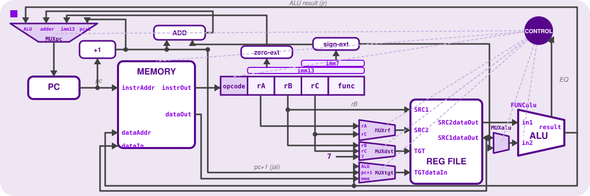

The finished machine. Every wire corresponds to a section above.

Time to watch the engine run: first one `add`, then one `addi`, one `lw`, and one `jeq`, and after the first we only care about **what changes**. Here's `add $3, $1, $2` (opcode `000`, `rA`=`$1`, `rB`=`$2`, `rC`=`$3`). Fair warning: combinational logic doesn't *have* a step 1 and a step 2. The numbering just matches the order values propagate through the wires.

**1. Fetch and 2. Decode.** The PC drives `instrAddr`; `instrOut` produces the 16 raw bits; the field-splitting wiring exposes `opcode = 000`, `rA = 001`, `rB = 010`, `rC = 011`, plus `func`, all at once.

    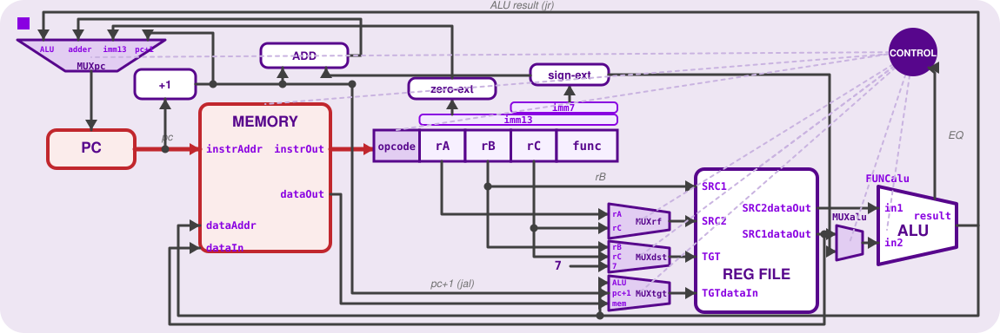

Fetch and decode: the PC, memory and the sliced instruction.

**3. Register read, 4. Control, 5. Execute.** `rB` drives `SRC1` and `rA` drives `SRC2` (through `MUXrf`), and the register file outputs the values of `$2` and `$1`. The control module, seeing opcode `000` and add's `func`, asserts every signal in the readout: add, register operand, `pc+1`, ALU result, destination `rC`, register write on, memory write off. The ALU adds the two values.

    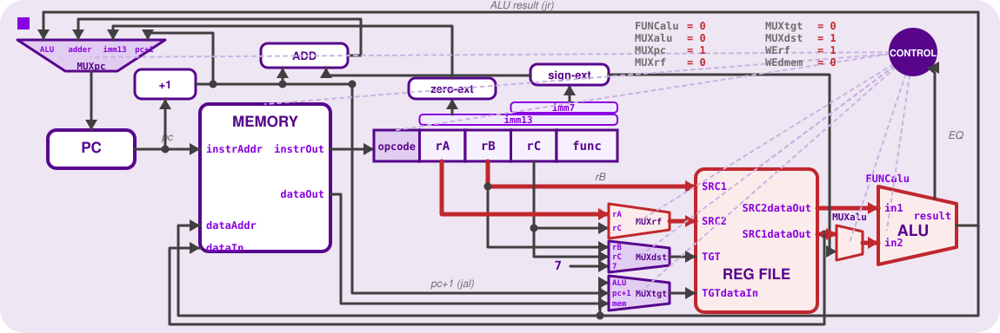

Register read, control and execute (control values for add shown top right).

**6. Write-back.** `MUXtgt` selects the ALU's output, `MUXdst` selects `rC`, and since `WErf = 1` the register file commits `$3 <- sum` on the clock edge. At the same moment `pc <- pc + 1` commits, because `MUXpc` picked the default.

    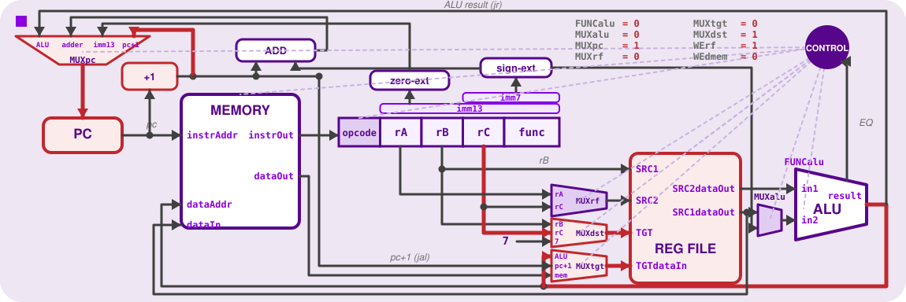

Write-back: the sum travels through MUXtgt into $3, while MUXpc loads pc+1.

All six happened in the **same** clock cycle. It's not a relay race. It's a water main, with pressure flooding every pipe at once. The ALU might even start adding garbage before the real operands arrive (engineers call that *settling*). We only need the clock slow enough that the longest pipe has settled before the edge arrives and snaps the photo. That's what makes this a **single-cycle** processor: one instruction, start to finish, every clock cycle, no exceptions.

**Now `addi $1, $2, 5`.**

Compared with `add`, which control signals have to change? *(Two: `MUXalu` must pick the sign-extended immediate instead of the register, and `MUXdst` must pick `rB` instead of `rC`. Everything else is identical.)*

Fetch and decode work exactly as before: opcode `001` says this is an `addi`, in the two-register layout, with `rA = 010` (`$2`), `rB = 001` (`$1`) and `imm7 = 0000101`. The bits that were `rC` and `func` for `add` are one 7-bit immediate now.

On the read side, `rA` drives `SRC2` (through `MUXrf`), so `$2`'s value reaches the ALU. The immediate takes the other route: through **sign-extend** into `MUXalu`, which now selects it. The ALU adds `$2 + 5`.

    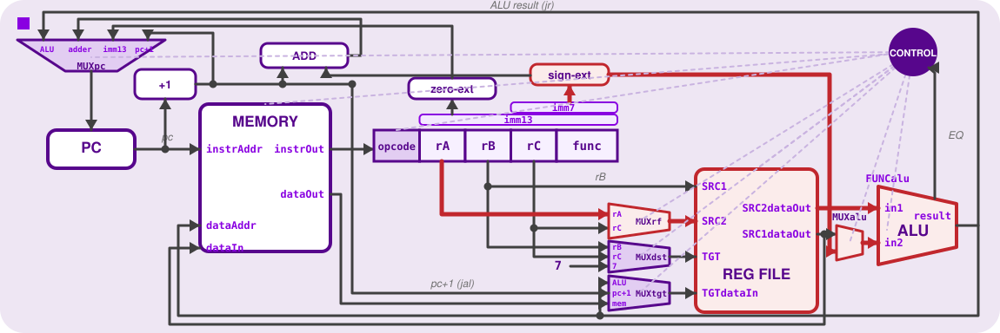

addi, read and execute: the immediate goes through sign-extend and MUXalu into the ALU.

On the write side, `MUXtgt` still picks the ALU's output, but `MUXdst` now picks `rB`, so the sum lands in `$1`. `MUXpc` still picks `pc + 1`. Same machine, two mux selects different.

    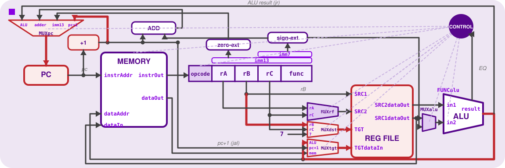

addi, write-back: MUXdst picks rB, so the sum lands in $1.

**Next, `lw $1, 3($2)`,** where `$2` holds 10 and memory cell 13 holds 42. 

Compared with `addi`, what changes? *(Almost nothing: the ALU still adds the base register and the sign-extended immediate, and `MUXalu` and `MUXdst` pick the same inputs as for `addi`. Only `MUXtgt` changes: it has to pick **memory's `dataOut`** instead of the ALU's output.)*

Fetch and decode: opcode `100` is `lw`, in the two-register layout, with `rA = 010` (`$2`, the base register), `rB = 001` (`$1`, the destination) and `imm7 = 0000011`.

The register file hands over `$2` (10), the immediate is sign-extended through `MUXalu`, and the ALU adds them: `10 + 3 = 13`. That 13 is **not the answer**: it's an *address*. It goes into `dataAddr`, the data port, and memory looks up cell 13 and puts `42` on `dataOut`. `WEdmem` is 0, because `lw` only reads.

    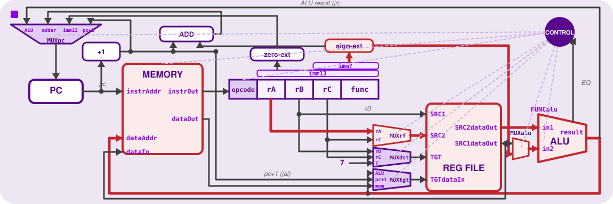

lw, address and memory read: the ALU adds 10 + 3 = 13, and 13 goes to dataAddr.

Then write-back: `MUXtgt` picks `dataOut` (the 42), *not* the ALU's 13; `MUXdst` picks `rB`, so `$1 = 42`. The classic mistake is stopping at the ALU and calling 13 the answer. `MUXpc` still picks `pc + 1`.

    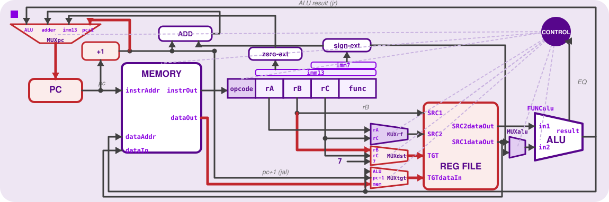

lw, write-back: MUXtgt picks memory's dataOut, so $1 gets 42.

**Finally `jeq $1, $2, target`, with `$1` equal to `$2`.** 

What does the register file write, and what does `MUXpc` pick? *(Nothing is written, and `MUXpc` picks the branch adder's sum.)* The whole instruction exists to steer the PC.

Both registers are read, `MUXalu` picks the register (not an immediate), and `FUNCalu = 1` makes the ALU subtract. Equal registers subtract to zero, which raises `EQ`, and `EQ` flows *backwards* into the control module. With `EQ = 1`, control knows the branch is taken.

    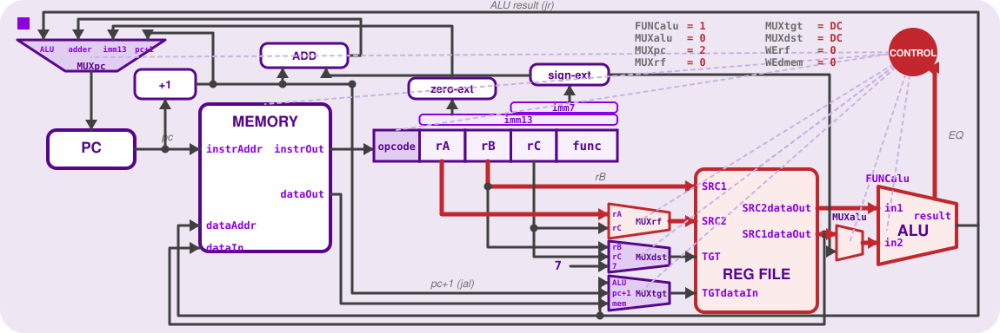

jeq, compare: the ALU subtracts, a zero result raises EQ, and EQ flows back to control.

Meanwhile, in the very same cycle, the branch adder has been adding `pc + 1` and the sign-extended `imm7`. It computes this on every instruction; only now does anyone care about the answer. `MUXpc = 2` selects the branch adder's sum, and nothing is written to the register file (`WErf = 0`, which is why `MUXtgt` and `MUXdst` are don't-cares). If `EQ` had been 0, `MUXpc` would have stayed on `pc + 1`.

    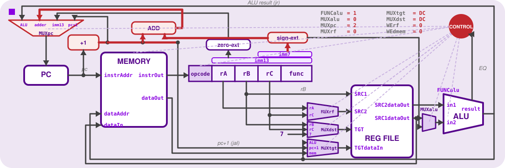

jeq, taken: the branch adder's sum is selected by MUXpc, and nothing is written to a register.

---

## The Cost of "Single-Cycle"

Everything so far has been a celebration, so here's the catch. A single-cycle processor has exactly **one** clock period, and every instruction gets that exact same amount of time. So how long does the period have to be? Long enough for the *slowest* instruction to finish. Which is that?

Follow `lw`: decode, read the base register, add in the ALU, send the sum to `dataAddr`, *wait for memory to read*, route the result through `MUXtgt`, and write the register file. That's a huge journey, and it's the one that crosses main memory in the middle of the cycle. Compare it to `j`, which only has to decode the instruction and zero-extend `imm13` before it's ready to latch. But the clock doesn't care: a `j` (or a `nop`) finishes early and then sits there twiddling its thumbs until the clock, sized for `lw`, finally ticks. It's like making a sprinter walk at a toddler's pace because the marathoner is in the same race.

That's the trade single-cycle design accepts in exchange for its conceptual simplicity (one instruction per cycle, full stop, no bookkeeping about "which stage is this instruction in"): the clock rate is capped by the *worst-case* instruction, even though most instructions could finish much faster.

Think about it. `jeq` sounds like a long trip too: read the registers, subtract in the ALU, wait for `EQ` to flow backwards, let control flip `MUXpc`. So why is the clock period set by `lw` and not by `jeq`? Trace both paths in your head before reading on.

It's because `jeq`'s path ends at `MUXpc`. It never touches data memory, and the branch adder runs in parallel with the ALU's comparison, so it adds no time at all. `lw` does everything `jeq` does up through the ALU, *and then* goes out to memory and back. Memory is slow, so `lw` wins.

The multicycle lecture picks up exactly here with the natural next question: what if, instead of stretching the cycle to fit the slowest instruction, we split the work into *stages*, and let different instructions occupy different stages at the same time? Same components, same wires, mostly, just no longer required to all finish inside one tick.

Looking ahead, this same tension (one clock period sized for the worst case, versus splitting work into independently-timed pieces) is the entire reason GPUs look nothing like a single beefy CPU core. A GPU's thousands of small ALUs are individually much closer to this lecture's single-cycle E20 than to a modern superscalar CPU: simple, uniform, predictable timing, no attempt to accelerate any one operation beyond what every other ALU in the array can also do. Multicycle and pipelining make *one* core more complicated; a GPU instead has thousands of simple cores. Two answers to "how do I get more computation done per second," both tracing back to this fork in the road.

---

**Previous: [E20 Assembly Programming](/lectures/06-e20-assembly-programming)** || **Next: [Midterm Review](/lectures/08-midterm-review)**
